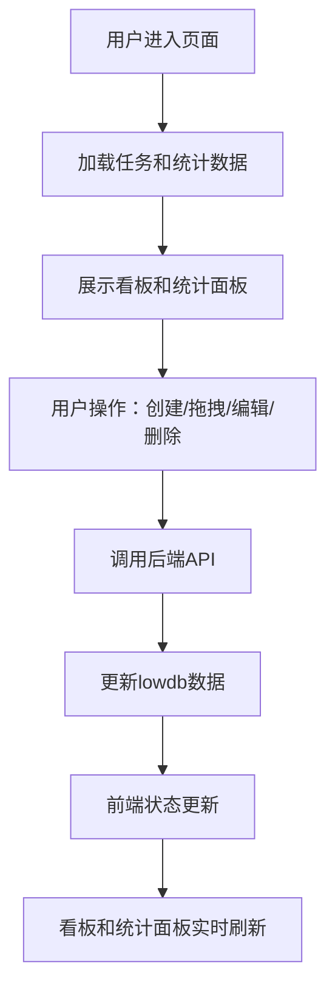

## 1. 产品概述
团队敏捷任务看板与工时统计应用，帮助团队高效管理任务分配、进度跟踪和工时投入分析。
- 主要目标：让团队成员能创建任务、分配到人、跟踪状态并自动生成每个人在周/月维度的工时投入统计
- 目标用户：敏捷开发团队成员、项目经理、团队负责人
- 产品价值：提升团队协作效率，可视化任务进度，准确统计工时投入，优化资源分配

## 2. 核心功能

### 2.1 用户角色
| 角色 | 注册方式 | 核心权限 |
|------|----------|----------|
| 团队成员 | 无需注册，直接使用 | 创建任务、编辑任务、删除任务、拖拽更改状态、查看统计数据 |

### 2.2 功能模块
1. **任务看板模块**：三泳道看板（待办、进行中、完成），任务卡片展示，拖拽排序，状态变更
2. **任务管理模块**：添加任务模态框，任务编辑（双击编辑），任务删除（确认删除）
3. **统计面板模块**：周/月工时统计，人员筛选，工时超支比例可视化，任务详情展开
4. **工具栏模块**：搜索任务、刷新数据、添加任务入口

### 2.3 页面详情
| 页面名称 | 模块名称 | 功能描述 |
|----------|----------|----------|
| 主页面 | 工具栏 | 64px高度白色背景，左侧添加任务按钮+搜索框，右侧刷新按钮 |
| 主页面 | 任务看板 | 三个泳道横向排列，按状态分组展示任务卡片，支持拖拽 |
| 主页面 | 任务卡片 | 展示标题、负责人、预估/实际工时、创建时间，支持双击编辑、删除 |
| 主页面 | 统计面板 | 右侧35%宽度，展示工时统计表，支持周/月筛选和人员筛选 |
| 主页面 | 添加任务模态框 | 弹出式表单，包含标题、负责人、预估工时、描述输入 |

## 3. 核心流程

**任务创建流程**：
用户点击添加任务按钮 → 弹出模态框 → 填写任务信息 → 确认提交 → 调用API保存 → 看板实时更新

**任务状态变更流程**：
用户拖拽任务卡片 → 拖拽过程视觉反馈 → 释放到目标泳道 → 调用API更新状态 → 看板和统计同步更新

**工时统计流程**：
选择时间范围（周/月）→ 选择人员（可选）→ 点击搜索 → 后端计算统计数据 → 表格展示结果 → 可展开查看任务详情

**任务删除流程**：
点击任务卡片删除图标 → 弹出确认框 → 确认删除 → API调用删除 → 卡片飞出动画 → 数据同步更新

## 4. 用户界面设计

### 4.1 设计风格
- **主色调**：#1890FF（蓝色）
- **辅助色**：#52C41A（绿色，完成/正常）、#FAAD14（橙色，进行中/警告）、#FF4D4F（红色，删除/超支严重）
- **背景色**：#F0F2F5（浅色主题）
- **卡片风格**：白色背景，8px圆角，1px #E8E8E8边框，Ant Design预设阴影
- **按钮风格**：8px圆角，主色按钮带hover效果
- **字体**：系统字体栈 -apple-system, BlinkMacSystemFont，行高1.5
- **图标**：Ant Design Icons 图标库

### 4.2 页面设计概述
| 页面名称 | 模块名称 | UI元素 |
|----------|----------|--------|
| 主页面 | 整体布局 | Ant Design Layout，左右分栏（65%看板 + 35%统计），小于1100px时上下排列 |
| 主页面 | 任务看板 | 三个泳道卡片，背景色分别为#FFFBE6/#F6FFED/#E6F7FF，标题带颜色指示点 |
| 主页面 | 任务卡片 | 宽280px，悬停阴影+右移动画，拖拽时缩小半透明，删除时右飞消失 |
| 主页面 | 统计面板 | 左侧4px蓝色竖条装饰，表格展示工时数据，超支比例用彩色进度条 |
| 主页面 | 工具栏 | 64px高度，底部2px边框，刷新按钮旋转动画 |

### 4.3 响应式设计
- **桌面端（>1100px）**：左右布局，看板65% + 统计面板35%（最小300px）
- **平板端（≤1100px）**：上下布局，看板在上50% + 统计在下50%
- **泳道滚动**：看板区域支持横向滚动，每个泳道最小宽度260px

### 4.4 交互动效
- 任务卡片悬停：阴影升至6px，右移2px，0.2s缓动
- 拖拽过程：卡片缩小0.9倍，半透明阴影#00000033
- 删除动画：卡片向右飞出，0.3s，透明度渐变至0
- 刷新按钮：点击后旋转0.5s动画
- 行悬停：统计表格行悬停背景变#F0F5FF
- 分隔线：拖拽时分隔线高亮为#1890FF
