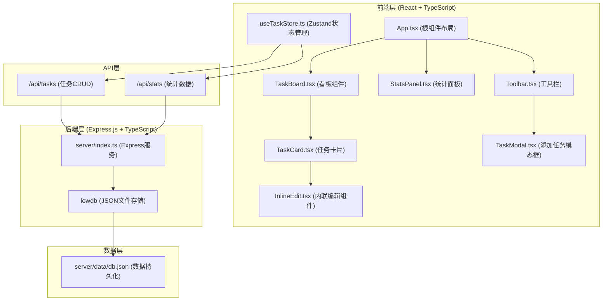
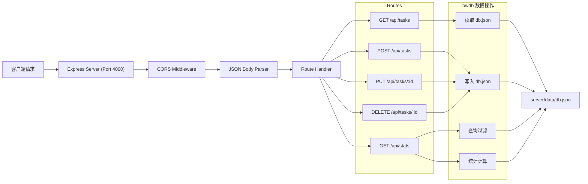
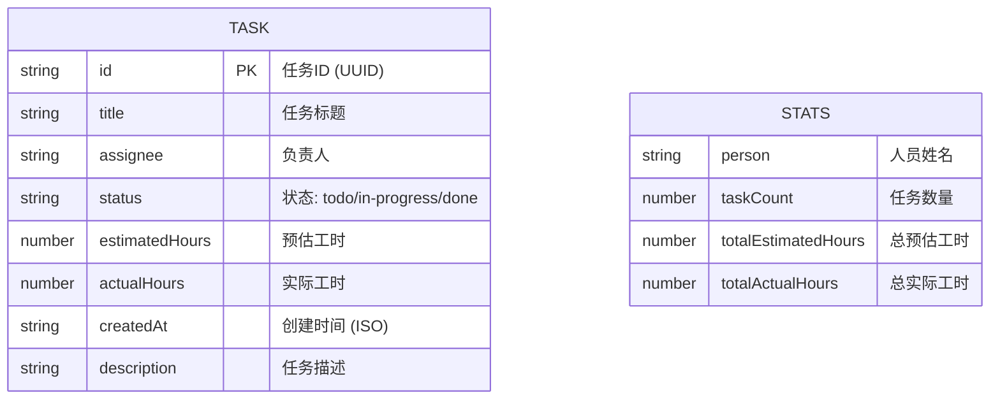

## 1. 架构设计



## 2. 技术描述

- **前端框架**：React 18 + TypeScript
- **构建工具**：Vite 5 + @vitejs/plugin-react
- **UI组件库**：Ant Design 5 + @ant-design/icons
- **状态管理**：Zustand 4
- **拖拽库**：react-beautiful-dnd 13
- **HTTP客户端**：原生 fetch API
- **后端框架**：Express.js 4 + TypeScript
- **数据存储**：lowdb 7（JSON文件存储于server/data/目录）
- **跨域处理**：cors 中间件
- **唯一ID生成**：uuid 9

## 3. 文件结构定义

| 文件路径 | 作用描述 |
|----------|----------|
| `package.json` | 项目依赖和启动脚本（npm run dev） |
| `vite.config.js` | Vite配置，代理/api到http://localhost:4000 |
| `tsconfig.json` | TypeScript配置，严格模式，moduleResolution: bundler |
| `index.html` | 入口HTML，标题"团队任务看板" |
| `server/index.ts` | Express服务，4000端口，CRUD API |
| `src/types.ts` | Task和Stats接口定义 |
| `src/store/useTaskStore.ts` | Zustand状态管理 |
| `src/components/TaskBoard.tsx` | 看板主组件，拖拽功能 |
| `src/components/StatsPanel.tsx` | 统计面板组件 |
| `src/components/TaskCard.tsx` | 任务卡片组件 |
| `src/components/Toolbar.tsx` | 顶部工具栏组件 |
| `src/components/TaskModal.tsx` | 添加任务模态框 |
| `src/components/InlineEdit.tsx` | 内联编辑组件 |
| `src/App.tsx` | 根组件，布局容器 |
| `src/main.tsx` | 应用入口 |
| `server/data/db.json` | lowdb数据存储文件 |

## 4. API 定义

### 4.1 类型定义

```typescript
// src/types.ts
interface Task {
  id: string;
  title: string;
  assignee: string;
  status: 'todo' | 'in-progress' | 'done';
  estimatedHours: number;
  actualHours: number;
  createdAt: string;
  description?: string;
}

interface Stats {
  person: string;
  totalHours: number;
  taskCount: number;
}
```

### 4.2 任务接口

| 方法 | 路径 | 请求参数 | 响应 | 描述 |
|------|------|----------|------|------|
| GET | `/api/tasks` | 无 | `Task[]` | 获取所有任务列表 |
| POST | `/api/tasks` | `{ title, assignee, estimatedHours, description? }` | `Task` | 创建新任务 |
| PUT | `/api/tasks/:id` | `Partial<Task>` | `Task` | 更新任务信息 |
| DELETE | `/api/tasks/:id` | 无 | `{ success: boolean }` | 删除任务 |

### 4.3 统计接口

| 方法 | 路径 | 请求参数 | 响应 | 描述 |
|------|------|----------|------|------|
| GET | `/api/stats` | `startDate?: string, endDate?: string, person?: string` | `Array<{ person, taskCount, totalEstimatedHours, totalActualHours, tasks: Task[] }>` | 获取工时统计数据 |

## 5. 服务器架构



## 6. 数据模型

### 6.1 数据模型定义



### 6.2 初始数据

```json
{
  "tasks": [
    {
      "id": "1",
      "title": "完成用户登录模块",
      "assignee": "张三",
      "status": "done",
      "estimatedHours": 16,
      "actualHours": 18,
      "createdAt": "2026-06-10T08:00:00.000Z",
      "description": "实现用户登录、注册、密码找回功能"
    },
    {
      "id": "2",
      "title": "设计数据库架构",
      "assignee": "李四",
      "status": "in-progress",
      "estimatedHours": 8,
      "actualHours": 6,
      "createdAt": "2026-06-12T09:00:00.000Z",
      "description": "设计用户、订单、产品表结构"
    },
    {
      "id": "3",
      "title": "编写API文档",
      "assignee": "张三",
      "status": "todo",
      "estimatedHours": 4,
      "actualHours": 0,
      "createdAt": "2026-06-15T10:00:00.000Z",
      "description": "使用Swagger编写REST API文档"
    }
  ]
}
```

## 7. 状态管理设计

### Zustand Store 结构

```typescript
interface TaskState {
  tasks: Task[];
  stats: Stats[];
  loading: boolean;
  searchKeyword: string;
  fetchTasks: () => Promise<void>;
  fetchStats: (params?: StatsParams) => Promise<void>;
  addTask: (task: Omit<Task, 'id' | 'createdAt' | 'status' | 'actualHours'>) => Promise<void>;
  updateTask: (id: string, updates: Partial<Task>) => Promise<void>;
  updateStatus: (id: string, status: Task['status']) => Promise<void>;
  deleteTask: (id: string) => Promise<void>;
  setSearchKeyword: (keyword: string) => void;
}
```

## 8. 性能优化

1. **拖拽性能**：使用 react-beautiful-dnd 优化拖拽，200个任务内延迟<100ms
2. **统计计算**：后端预计算统计数据，前端200ms内完成渲染
3. **组件优化**：使用 React.memo 避免不必要重渲染
4. **状态更新**：Zustand 批量更新减少重绘
5. **虚拟列表**：任务数量较多时考虑虚拟滚动（当前200以内不需要）
