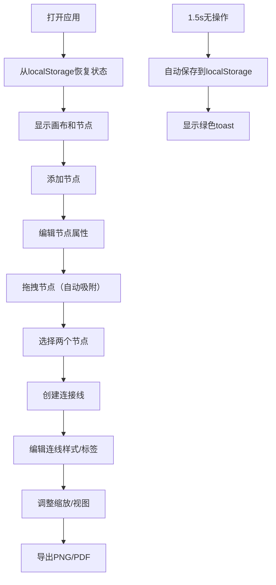

## 1. 产品概述
互动信息图编辑器是一款面向内容创作者的Web应用，帮助用户在浏览器中快速设计、预览和导出带有交互效果的信息图表（数据地图、流程图、知识图谱）。解决博客编写或演示文稿制作中无法嵌入可交互、可缩放信息图表的痛点，替代传统静态图片。

### 核心价值
- 让内容创作者无需专业设计技能即可创建专业级信息图表
- 生成可交互、可缩放的图表，提升内容的信息密度和用户体验
- 支持多种导出格式，方便在各种场景下使用

## 2. 核心功能

### 2.1 功能模块

1. **画布编辑区**：Canvas 2D渲染，支持节点拖拽、连接线绘制、缩放和平移
2. **左侧节点面板**：节点添加、属性编辑、节点列表管理
3. **顶部工具栏**：缩放控制、视图重置、自动保存状态、导出功能
4. **连接线系统**：多种连线样式、标签编辑、自动路径更新
5. **数据持久化**：localStorage自动保存、状态恢复、新图表创建

### 2.2 页面详情

| 页面名称 | 模块名称 | 功能描述 |
|---------|---------|---------|
| 主编辑页 | 节点管理 | 添加节点、编辑属性（文本、颜色、形状、边框、图标）、删除节点 |
| 主编辑页 | 节点交互 | 拖拽移动（上浮+阴影+回弹）、吸附对齐（15px吸附距离+闪烁反馈） |
| 主编辑页 | 连接线 | 点击两节点创建连线、三种样式（直线/贝塞尔/阶梯）、颜色线宽可调、箭头开关、标签编辑 |
| 主编辑页 | 画布控制 | 缩放滑块（50%-200%）、重置视图（0.4s缓动动画）、网格背景 |
| 主编辑页 | 导出功能 | PNG/PDF导出、预览弹窗（12px圆角、居中）、1920x1080分辨率、白色背景 |
| 主编辑页 | 数据持久化 | 1.5s防抖自动保存、绿色toast提示、localStorage存储、新图表确认对话框 |

## 3. 核心流程

### 3.1 图表创建流程
用户打开应用 → 自动恢复上次编辑状态 → 点击左侧面板添加节点 → 拖拽调整位置（自动吸附）→ 点击两节点创建连接线 → 编辑连线样式和标签 → 使用工具栏调整视图 → 导出PNG/PDF文件

### 3.2 操作流程图

## 4. 用户界面设计

### 4.1 设计风格

**色调系统**：
- 主背景：#F0F2F5（浅灰蓝）
- 左侧面板：#F8F9FA（浅灰白，320px宽度）
- 画布背景：#FFFFFF（细网格纹理，#E8E8E8网格线，间距40px）
- 节点色盘：#E3F2FD（蓝）、#F3E5F5（紫）、#E8F5E9（绿）、#FFF3E0（橙）、#FFEBEE（红）
- 主色调：#1976D2（蓝色，用于按钮和强调）
- 边框：#E0E0E0
- 文本：#333333

**交互元素**：
- 圆角：所有交互元素8px圆角，弹窗12px圆角，模态框8px圆角
- 过渡动画：0.3s ease标准过渡，拖拽回弹0.2s easing-out，视图重置0.4s缓动
- 阴影：拖拽时阴影0 8px 24px rgba(0,0,0,0.15)，上浮10px
- 反馈：吸附时0.1s闪烁，保存时1.5s绿色toast

**字体与图标**：
- 连接线标签：14px字体，颜色#333
- 内置30+ emoji图标库供节点选择
- 整体采用现代无衬线字体

### 4.2 页面设计概述

| 页面名称 | 模块名称 | UI元素 |
|---------|---------|---------|
| 主编辑页 | 左侧面板 | 添加节点按钮（8px圆角）、节点属性编辑区（色卡、形状选择、边框样式、emoji选择器）、节点列表（颜色标识+文本摘要+删除按钮） |
| 主编辑页 | 画布区域 | Canvas元素、细网格背景、节点渲染（带emoji图标）、连接线渲染（支持三种样式）、缩放平移变换 |
| 主编辑页 | 顶部工具栏 | 缩放滑块（50%-200%）、重置视图按钮、自动保存状态指示器（绿/灰圆点）、导出PNG按钮、导出PDF按钮 |
| 主编辑页 | 弹窗组件 | 导出预览弹窗（#FFFFFF背景、#E0E0E0 1px边框、12px圆角、居中）、新图表确认对话框（#FAFAFA背景、8px圆角、蓝色按钮#1976D2） |
| 主编辑页 | 状态提示 | 左下角绿色toast提示（保存成功）、节点吸附闪烁效果、拖拽上浮阴影效果 |

### 4.3 响应式设计

- **桌面端**（≥768px）：左侧面板320px固定宽度，画布区域自适应，顶部工具栏水平排列
- **移动端**（<768px）：竖屏布局，工具栏移至顶部，节点点击区域放大1.5倍以适应触控操作
- **触控优化**：移动端节点热区扩大，手势缩放支持

### 4.4 性能指标

- 50个节点 + 80条连接线同时显示时，拖拽FPS ≥ 45帧
- 连接线重绘延迟 < 100ms
- 使用requestAnimationFrame驱动渲染循环
- 防抖自动保存（1.5s无操作）
