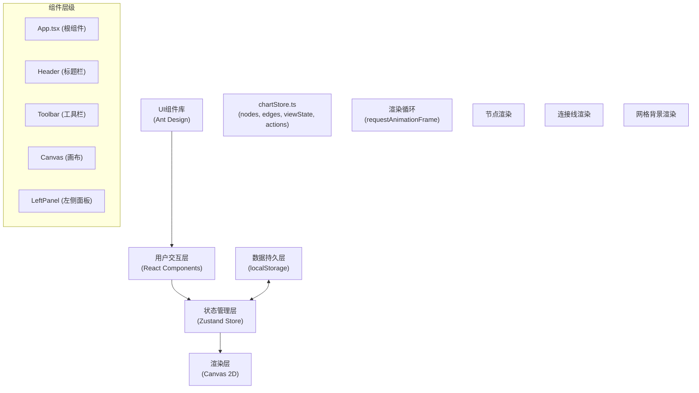

## 1. 架构设计



## 2. 技术描述

- **前端框架**：React 18 + TypeScript
- **构建工具**：Vite 5.x
- **状态管理**：Zustand 4.x（轻量级，支持订阅选择器，优化性能）
- **UI组件库**：Ant Design 5.x + @ant-design/icons
- **渲染技术**：HTML5 Canvas 2D API（高性能节点和连接线渲染）
- **数据持久化**：浏览器localStorage API
- **唯一ID生成**：uuid 9.x
- **导出功能**：
  - PNG：Canvas.toDataURL()
  - PDF：html2canvas + jsPDF
- **代码规范**：TypeScript严格模式（strict: true）

## 3. 项目结构

```
auto47/
├── package.json              # 项目依赖和脚本
├── index.html                # HTML入口
├── vite.config.js            # Vite构建配置
├── tsconfig.json             # TypeScript配置
└── src/
    ├── App.tsx               # 根组件，布局组织
    ├── main.tsx              # React入口
    ├── index.css             # 全局样式
    ├── components/
    │   ├── Canvas.tsx        # Canvas画布组件（核心渲染）
    │   ├── LeftPanel.tsx     # 左侧节点管理面板
    │   ├── Toolbar.tsx       # 顶部工具栏
    │   └── common/           # 公共UI组件
    ├── store/
    │   └── chartStore.ts     # Zustand状态管理
    ├── types/
    │   └── index.ts          # TypeScript类型定义
    └── utils/
        ├── canvas.ts         # Canvas绘制工具函数
        ├── geometry.ts       # 几何计算（吸附、碰撞等）
        └── export.ts         # 导出相关工具函数
```

## 4. 数据模型

### 4.1 核心类型定义

```typescript
// 节点形状类型
type BorderRadius = 'rect' | 'round' | 'ellipse';

// 边框样式类型
type BorderStyle = 'none' | 'solid' | 'dashed';

// 连接线样式类型
type EdgeStyle = 'straight' | 'bezier' | 'step';

// 节点接口
interface ChartNode {
  id: string;
  x: number;
  y: number;
  width: number;
  height: number;
  text: string;
  bgColor: string;
  borderRadius: BorderRadius;
  borderStyle: BorderStyle;
  icon: string;  // emoji字符
}

// 连接线接口
interface ChartEdge {
  id: string;
  fromId: string;
  toId: string;
  style: EdgeStyle;
  color: string;
  width: number;
  arrow: boolean;
  label: string;
}

// 视口状态
interface ViewState {
  zoom: number;      // 0.5 - 2.0
  offsetX: number;
  offsetY: number;
}

// 应用状态
interface ChartState {
  nodes: ChartNode[];
  edges: ChartEdge[];
  viewState: ViewState;
  selectedNodeId: string | null;
  selectedEdgeId: string | null;
  connectingFromId: string | null;
  isDragging: boolean;
  dragNodeId: string | null;
  isSaved: boolean;
  lastSaved: number | null;
  
  // Actions
  addNode: (node: Partial<ChartNode>) => void;
  updateNode: (id: string, updates: Partial<ChartNode>) => void;
  deleteNode: (id: string) => void;
  addEdge: (edge: Partial<ChartEdge>) => void;
  updateEdge: (id: string, updates: Partial<ChartEdge>) => void;
  deleteEdge: (id: string) => void;
  setViewState: (state: Partial<ViewState>) => void;
  resetView: () => void;
  selectNode: (id: string | null) => void;
  startConnecting: (fromId: string) => void;
  cancelConnecting: () => void;
  clearChart: () => void;
  saveToLocalStorage: () => void;
  loadFromLocalStorage: () => void;
}
```

### 4.2 常量定义

```typescript
// 颜色常量
const COLORS = {
  primary: '#1976D2',
  background: '#F0F2F5',
  panelBg: '#F8F9FA',
  canvasBg: '#FFFFFF',
  gridLine: '#E8E8E8',
  border: '#E0E0E0',
  text: '#333333',
  success: '#4CAF50',
  modalBg: '#FAFAFA',
};

// 节点色盘
const NODE_COLORS = [
  '#E3F2FD',  // 蓝
  '#F3E5F5',  // 紫
  '#E8F5E9',  // 绿
  '#FFF3E0',  // 橙
  '#FFEBEE',  // 红
];

// 内置emoji图标（30+个）
const EMOJI_ICONS = [
  '📊', '📈', '📉', '🎯', '💡', '🔍', '⚡', '🔥',
  '🎨', '📝', '📌', '🎪', '🚀', '⭐', '❤️', '💎',
  '🔗', '📁', '📂', '🗂️', '🧠', '🎓', '🏆', '🎭',
  '🌐', '📍', '📱', '💻', '🖥️', '☁️', '🔒', '✅',
];

// 配置常量
const CONFIG = {
  PANEL_WIDTH: 320,
  GRID_SIZE: 40,
  SNAP_DISTANCE: 15,
  MIN_ZOOM: 0.5,
  MAX_ZOOM: 2.0,
  DEFAULT_ZOOM: 1.0,
  AUTO_SAVE_DELAY: 1500,
  TOAST_DURATION: 1500,
  EXPORT_WIDTH: 1920,
  EXPORT_HEIGHT: 1080,
  DEFAULT_NODE_WIDTH: 140,
  DEFAULT_NODE_HEIGHT: 80,
  EDGE_LABEL_FONT_SIZE: 14,
  DRAG_LIFT_OFFSET: 10,
  DRAG_SHADOW: '0 8px 24px rgba(0,0,0,0.15)',
};
```

## 5. 核心模块设计

### 5.1 Canvas渲染模块

**核心职责**：
- 管理Canvas元素和2D上下文
- 使用requestAnimationFrame驱动60fps渲染循环
- 实现网格背景、节点、连接线的分层渲染
- 处理鼠标/触摸事件（点击、拖拽、缩放）
- 实现坐标转换（屏幕坐标 ↔ 画布坐标）

**性能优化**：
- 脏矩形渲染：仅重绘变化区域
- 离屏Canvas预渲染网格背景
- Zustand选择器订阅：仅当相关状态变化时重渲染
- 连接线路径缓存：节点未移动时复用计算结果

### 5.2 状态管理模块

**核心特性**：
- 扁平化状态结构，避免嵌套过深
- 使用Immer middleware支持不可变更新
- 自动保存防抖逻辑（1.5s无操作）
- localStorage持久化/恢复
- 动作日志（便于调试）

### 5.3 几何计算模块

**核心算法**：
- 节点-节点吸附检测（距离计算）
- 节点-网格吸附（取模运算）
- 连接线路径计算（直线、贝塞尔、阶梯）
- 点-节点碰撞检测（用于点击命中）
- 点-连接线碰撞检测（用于标签点击）

### 5.4 导出模块

**PNG导出流程**：
1. 创建1920x1080离屏Canvas
2. 填充白色背景
3. 计算所有元素边界，自动缩放适配
4. 绘制所有节点和连接线
5. 调用toDataURL('image/png')生成base64
6. 创建<a>标签触发下载

**PDF导出流程**：
1. 使用html2canvas捕获Canvas区域
2. 转换为图片数据
3. 使用jsPDF创建A4或1920x1080尺寸PDF
4. 将图片嵌入PDF
5. 触发下载

## 6. 性能优化策略

| 优化点 | 技术方案 | 预期效果 |
|-------|---------|---------|
| 渲染性能 | requestAnimationFrame + 分层渲染 | 拖拽FPS ≥ 45 |
| 状态更新 | Zustand选择器 + 批量更新 | 避免不必要重渲染 |
| 连接线重绘 | 路径缓存 + 局部更新 | 重绘延迟 < 100ms |
| 自动保存 | 1.5s防抖 + 异步写入 | 不阻塞主线程 |
| 大数据量 | Web Worker几何计算（可选） | 50节点+80连线流畅 |
| 内存管理 | 事件监听清理 + RAF取消 | 无内存泄漏 |
