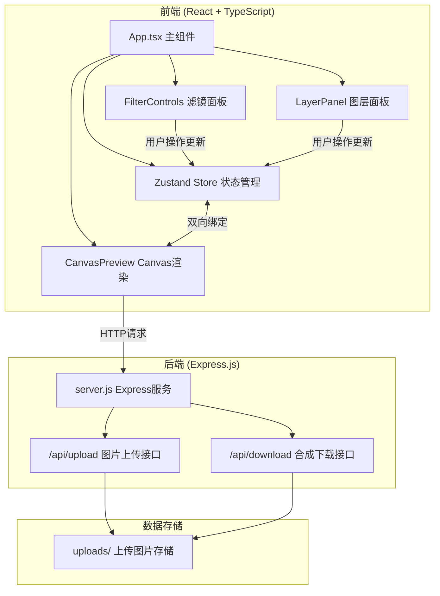

## 1. 架构设计



### 文件调用关系
1. `App.tsx` → 引入并组合 `CanvasPreview.tsx`、`FilterControls.tsx`、`LayerPanel.tsx`
2. 所有组件 → 引入 `store.ts` 进行状态读写
3. `CanvasPreview.tsx` → 订阅 `store` 中图层数据变化，触发重绘
4. `FilterControls.tsx` → 修改 `store` 中当前选中图层的滤镜属性
5. `LayerPanel.tsx` → 修改 `store` 中图层列表（排序、删除、复制）
6. 前端 → 调用后端 `/api/upload` 上传图片，调用 `/api/download` 下载合成图

### 数据流向
- 用户操作 → 组件事件 → 更新 Store → Canvas订阅变化 → 重新绘制
- Store → Canvas 为单向数据流
- 组件之间通过 Store 通信，无直接依赖

## 2. 技术描述

### 前端技术栈
- **框架**：React 18 + TypeScript
- **构建工具**：Vite 5 + @vitejs/plugin-react
- **状态管理**：Zustand 4
- **Canvas渲染**：HTML5 Canvas 2D API
- **唯一标识**：uuid
- **字体**：Google Fonts在线字体（思源黑体、思源宋体、Dancing Script）

### 后端技术栈
- **框架**：Express.js 4
- **跨域**：cors
- **文件上传**：multer
- **静态文件**：express.static

### 项目初始化
- 使用 `npm create vite@latest . -- --template react-ts` 初始化项目
- 安装依赖：zustand、uuid、express、cors、multer、@types/uuid

## 3. 目录结构

```
auto5/
├── package.json              # 项目依赖和脚本
├── vite.config.js            # Vite构建配置
├── tsconfig.json             # TypeScript配置（严格模式）
├── index.html                # 入口HTML
├── src/
│   ├── App.tsx               # 主组件，三栏布局
│   ├── store.ts              # Zustand状态管理
│   ├── CanvasPreview.tsx     # Canvas渲染组件
│   ├── FilterControls.tsx    # 滤镜控制面板
│   ├── LayerPanel.tsx        # 图层管理面板
│   ├── types.ts              # TypeScript类型定义
│   └── utils/
│       ├── canvasUtils.ts    # Canvas绘制工具函数
│       └── filterUtils.ts    # 滤镜算法工具函数
├── server/
│   └── server.js             # Express后端服务
└── uploads/                  # 上传图片存储目录
```

## 4. 数据模型定义

### TypeScript类型定义

```typescript
// src/types.ts

export interface FilterConfig {
  brightness: number;    // 亮度 -100 ~ 100
  contrast: number;      // 对比度 -100 ~ 100
  hue: number;           // 色相 -180 ~ 180
  saturation: number;    // 饱和度 -100 ~ 100
  preset: string | null; // 预设滤镜名称
}

export interface TextStyle {
  content: string;       // 文案内容
  fontFamily: string;    // 字体
  fontSize: number;      // 字号 12-120
  fontWeight: number;    // 字重 100-900
  color: string;         // 颜色 rgba
  align: 'left' | 'center' | 'right';
  rotation: number;      // 旋转角度 -90 ~ 90
}

export interface Layer {
  id: string;
  type: 'image' | 'text';
  name: string;
  x: number;             // 画布中心X坐标
  y: number;             // 画布中心Y坐标
  width: number;
  height: number;
  scale: number;         // 缩放比例
  rotation: number;      // 旋转角度
  opacity: number;       // 透明度 0-1
  visible: boolean;
  zIndex: number;        // 图层顺序
  filterConfig: FilterConfig;
  imageSrc?: string;     // 图片图层：图片URL
  textStyle?: TextStyle; // 文字图层：文字样式
}

export interface CanvasState {
  width: number;         // 画布宽度
  height: number;        // 画布高度
  platform: 'taobao' | 'jd' | 'pdd';
}

export interface AppState {
  layers: Layer[];
  selectedLayerId: string | null;
  canvas: CanvasState;
  isUploading: boolean;
  uploadProgress: number;
  isDownloading: boolean;
}
```

### Store Actions
```typescript
// src/store.ts
- addLayer(layer: Layer): void
- removeLayer(id: string): void
- duplicateLayer(id: string): void
- updateLayer(id: string, updates: Partial<Layer>): void
- reorderLayers(fromIndex: number, toIndex: number): void
- selectLayer(id: string | null): void
- setCanvasSize(platform: string): void
- setUploading(uploading: boolean, progress?: number): void
- setDownloading(downloading: boolean): void
```

## 5. API定义

### 后端接口

#### 5.1 图片上传接口
- **路由**：`POST /api/upload`
- **Content-Type**：`multipart/form-data`
- **请求参数**：
  - `file`: 图片文件（jpg/png/zip）
- **响应**：
```json
{
  "success": true,
  "data": {
    "id": "uuid",
    "url": "/uploads/filename.jpg",
    "width": 800,
    "height": 800
  }
}
```

#### 5.2 合成图片下载接口
- **路由**：`POST /api/download`
- **Content-Type**：`application/json`
- **请求参数**：
```json
{
  "layers": [/* 图层数据 */],
  "canvas": { "width": 800, "height": 800 },
  "format": "png" | "jpg"
}
```
- **响应**：`Content-Type: image/png` 文件流

## 6. 关键实现方案

### 6.1 Canvas渲染性能优化
- 使用 `requestAnimationFrame` 控制渲染帧率
- 离屏Canvas（OffscreenCanvas）处理滤镜效果
- 脏矩形渲染：仅重绘变化区域
- 图层缓存：未变化图层缓存为ImageBitmap

### 6.2 滤镜实现方案
- 使用 Canvas `filter` CSS属性实现基础滤镜
- 复杂滤镜（复古胶片、高饱和电商）使用像素级操作（getImageData/putImageData）
- 预设滤镜配置：亮度、对比度、色相、饱和度组合

### 6.3 图层交互实现
- 拖拽移动：监听鼠标事件，计算偏移量更新图层x/y
- 缩放手柄：8个控制点，拖拽时更新scale和width/height
- 旋转控制：右上角手柄，基于中心点计算旋转角度

### 6.4 平台尺寸切换
- 计算缩放比例：新尺寸 / 旧尺寸
- 所有图层坐标和尺寸按比例缩放
- 确保所有图层在新画布范围内居中显示
