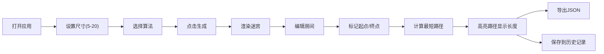

## 1. 产品概述

Roguelike地牢迷宫布局工具是一款面向独立游戏开发者的专业工具，旨在解决手动设计迷宫耗时、单调且难以控制难度曲线的问题。

- **核心目标**：提供快速生成、可视化编辑、智能路径计算的一体化迷宫设计环境
- **目标用户**：独立游戏开发者、关卡设计师、Roguelike游戏爱好者
- **市场价值**：大幅提升迷宫设计效率，支持多种算法生成，可导出JSON格式便于游戏集成

## 2. 核心功能

### 2.1 功能模块

1. **迷宫生成模块**：支持递归回溯法和Prim算法生成迷宫，尺寸范围5x5到20x20

2. **迷宫编辑模块**：单击切换房间通行状态，双击标记起点/终点

3. **路径计算模块**：BFS算法自动计算最短路径并高亮显示

4. **导出模块**：导出迷宫为JSON格式，包含完整的房间坐标、连通关系、起点终点索引

5. **历史记录模块**：保存最近10次生成记录，支持快速重新加载

### 2.3 页面详情

| 页面名称 | 模块名称 | 功能描述 |
|-----------|-------------|---------------------|
| 主页面 | 控制面板 | 尺寸输入、算法选择、生成按钮、导出按钮、历史记录列表 |
| 主页面 | 画布区域 | 迷宫渲染、路径高亮、起点终点标记、路径长度显示 |

## 3. 核心流程

用户打开应用 → 设置迷宫尺寸和算法 → 点击生成 → 查看迷宫 → 编辑房间（可选）→ 标记起点终点 → 查看路径 → 导出JSON

## 4. 用户界面设计

### 4.1 设计风格

- **主色调**：深灰蓝 #2C3E50
- **文字色**：浅灰白 #ECF0F1
- **起点色**：绿色 #27AE60
- **终点色**：红色 #E74C3C
- **路径色**：黄色 #F1C40F
- **按钮色**：蓝色 #2980B9，悬停 #3498DB
- **分隔线**：#BDC3C7

### 4.2 布局

- **整体布局**：控制面板(左300px) + 画布区域(右，最小600x600)
- **控制面板**：1px实线分隔，背景#2C3E50
- **历史记录**：控制面板下方，最大高度200px，溢出滚动
- **按钮**：圆角6px，点击缩小到0.95倍(0.1s过渡)
- **输入框**：圆角4px，背景#34495E

### 4.3 动画效果

- **画布渐入**：opacity从0到1，0.3s
- **路径计算闪烁**：白色半透明#FFFFFF20覆盖全画布0.2s
- **终点闪烁**：0.5s周期
- **按钮加载旋转**：0.3s过渡
- **历史项悬停**：背景色变为#34495E

### 4.4 响应式

- **屏幕宽度<900px**：改为上下布局
- **移动端适配**：meta viewport适配

### 4.5 页面设计概述

| 页面名称 | 模块名称 | UI Elements |
|-----------|-------------|-------------|
| 主页面 | 控制面板 | 深色背景、圆角控件、悬停动画、Toast提示 |
| 主页面 | 画布区域 | Canvas渲染、路径虚线、高亮边框、渐入动画 |
