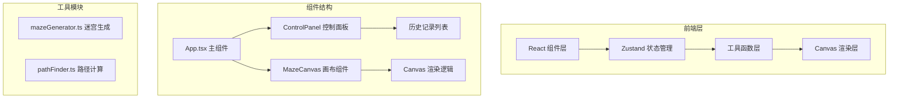

## 1. 架构设计



## 2. 技术描述

- **前端框架**：React 18 + TypeScript
- **构建工具**：Vite
- **状态管理**：Zustand
- **唯一ID**：uuid
- **样式方案**：原生CSS + CSS变量
- **渲染技术**：HTML5 Canvas API

## 3. 文件组织

```
.
├── package.json
├── vite.config.js
├── tsconfig.json
├── index.html
└── src/
    ├── App.tsx
    ├── store/
    │   └── mazeStore.ts
    ├── components/
    │   ├── ControlPanel.tsx
    │   └── MazeCanvas.tsx
    └── utils/
        ├── mazeGenerator.ts
        └── pathFinder.ts
```

## 4. 数据模型

### 4.1 核心数据结构

```typescript
interface Cell {
  x: number;
  y: number;
  walls: { top: boolean; right: boolean; bottom: boolean; left: boolean };
  passable: boolean;
}

interface Grid {
  width: number;
  height: number;
  cells: Cell[][];
  start?: { x: number; y: number };
  end?: { x: number; y: number };
  algorithm: 'recursive-backtrack' | 'prim';
}

interface HistoryItem {
  id: string;
  timestamp: number;
  grid: Grid;
  thumbnail: string;
}

interface MazeState {
  grid: Grid | null;
  path: Cell[] | null;
  pathLength: number;
  history: HistoryItem[];
  isGenerating: boolean;
  isExporting: boolean;
  toast: { message: string; type: 'error' | 'success' } | null;
  flashPath: boolean;
}
```

### 4.2 导出JSON格式

```typescript
interface ExportedMaze {
  width: number;
  height: number;
  algorithm: string;
  cells: Array<{
    x: number;
    y: number;
    passable: boolean;
    connections: string[];
  }>;
  startIndex: number;
  endIndex: number;
  pathLength: number;
  generatedAt: string;
}
```

## 5. 核心算法

### 5.1 迷宫生成算法

1. **递归回溯法**：深度优先搜索，随机选择方向，打通墙壁，回溯访问所有单元格
2. **Prim算法**：随机Prim变体，维护墙壁列表，随机选择墙壁打通

### 5.2 路径计算算法

- **BFS广度优先搜索**：保证最短路径，从起点开始逐层扩展，记录路径

## 6. 性能优化

- 20x20迷宫生成时间≤100ms
- Canvas渲染帧率≥60FPS
- 响应时间≤200ms
- 使用requestAnimationFrame优化渲染
- 路径计算结果缓存
