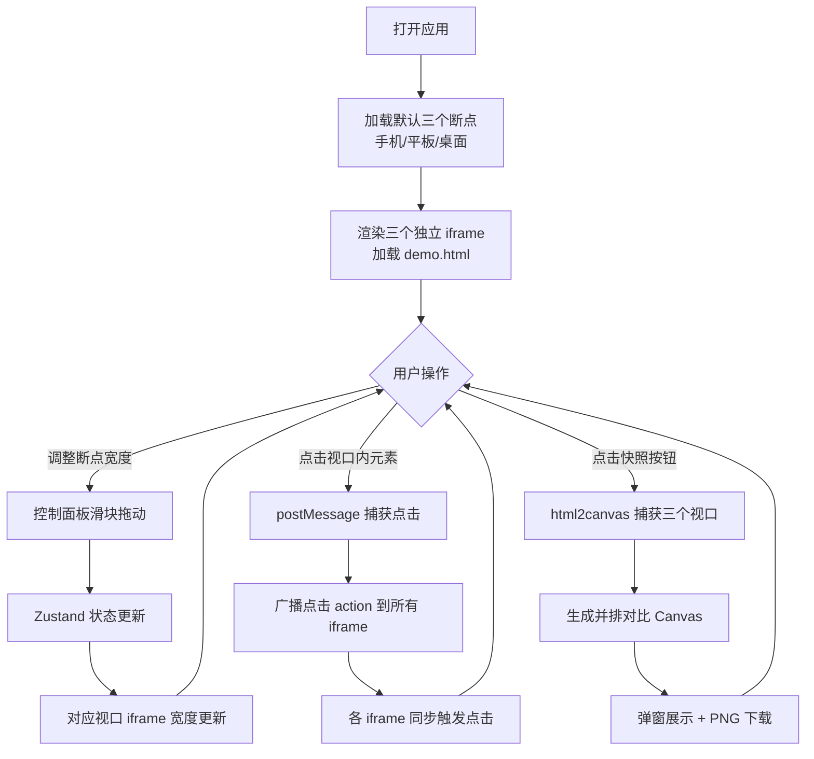

## 1. 产品概述

交互式 CSS 断点调试与布局预览应用，帮助设计师和前端开发者在同一界面中快速预览网页在不同屏幕尺寸下的响应式布局效果，避免在真实设备上反复切换调试。

- 核心价值：将多设备响应式调试从"反复切换设备"转变为"一屏多视口同步预览"，大幅提升调试效率
- 目标用户：UI 设计师、前端开发者、响应式布局测试人员

## 2. 核心功能

### 2.1 用户角色

| 角色 | 注册方式 | 核心权限 |
|------|----------|----------|
| 普通用户 | 无需注册，本地使用 | 全部功能：断点管理、视口预览、快照对比、同步交互 |

### 2.2 功能模块

1. **多视口预览区**：手机/平板/桌面三栏平铺，独立 iframe 渲染，实时尺寸联动
2. **断点控制面板**：添加/删除/编辑断点，拖拽排序，宽度滑块调节
3. **同步交互功能**：一视口点击，多视口同步触发，观察不同断点下交互差异
4. **快照对比功能**：一键生成多视口并排对比截图，支持 PNG 下载
5. **顶部工具栏**：应用标题、目标 URL 输入框、快照按钮

### 2.3 页面详情

| 页面名称 | 模块名称 | 功能描述 |
|----------|----------|----------|
| 主页面 | 顶部工具栏 | 48px 高度，深色背景，包含标题、URL 输入框、快照按钮 |
| 主页面 | 左侧控制面板 | 可折叠抽屉式设计，340px 宽度，断点列表管理 |
| 主页面 | 中央视口区 | 三栏卡片式布局，每个卡片含颜色指示条、标签、iframe |
| 主页面 | 快照弹窗 | 生成并排对比图，提供下载按钮 |

## 3. 核心流程

## 4. 用户界面设计

### 4.1 设计风格

- **主题色**：深色主题，主背景 #1E1E2E，面板背景 #2B2B3D / #313244
- **强调色**：#89B4FA（操作按钮）、#F38BA8（删除按钮）、#7B61FF（平板断点）
- **断点色**：手机 #4A90D9（蓝）、平板 #7B61FF（紫）、桌面 #50B86C（绿）
- **按钮风格**：圆角 6px，背景色填充，hover 时亮度/缩放微交互
- **字体**：系统无衬线字体，标题 18px，正文 14px
- **布局风格**：卡片式布局，12px 圆角，柔和阴影
- **动效风格**：300ms ease-out 过渡，60fps 动画，控制面板抽屉式滑入滑出

### 4.2 页面设计概览

| 页面名称 | 模块名称 | UI 元素 |
|----------|----------|---------|
| 主页面 | 顶部工具栏 | 48px 深色条、左侧标题、居中 URL 输入框、右侧快照按钮 |
| 主页面 | 控制面板 | 左侧折叠标签、展开后断点列表（色标圆点+标签输入+宽度滑块+删除按钮）、添加按钮、重置按钮 |
| 主页面 | 视口卡片 | 顶部 4px 颜色条、标签名+宽度显示、iframe 区域、虚线边框 |
| 主页面 | 快照弹窗 | 居中弹窗、对比图 Canvas、下载按钮、关闭按钮 |

### 4.3 响应式

- 本应用为桌面端开发工具，优先桌面端体验
- 视口区域内容若宽度不足，支持水平滚动
- 控制面板可折叠，节省空间

### 4.4 性能指标

- 断点修改到视口更新延迟 ≤ 30ms
- 点击同步跨视口延迟 ≤ 100ms
- 快照生成时间 ≤ 3 秒
- 面板展开/折叠动画保持 60fps
