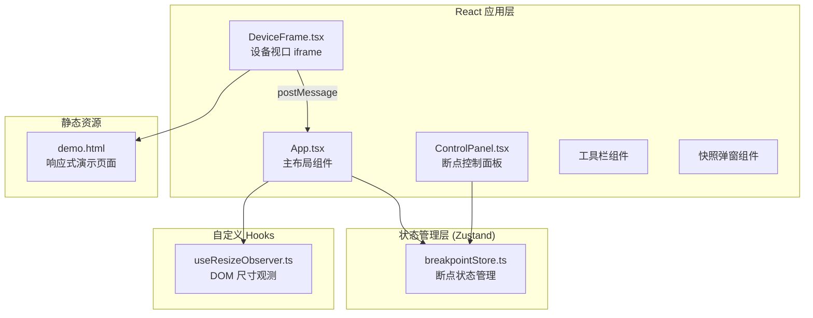

## 1. 架构设计



## 2. 技术选型

- **前端框架**：React 18 + TypeScript
- **构建工具**：Vite 5 + @vitejs/plugin-react
- **状态管理**：Zustand
- **样式方案**：原生 CSS + CSS 变量（深色主题）
- **截图功能**：html2canvas
- **唯一 ID**：uuid
- **通信机制**：postMessage（父子 iframe 通信）

## 3. 文件结构

```
src/
├── main.tsx                 # 应用入口
├── App.tsx                  # 主布局组件
├── stores/
│   └── breakpointStore.ts   # Zustand 断点状态管理
├── hooks/
│   └── useResizeObserver.ts # 尺寸观测自定义 Hook
├── components/
│   ├── DeviceFrame.tsx      # 设备 iframe 组件
│   └── ControlPanel.tsx     # 断点控制面板组件
└── assets/
    └── demo.html            # 响应式演示页面
```

### 文件调用关系

1. **main.tsx** → 渲染 **App.tsx** 到 DOM
2. **App.tsx** 
   - 引入 **breakpointStore.ts** 获取断点列表
   - 引入 **useResizeObserver.ts** 监听视口容器尺寸
   - 渲染 **ControlPanel.tsx** 和多个 **DeviceFrame.tsx**
   - 监听 postMessage 实现跨 iframe 同步
3. **ControlPanel.tsx** → 调用 **breakpointStore.ts** 的 actions 增删改断点
4. **DeviceFrame.tsx** → 加载 **demo.html**，通过 postMessage 与父窗口通信

### 数据流向

```
用户操作控制面板 → breakpointStore 更新 → App 组件重渲染 → DeviceFrame 尺寸更新
   ↑                                                              ↓
   └────────────── postMessage 广播 ←────────────── iframe 内点击
```

## 4. 核心数据模型

### Breakpoint 类型

```typescript
interface Breakpoint {
  id: string;       // 唯一标识 (uuid)
  label: string;    // 设备标签名，如"手机"
  width: number;    // 视口宽度 (px)
  color: string;    // 关联颜色，十六进制
}
```

### Breakpoint Store State

```typescript
interface BreakpointState {
  breakpoints: Breakpoint[];
  addBreakpoint: (bp: Omit<Breakpoint, 'id'>) => void;
  removeBreakpoint: (id: string) => void;
  updateBreakpoint: (id: string, updates: Partial<Omit<Breakpoint, 'id'>>) => void;
  resetBreakpoints: () => void;
  reorderBreakpoints: (fromIndex: number, toIndex: number) => void;
}
```

### 默认断点数据

```typescript
const DEFAULT_BREAKPOINTS = [
  { id: '...', label: '手机', width: 375, color: '#4A90D9' },
  { id: '...', label: '平板', width: 768, color: '#7B61FF' },
  { id: '...', label: '桌面', width: 1280, color: '#50B86C' },
];
```

## 5. 关键技术实现

### 5.1 iframe 通信机制

- **父 → 子**：通过 `iframe.contentWindow.postMessage` 广播点击同步事件
- **子 → 父**：demo.html 中监听点击事件，`window.parent.postMessage` 上报
- **消息格式**：`{ type: 'click', selector: string, timestamp: number }`

### 5.2 快照生成流程

1. 遍历所有 DeviceFrame 对应的 iframe 容器
2. 使用 html2canvas 逐个截图
3. 将所有 canvas 绘制到一个总 canvas 上，并排排列
4. 转换为 dataURL，弹窗展示并提供下载

### 5.3 性能优化

- useResizeObserver 使用 50ms 防抖，避免频繁重渲染
- 断点状态使用 Zustand，避免 props 层层传递
- iframe 使用独立渲染上下文，互不阻塞
- CSS 动画使用 transform + opacity，保证 60fps

### 5.4 拖拽排序

- 使用原生 HTML5 Drag and Drop API 实现
- 拖拽时更新 Zustand store 中 breakpoints 数组顺序
- 视口区域同步重排
