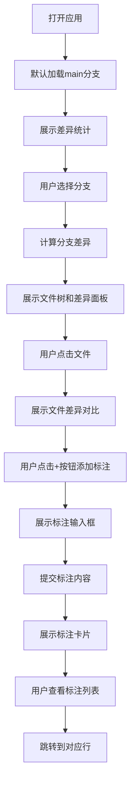

## 1. 产品概述
CodeDiff Reviewer 是一个在线Git分支代码差异查看与交互式评审应用，帮助团队协作开发中的代码评审者在浏览器中直观地对比多个分支的目录结构和文件内容变化，并进行交互式标注评审。
- 主要目的：简化代码评审流程，提供直观的差异对比和标注功能
- 目标用户：软件开发者、代码评审者、技术团队负责人

## 2. 核心功能

### 2.1 用户角色
| 角色 | 注册方式 | 核心权限 |
|------|----------|----------|
| 代码评审者 | 无需注册，直接使用 | 查看分支差异、添加/删除标注、浏览标注列表 |

### 2.2 功能模块
1. **分支选择模块**：展示Git分支列表，选择分支后加载差异
2. **差异对比模块**：左侧文件树目录，右侧行级差异展示，支持字符级高亮
3. **评审标注模块**：浮动工具栏、标注输入框、标注卡片展示
4. **标注列表模块**：右下角浮动面板，展示所有标注，支持跳转定位

### 2.3 页面详情
| 页面名称 | 模块名称 | 功能描述 |
|----------|----------|----------|
| 差异对比页 | 分支选择器 | 下拉选择框展示分支列表，每项显示名称和最近提交时间 |
| 差异对比页 | 统计概览 | 显示新增/修改/删除文件数、总差异行数 |
| 差异对比页 | 文件树面板 | 目录层级展示有差异的文件列表，点击切换差异视图 |
| 差异对比页 | 差异展示面板 | 并排对比原文件和新文件，行级和字符级差异高亮 |
| 差异对比页 | 标注工具栏 | 浮动工具栏，添加评论按钮、显示/隐藏标注列表 |
| 差异对比页 | 标注列表面板 | 右下角浮动面板，列出所有标注，支持跳转定位 |

## 3. 核心流程
用户打开应用后，默认选择main分支，系统展示该分支的差异统计。用户从下拉列表选择其他分支，系统自动计算并展示该分支相对于main的文件差异。用户点击文件树中的文件名，右侧展示该文件的并排差异对比。用户点击行号旁的+按钮添加标注，标注以浮动卡片形式展示。用户可通过右下角标注列表面板查看所有标注并跳转到对应行。

## 4. 用户界面设计

### 4.1 设计风格
- 主色调：蓝色 #3B82F6
- 辅助色：绿色 #22C55E（新增）、红色 #EF4444（删除）、黄色 #FFF8DC（修改）
- 背景色：浅灰 #F8FAFC
- 分隔线：#E2E8F0
- 按钮样式：圆形按钮，悬浮时缩放1.05倍，过渡0.15s
- 字体：代码块使用Fira Code等宽字体，字号14px，行高1.6
- 布局：左右两栏布局，左侧30%，右侧70%

### 4.2 页面设计概述
| 页面名称 | 模块名称 | UI元素 |
|----------|----------|--------|
| 差异对比页 | 顶栏 | 分支下拉选择框、差异统计标签 |
| 差异对比页 | 左侧面板 | 文件树（8px左内边距，悬浮背景#E2E8F0）、1px分隔线 |
| 差异对比页 | 右侧面板 | 并排代码对比视图、行号列、+按钮 |
| 差异对比页 | 标注卡片 | 背景#F0FDF4，左边框4px绿色#22C55E，圆角8px |
| 差异对比页 | 标注列表面板 | 背景白色，圆角12px，阴影#0000001A，宽300px |

### 4.3 动画效果
- 页面加载：分支选择框和文件树从右向左渐入（0.3s，ease-out）
- 标注卡片：从下向上弹入（0.2s，cubic-bezier(0.34, 1.56, 0.64, 1)）
- 按钮悬浮：手型光标，缩放1.05倍，过渡0.15s
- 标注跳转：边框3px #22C55E闪烁3次，每次0.5s
- 滚动条：0.5s展开动画

### 4.4 响应式设计
- 桌面端：左右两栏布局，左侧30%，右侧70%
- 移动端（768px以下）：文件树收起为左侧图标按钮，点击后浮出侧栏
