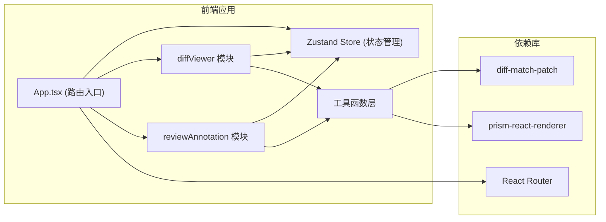

## 1. 架构设计



## 2. 技术描述
- **前端框架**：React@18 + TypeScript
- **构建工具**：Vite@5 + @vitejs/plugin-react
- **状态管理**：Zustand@4
- **路由管理**：react-router-dom@6
- **差异计算**：diff-match-patch
- **代码高亮**：prism-react-renderer
- **ID生成**：uuid
- **样式方案**：原生CSS（CSS变量 + 模块化样式）

## 3. 目录结构
```
d:\Pro\tasks\auto55\
├── index.html
├── package.json
├── vite.config.js
├── tsconfig.json
└── src/
    ├── App.tsx
    ├── main.tsx
    ├── index.css
    ├── store/
    │   └── diffStore.ts
    ├── modules/
    │   ├── diffViewer/
    │   │   ├── components/
    │   │   │   ├── BranchSelector.tsx
    │   │   │   └── DiffPanel.tsx
    │   │   └── utils/
    │   │       └── diffCalculator.ts
    │   └── reviewAnnotation/
    │       └── components/
    │           ├── AnnotationBar.tsx
    │           └── AnnotationList.tsx
    └── utils/
        └── types.ts
```

## 4. 路由定义
| 路由 | 用途 |
|------|------|
| / | 重定向到差异对比页 |
| /diff | 差异对比与评审主页 |

## 5. 数据模型

### 5.1 类型定义

```typescript
// 分支信息
interface Branch {
  name: string;
  lastCommitTime: string;
  lastCommitTimestamp: number;
}

// 差异行类型
type DiffLineType = 'added' | 'deleted' | 'modified' | 'unchanged';

// 差异行
interface DiffLine {
  type: DiffLineType;
  oldLineNumber: number | null;
  newLineNumber: number | null;
  oldContent: string;
  newContent: string;
  charDiff?: {
    old: Array<{ text: string; isDiff: boolean }>;
    new: Array<{ text: string; isDiff: boolean }>;
  };
}

// 文件差异
interface FileDiff {
  id: string;
  filePath: string;
  fileName: string;
  directory: string;
  status: 'added' | 'modified' | 'deleted';
  oldContent: string;
  newContent: string;
  diffLines: DiffLine[];
  additions: number;
  deletions: number;
}

// 标注
interface Annotation {
  id: string;
  fileId: string;
  filePath: string;
  lineNumber: number;
  content: string;
  timestamp: number;
  timeString: string;
}

// 差异统计
interface DiffStats {
  addedFiles: number;
  modifiedFiles: number;
  deletedFiles: number;
  totalDiffLines: number;
}

// Store状态
interface DiffStore {
  branches: Branch[];
  selectedBranch: string;
  baseBranch: string;
  fileDiffs: FileDiff[];
  annotations: Annotation[];
  selectedFileId: string | null;
  stats: DiffStats;
  showAnnotationList: boolean;
  
  fetchBranches: () => void;
  fetchDiff: (branchName: string) => void;
  selectFile: (fileId: string) => void;
  addAnnotation: (fileId: string, lineNumber: number, content: string) => void;
  deleteAnnotation: (annotationId: string) => void;
  toggleAnnotationList: () => void;
}
```

### 5.2 数据流向
1. **App.tsx**：读取Store状态，渲染路由和整体布局
2. **BranchSelector.tsx**：调用`diffStore.fetchBranches()`获取分支列表，调用`diffStore.fetchDiff()`更新差异
3. **DiffPanel.tsx**：从Store读取`fileDiffs`、`selectedFileId`、`annotations`，调用`selectFile()`切换文件
4. **AnnotationBar.tsx**：调用`addAnnotation()`写入标注，从Store读取`annotations`渲染
5. **AnnotationList.tsx**：从Store读取`annotations`，调用`deleteAnnotation()`删除

## 6. 性能优化策略

### 6.1 计算性能
- 使用`React.memo`包裹所有展示组件，避免不必要的重渲染
- 使用`useMemo`缓存差异计算结果、字符级高亮结果
- 使用`useCallback`缓存事件处理函数

### 6.2 渲染性能
- 文件差异列表采用虚拟滚动（可选，当前需求文件数较少可暂不实现）
- 标注卡片按需渲染，仅在可见区域内渲染
- CSS动画优先使用transform和opacity属性，避免触发重排

### 6.3 加载性能
- 代码高亮库按需加载
- 差异计算延迟到分支选择后执行
- 首屏优先渲染骨架屏和基础布局
