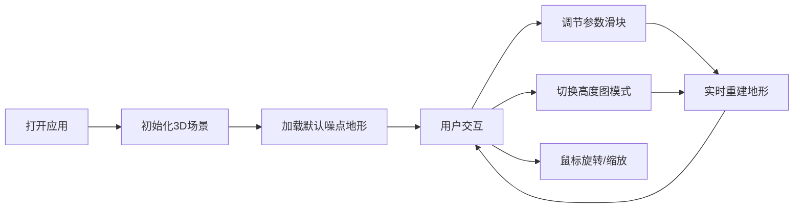

## 1. 产品概述

基于地理坐标的3D地形交互可视化应用，通过Three.js实现数字高程模型（DEM）数据的加载与渲染，用户可实时调整地形参数观察地形变化。

- 主要用途：地理数据可视化、地形参数调试、3D地形交互体验
- 目标用户：地理信息研究者、游戏开发者、3D可视化爱好者
- 产品价值：提供直观的地形参数调节与实时渲染反馈，助力地形设计与研究

## 2. 核心特性

### 2.1 功能模块

1. **3D地形渲染**：基于高度图数据生成几何体，支持多种地形模式
2. **参数控制面板**：右侧悬浮控制面板，实时调节地形参数
3. **轨道控制交互**：鼠标拖拽旋转、滚轮缩放，流畅视角控制
4. **光照与阴影系统**：环境光+定向光，增强地形立体感
5. **帧率监测**：实时显示当前渲染帧率

### 2.2 页面详情

| 页面名称 | 模块名称 | 功能描述 |
|-----------|-------------|---------------------|
| 主页面 | 3D场景 | 全屏地形渲染，渐变天空背景，绿色到棕色渐变材质 |
| 主页面 | 控制面板 | 地形高度缩放、噪声频率、网格分辨率滑块，模式切换，重置按钮，帧率显示 |

## 3. 核心流程

用户打开应用 → 查看默认噪点地形 → 调节滑块参数观察地形变化 → 切换高度图模式体验不同地形 → 使用鼠标拖拽和缩放探索地形细节

## 4. 用户界面设计

### 4.1 设计风格

- 整体风格：暗色系控制面板与明亮3D场景的对比风格
- 主色调：控制面板#1A1A2E，滑块#00BCD4，文字#FFFFFF
- 地形渐变：低海拔#4CAF50（绿色）到高海拔#8D6E63（棕色）
- 天空渐变：#87CEEB到#E0F6FF
- 字体：系统默认无衬线字体，14px
- 布局：全屏3D场景 + 右侧悬浮控制面板

### 4.2 页面设计概述

| 页面名称 | 模块名称 | UI元素 |
|-----------|-------------|-------------|
| 主页面 | 3D场景 | 渐变天空背景、地形网格、光照阴影、相机视角 |
| 主页面 | 控制面板 | 圆角10px、内边距16px、阴影效果、滑块控件、下拉选择器、按钮、帧率文字 |

### 4.3 交互细节

- 滑块轨道高度4px、颜色#333，手柄直径16px、颜色#00BCD4
- 滑动时数值实时更新
- 参数调整后500ms内完成地形重建
- 模式切换有0.3秒高度渐变过渡动画
- 鼠标操作响应延迟低于50ms

### 4.4 3D场景指引

- 环境：渐变天空背景（#87CEEB → #E0F6FF），无雾效
- 光照：环境光强度0.4，定向光强度0.8，位置(200, 300, 200)
- 相机：初始位置(300, 200, 300)，俯视地形中心
- 控制器：轨道控制器，Y轴360度旋转，X轴-30°到60°，缩放0.5x到10x
- 地形材质：基于高度的顶点颜色渐变，支持光照凹凸效果
- 性能目标：默认视图55-60fps，重建时不低于30fps
