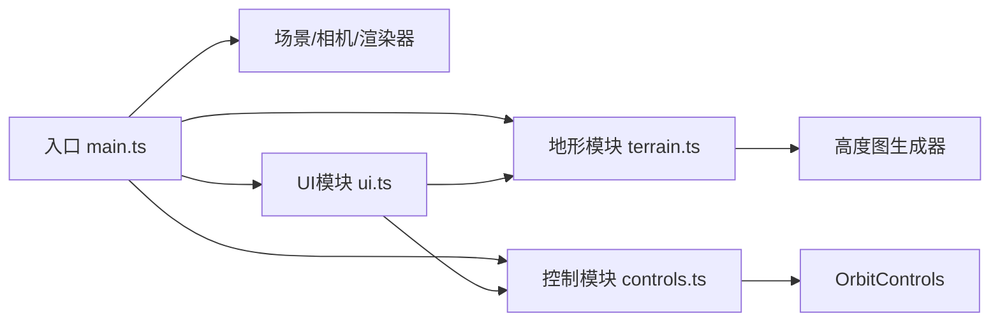

## 1. 架构设计



## 2. 技术描述

- 前端框架：原生 TypeScript + Three.js
- 构建工具：Vite
- 3D引擎：three@0.160+
- 类型定义：@types/three
- 模块化：ES Module
- 严格模式：TypeScript strict 模式

### 项目结构

```
├── package.json
├── vite.config.js
├── tsconfig.json
├── index.html
└── src/
    ├── main.ts      # 主入口，场景初始化与模块管理
    ├── terrain.ts   # 地形网格生成与更新
    ├── controls.ts  # 轨道控制器封装
    └── ui.ts        # HTML控制面板
```

## 3. 核心模块定义

### 3.1 Terrain 模块

| 方法/属性 | 类型 | 说明 |
|-----------|------|------|
| `resolution` | `number` | 网格分辨率（2的幂次） |
| `heightScale` | `number` | 高度缩放系数 |
| `noiseFrequency` | `number` | 噪声频率 |
| `mode` | `'noise' \| 'ridge'` | 高度图模式 |
| `mesh` | `THREE.Mesh` | 地形网格对象 |
| `generateHeightmap()` | `Float32Array` | 生成高度图数据 |
| `updateGeometry()` | `void` | 更新几何体顶点 |
| `animateTransition(targetHeights, duration)` | `void` | 高度渐变动画 |

### 3.2 Controls 模块

| 方法/属性 | 类型 | 说明 |
|-----------|------|------|
| `controls` | `OrbitControls` | Three.js 轨道控制器 |
| `onParameterChange(callback)` | `void` | 参数变化回调注册 |
| `setHeightScale(value)` | `void` | 设置高度缩放 |
| `setNoiseFrequency(value)` | `void` | 设置噪声频率 |
| `setResolution(value)` | `void` | 设置分辨率 |
| `setMode(mode)` | `void` | 设置地形模式 |
| `reset()` | `void` | 重置所有参数 |

### 3.3 UI 模块

| 方法/属性 | 类型 | 说明 |
|-----------|------|------|
| `container` | `HTMLElement` | 面板容器 |
| `fpsDisplay` | `HTMLElement` | 帧率显示元素 |
| `onHeightScaleChange(callback)` | `void` | 高度滑块变化回调 |
| `onFrequencyChange(callback)` | `void` | 频率滑块变化回调 |
| `onResolutionChange(callback)` | `void` | 分辨率滑块变化回调 |
| `onModeChange(callback)` | `void` | 模式切换回调 |
| `onReset(callback)` | `void` | 重置按钮回调 |
| `updateFPS(fps)` | `void` | 更新帧率显示 |

## 4. 关键技术点

### 4.1 地形生成

- 使用 PlaneGeometry 作为基础几何体
- 根据高度图数据修改顶点 y 坐标
- 顶点着色器实现海拔颜色渐变
- 计算法向量以支持光照

### 4.2 性能优化

- 分辨率变化时重建几何体
- 高度/频率变化时仅更新顶点位置
- 防抖处理滑块输入（500ms延迟重建）
- requestAnimationFrame 渲染循环

### 4.3 平滑过渡

- 模式切换时使用线性插值（lerp）过渡高度值
- 0.3秒动画时长，requestAnimationFrame 驱动

### 4.4 高度图算法

- 噪点模式：Perlin噪声多层叠加（fBm）
- 山脊模式：反向绝对值噪声叠加

## 5. 构建配置

- Vite 配置 three 模块解析
- TypeScript 严格模式
- 开发服务器支持热更新
