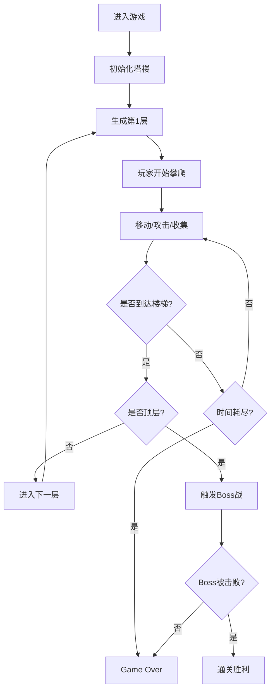

## 1. 产品概述

无尽树塔是一款像素风格的爬塔冒险小游戏，玩家操控像素骑士在随机生成的塔楼中向上攀爬，通过击败敌人、收集装备、躲避陷阱，最终挑战顶层Boss完成通关。

- 核心玩法：像素风横版爬塔，融合Roguelike随机元素与动作战斗
- 目标用户：休闲游戏玩家，像素风格爱好者
- 市场价值：提供轻量化、高重玩度的浏览器端游戏体验

## 2. 核心功能

### 2.1 用户角色
| 角色 | 注册方式 | 核心权限 |
|------|----------|----------|
| 玩家 | 无需注册，直接进入游戏 | 操控角色、查看状态、收集物品、挑战Boss |

### 2.2 功能模块
1. **游戏主界面**：等距视角塔楼渲染、玩家角色控制、战斗系统
2. **信息面板**：层数显示、生命值、金币、经验值进度条
3. **物品栏系统**：3x4网格展示装备、悬停提示、装备管理
4. **敌人AI系统**：史莱姆、骷髅、蝙蝠三种独立AI行为
5. **关卡生成**：随机生成楼层敌人、宝箱、陷阱分布
6. **时间系统**：每层60秒倒计时、超时警告与惩罚
7. **Boss战**：顶层Boss战斗、通关结算

### 2.3 页面详情
| 页面名称 | 模块名称 | 功能描述 |
|----------|----------|----------|
| 游戏主界面 | 塔楼渲染 | 等距视角Canvas渲染，楼层渐变背景 |
| 游戏主界面 | 角色控制 | WASD移动，空格攻击，弹跳动画，剑光特效 |
| 信息面板 | 状态显示 | 层数、生命值、金币、经验值实时更新 |
| 物品栏 | 装备管理 | 3行4列网格，悬停放大，工具提示 |
| 敌人系统 | AI行为 | 三种敌人独立AI，粒子爆炸效果 |
| 关卡系统 | 随机生成 | 敌人、宝箱、陷阱位置随机分布 |
| 时间系统 | 倒计时 | 60秒限时，超时屏幕变红警告 |
| Boss战 | 顶层战斗 | 击败Boss通关，胜利结算 |

## 3. 核心流程

## 4. 用户界面设计

### 4.1 设计风格
- **整体风格**：像素复古风格，所有元素以像素块呈现
- **主色调**：深紫背景#2D1B2E，楼层渐变#3A1C3E到#8B5CF6
- **强调色**：金色#FFD700，蓝色#3B82F6，红色#EF4444，绿色#4ADE80
- **字体**：monospace等宽字体，高对比度
- **按钮/边框**：像素化边框，圆角8px

### 4.2 页面设计概述
| 页面名称 | 模块名称 | UI元素 |
|----------|----------|--------|
| 游戏主界面 | 塔楼区域 | 居中Canvas，最小800x480，等距视角，64px层高 |
| 游戏主界面 | 玩家角色 | 16x16像素骑士，金头盔#FFD700，蓝剑#3B82F6，弹跳动画 |
| 左侧信息面板 | 状态栏 | 背景#1A1A2E，圆角8px，文字#E2E8F0，红色生命条，蓝色经验条，金色金币 |
| 右侧物品栏 | 装备网格 | 背景#16213E，圆角8px，3x4网格，格子间距2px，边框#334155 |
| 敌人 | 动画效果 | 史莱姆绿色滚动，骷髅灰色巡逻，蝙蝠暗红飞行，死亡粒子爆炸 |
| 交互元素 | 宝箱/陷阱 | 木箱棕色，银箱银色，开启动画；落石灰色，地刺红色 |
| 时间警告 | 视觉反馈 | 屏幕边缘红化，白色大字心跳缩放动画 |

### 4.3 响应式
- 桌面优先设计，Canvas宽度自适应但最小800px
- 信息面板和物品栏固定宽度各200px
- 支持键盘操作（WASD+空格），无需触摸优化

### 4.4 动画效果
- 玩家移动：上下弹跳2px，周期0.2s
- 玩家攻击：剑划半圆弧光#60A5FA，150ms消失
- 宝箱开启：盖子上翻-90度，0.4s过渡，金光闪烁
- 陷阱触发：红框闪烁3次，0.1s每次
- 敌人死亡：4-6个粒子扩散60px，0.5s持续
- 时间警告：边缘红化1s过渡，文字心跳缩放0.5s周期
