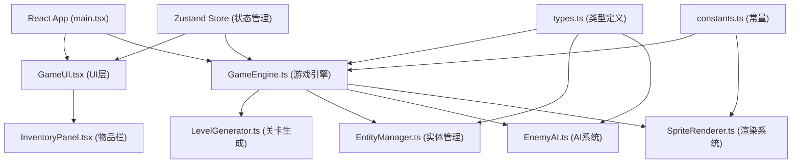

## 1. 架构设计



## 2. 技术描述

- **前端框架**：React@18 + TypeScript@5
- **构建工具**：Vite@5 + @vitejs/plugin-react@4
- **状态管理**：Zustand@4
- **渲染技术**：Canvas 2D API
- **游戏循环**：requestAnimationFrame，目标60fps
- **其他依赖**：uuid@9（唯一ID生成）
- **后端**：无（纯前端游戏）
- **数据库**：无（内存状态管理）

## 3. 目录结构

```
src/
├── main.tsx              # React入口
├── types.ts              # 类型定义
├── game/
│   ├── GameEngine.ts     # 游戏主引擎
│   ├── LevelGenerator.ts # 关卡生成器
│   └── EntityManager.ts  # 实体管理器
├── ai/
│   └── EnemyAI.ts        # 敌人AI系统
├── ui/
│   ├── GameUI.tsx        # 游戏UI组件
│   └── InventoryPanel.tsx # 物品栏组件
└── utils/
    ├── SpriteRenderer.ts # 精灵渲染器
    └── constants.ts      # 常量定义
```

## 4. 核心模块说明

### 4.1 GameEngine
- 游戏主循环控制（requestAnimationFrame）
- 帧率控制与deltaTime计算
- 输入事件监听（键盘WASD+空格）
- 碰撞检测系统
- 调度各模块更新

### 4.2 LevelGenerator
- 随机生成楼层布局
- 敌人、宝箱、陷阱位置计算
- 楼层渐变颜色生成
- 确保每层生成耗时<100ms

### 4.3 EntityManager
- 玩家、敌人、物品生命周期管理
- 实体属性更新
- 渲染调度
- 粒子效果管理

### 4.4 EnemyAI
- 史莱姆AI：每2秒随机跳向玩家
- 骷髅AI：水平巡逻，每1.5秒射骨箭
- 蝙蝠AI：正弦波Z字形飞行

### 4.5 SpriteRenderer
- 像素角色绘制
- 动画帧管理
- 等距视角坐标转换
- 特效渲染（剑光、粒子、闪光）

## 5. 状态管理（Zustand）

```typescript
interface GameState {
  // 玩家状态
  player: Player;
  // 楼层状态
  currentFloor: number;
  totalFloors: number;
  // 时间状态
  timeRemaining: number;
  isTimeWarning: boolean;
  // 实体状态
  enemies: Enemy[];
  chests: Chest[];
  traps: Trap[];
  items: Item[];
  // 游戏状态
  gameStatus: 'menu' | 'playing' | 'paused' | 'gameover' | 'victory';
  // 操作方法
  movePlayer: (direction: Direction) => void;
  attack: () => void;
  update: (deltaTime: number) => void;
  nextFloor: () => void;
  restart: () => void;
}
```

## 6. 性能优化
- 固定时间步长更新，插值渲染确保60fps
- 实体对象池复用，减少GC开销
- Canvas脏矩形渲染，仅重绘变化区域
- 楼层生成使用Web Worker（可选，确保<100ms）
- 粒子效果限制数量，自动回收
