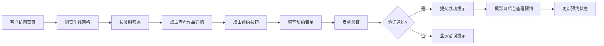

## 1. 产品概述

本产品为自由摄影师打造的在线作品集展示与客户预约管理系统，旨在帮助摄影师展示作品、管理客户预约请求，提升业务转化效率。目标用户包括摄影师（内容和订单管理者）及潜在客户（作品浏览者和预约者）。

产品核心价值在于通过精美的视觉展示吸引客户，并提供便捷的在线预约渠道，同时为摄影师提供后台订单管理功能。

## 2. 核心功能

### 2.1 用户角色

| 角色 | 注册方式 | 核心权限 |
|------|----------|----------|
| 客户 | 无需注册 | 浏览作品集、筛选作品、提交预约请求 |
| 摄影师 | 后台登录 | 查看所有预约、更新预约状态 |

### 2.2 功能模块

1. **作品集展示页**：作品瀑布流展示、类别筛选、大图详情模态框
2. **预约表单页**：客户信息收集、作品选择、日期选择、表单验证
3. **预约管理后台**：预约列表展示、状态标记管理

### 2.3 页面详情

| 页面名称 | 模块名称 | 功能描述 |
|----------|----------|----------|
| 作品集展示页 | 导航栏 | Logo、页面跳转、移动端汉堡菜单 |
| 作品集展示页 | 类别筛选 | 人像/风景/商业/活动四类标签切换，选中高亮 |
| 作品集展示页 | 作品网格 | 瀑布流布局，每列最小220px，间距12px，悬停上浮效果 |
| 作品集展示页 | 作品详情模态框 | 大图展示、作品信息、关闭动画 |
| 预约表单页 | 表单组件 | 姓名、邮箱、电话、作品多选、日期选择、补充说明 |
| 预约表单页 | 表单验证 | 必填项红色边框提示，提交前校验 |
| 预约表单页 | 成功提示 | 绿色成功动画，图标旋转缩放 |
| 预约管理后台 | 预约表格 | 客户信息、作品、日期、状态列表展示 |
| 预约管理后台 | 状态管理 | 标记为已联系/已确认，背景色渐变动画 |

## 3. 核心流程

客户浏览作品集 → 按类别筛选 → 点击查看详情 → 点击预约 → 填写表单 → 提交预约 → 摄影师后台查看 → 更新预约状态

## 4. 用户界面设计

### 4.1 设计风格
- **主色调**：深灰#1D3557（导航、标题）、亮红#E63946（按钮、选中状态）
- **背景色**：浅灰#F1FAEE
- **按钮风格**：圆角6px，红色主题，悬停亮度降低5%
- **字体**：优雅的衬线字体用于标题，简洁无衬线字体用于正文
- **布局风格**：卡片式布局，精细阴影，留白充足
- **图标风格**：简约线性图标，统一线条粗细

### 4.2 页面设计概览

| 页面名称 | 模块名称 | UI元素 |
|----------|----------|--------|
| 作品集展示页 | 作品网格 | 瀑布流布局、卡片悬浮上移4px、阴影加深、0.2s过渡 |
| 作品集展示页 | 筛选标签 | 圆角20px、选中背景#E63946白色文字、0.3s渐入切换 |
| 作品集展示页 | 模态框 | 半透明遮罩rgba(0,0,0,0.6)、内容圆角12px、关闭按钮悬停旋转90度0.3s |
| 预约表单页 | 表单控件 | 红色边框错误提示、输入框聚焦效果 |
| 预约表单页 | 日期选择器 | 限制今天起30天内可选 |
| 预约管理后台 | 状态变更 | 背景色渐变动画0.2s |
| 全站 | 页面切换 | 淡入淡出效果0.3s |

### 4.3 响应式设计
- **桌面端（>1024px）**：多列瀑布流，完整导航
- **平板端（768-1024px）**：两列网格
- **手机端（<768px）**：单列网格，汉堡菜单，表单全宽

### 4.4 动效规范
- 作品卡片悬浮：上移4px + 阴影加深，0.2s
- 筛选切换：内容渐入opacity 0→1，0.3s
- 关闭按钮：悬停旋转90度，0.3s
- 页面切换：淡入淡出，0.3s
- 状态变更：背景色渐变，0.2s
- 成功提示：图标旋转缩放动画
