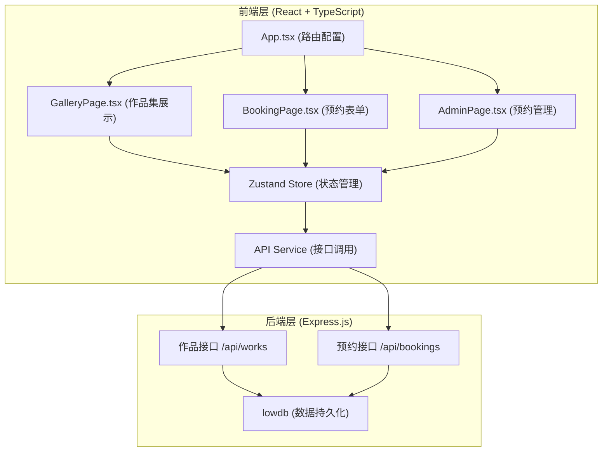
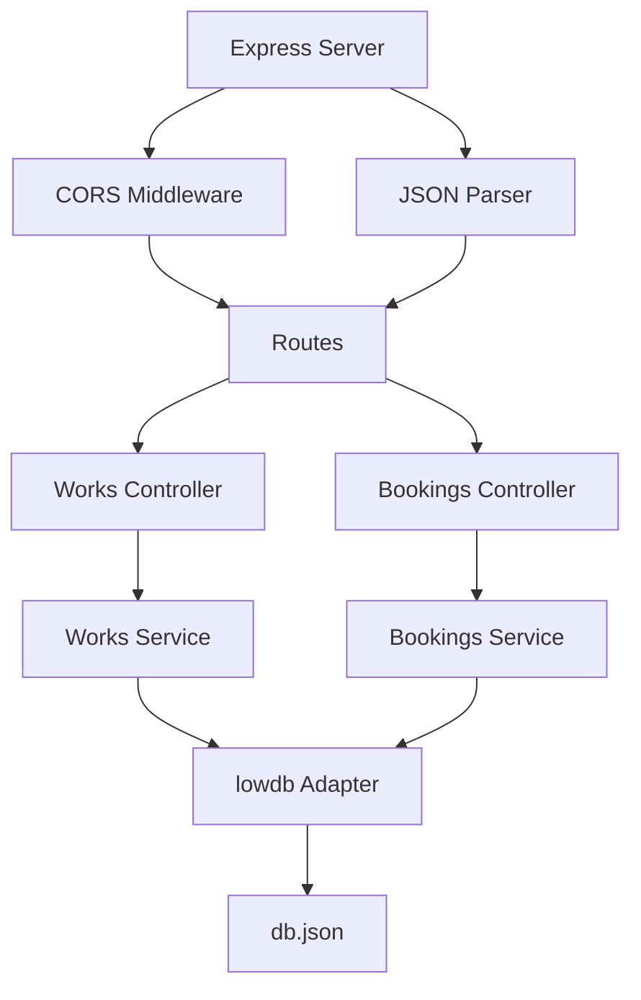
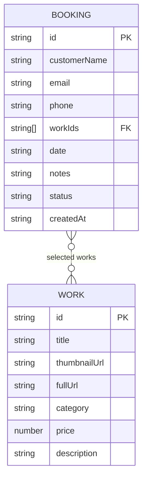

## 1. 架构设计



**调用关系与数据流向：**
1. `App.tsx` → 路由配置，挂载各页面组件
2. `GalleryPage.tsx` → 调用 Zustand Store 获取作品数据 → API Service → Express → lowdb
3. `BookingPage.tsx` → 表单数据 → Zustand Store → API Service → Express → lowdb
4. `AdminPage.tsx` → 调用 Zustand Store 获取预约列表 → API Service → Express → lowdb
5. 状态变更：Zustand Store 统一管理，组件订阅状态自动更新

## 2. 技术描述

- **前端框架**：React@18 + TypeScript@5
- **构建工具**：Vite@5 + @vitejs/plugin-react@4
- **路由管理**：react-router-dom@6
- **状态管理**：zustand@4
- **UI组件**：自定义CSS（无外部UI库）
- **后端框架**：Express@4
- **跨域处理**：cors@2
- **数据持久化**：lowdb@6 + FileSync
- **工具库**：uuid@9（ID生成）
- **初始化方式**：npm create vite@latest

## 3. 路由定义

| 路由 | 页面 | 说明 |
|------|------|------|
| `/` | GalleryPage | 作品集展示首页 |
| `/booking` | BookingPage | 预约表单页 |
| `/admin` | AdminPage | 预约管理后台 |
| `*` | GalleryPage | 404重定向到首页 |

## 4. API 定义

### 4.1 作品接口

**TypeScript 类型定义：**
```typescript
interface Work {
  id: string;
  title: string;
  thumbnailUrl: string;
  fullUrl: string;
  category: 'portrait' | 'landscape' | 'commercial' | 'event';
  price: number;
  description?: string;
}
```

**接口列表：**
- `GET /api/works` - 获取所有作品
- `GET /api/works?category=:category` - 按类别筛选作品
- `GET /api/works/:id` - 获取单个作品详情

### 4.2 预约接口

**TypeScript 类型定义：**
```typescript
interface Booking {
  id: string;
  customerName: string;
  email: string;
  phone: string;
  workIds: string[];
  date: string;
  notes: string;
  status: 'pending' | 'contacted' | 'confirmed';
  createdAt: string;
}

interface BookingRequest {
  customerName: string;
  email: string;
  phone: string;
  workIds: string[];
  date: string;
  notes: string;
}
```

**接口列表：**
- `GET /api/bookings` - 获取所有预约
- `POST /api/bookings` - 创建预约
- `PATCH /api/bookings/:id/status` - 更新预约状态

## 5. 服务端架构



## 6. 数据模型

### 6.1 实体关系图



### 6.2 数据库结构 (db.json)

```json
{
  "works": [
    {
      "id": "uuid-1",
      "title": "人像作品1",
      "thumbnailUrl": "https://.../thumb1.jpg",
      "fullUrl": "https://.../full1.jpg",
      "category": "portrait",
      "price": 500,
      "description": "..."
    }
  ],
  "bookings": [
    {
      "id": "uuid-2",
      "customerName": "张三",
      "email": "zhangsan@example.com",
      "phone": "13800138000",
      "workIds": ["uuid-1"],
      "date": "2026-06-20",
      "notes": "希望拍摄户外场景",
      "status": "pending",
      "createdAt": "2026-06-17T10:00:00Z"
    }
  ]
}
```

### 6.3 初始化数据

服务端启动时自动加载初始作品数据（共12件，每类3件），数据文件不存在时自动创建。

## 7. 文件结构

```
auto58/
├── package.json
├── vite.config.js
├── tsconfig.json
├── index.html
├── db.json                    # lowdb 数据文件
├── server/
│   └── index.js              # Express 服务端
└── src/
    ├── main.tsx              # React 入口
    ├── App.tsx               # 路由配置
    ├── store/
    │   └── useStore.ts       # Zustand 状态管理
    ├── services/
    │   └── api.ts            # API 服务层
    ├── components/
    │   ├── GalleryPage.tsx   # 作品集页面
    │   ├── BookingPage.tsx   # 预约页面
    │   ├── AdminPage.tsx     # 管理后台
    │   ├── Navbar.tsx        # 导航组件
    │   ├── WorkModal.tsx     # 作品详情模态框
    │   └── SuccessModal.tsx  # 成功提示模态框
    ├── types/
    │   └── index.ts          # TypeScript 类型定义
    └── styles/
        └── global.css        # 全局样式
```

## 8. 性能优化策略

1. **图片懒加载**：Intersection Observer API 实现
2. **数据缓存**：Zustand Store 缓存作品和预约数据
3. **虚拟滚动**：作品列表较多时考虑
4. **按需渲染**：筛选结果使用 CSS transition 而非重渲染
5. **防抖节流**：表单验证使用防抖
