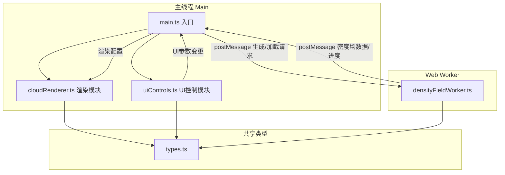

## 1. 架构设计



## 2. 技术描述

- **前端框架**：原生TypeScript + Three.js (无React/Vue，按用户指定文件结构)
- **构建工具**：Vite
- **3D渲染**：three，使用BufferGeometry优化性能
- **UI控件**：dat.gui + 原生DOM（进度条、标题、响应式抽屉）
- **色彩插值**：自定义HSL/线性插值 + 简易Tween动画
- **多线程**：Web Worker处理密度场计算，不阻塞主线程
- **等值面算法**：Marching Cubes (MC算法) 自实现

## 3. 文件结构

```
d:\Pro\tasks\auto59\
├── package.json
├── vite.config.js
├── tsconfig.json
├── index.html
└── src/
    ├── main.ts              # 场景初始化、数据流管理、相机控制
    ├── cloudRenderer.ts     # 三种渲染模式（点云/体素/等值面）
    ├── densityFieldWorker.ts # Web Worker: Perlin噪声/数据集生成
    ├── uiControls.ts        # dat.gui控制面板 + 原生UI元素
    └── types.ts             # 全局类型定义
```

## 4. 类型定义（types.ts）

```typescript
export type DensityField = Float32Array; // 长度 = size^3，值范围0-1

export type RenderMode = 'points' | 'voxels' | 'isosurface';

export type ColorMapMode = 'thermal' | 'rainbow' | 'monochrome';

export type DatasetType = 'taurus' | 'orion' | 'perlin';

export interface DensityFieldConfig {
  size: number;       // 网格尺寸，默认64
  dataset: DatasetType;
  seed?: number;
}

export interface RendererConfig {
  mode: RenderMode;
  threshold: number;          // 0.1-0.9
  colorMap: ColorMapMode;
  pointSize: number;          // 点云：3px
  voxelSize: number;          // 体素：2px
}

export interface UIParams {
  threshold: number;
  colorMap: ColorMapMode;
  renderMode: RenderMode;
  dataset: DatasetType;
}

export interface WorkerMessage {
  type: 'generate' | 'progress' | 'result' | 'error';
  config?: DensityFieldConfig;
  progress?: number;
  data?: DensityField;
  error?: string;
  size?: number;
}
```

## 5. 数据模型

### 5.1 密度场数据
- **存储格式**：`Float32Array`，扁平一维数组，索引 = `x + y * size + z * size * size`
- **尺寸**：64×64×64 = 262,144 个浮点数 ≈ 1MB
- **值范围**：归一化到 [0, 1]

### 5.2 三种数据集预设
| 数据集 | 生成方式 | 特征 |
|--------|---------|------|
| Taurus分子云 | 多层Perlin噪声 + 纤维状扭曲 | 拉长的丝状结构，密度集中于对角线区域 |
| Orion星云 | Perlin噪声 + 球形衰减 + 多峰值 | 团块状，中心高密度区域 |
| 自定义Perlin噪声 | 标准3D Perlin噪声 (4倍频) | 均匀分布的自然噪声 |
