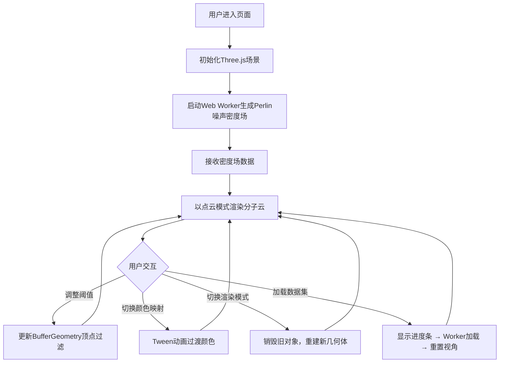

## 1. 产品概述

基于3D密度场的星际分子云交互可视化应用，面向天文爱好者和科研人员，通过沉浸式3D渲染探索分子云内部的纤维状结构。

- 支持预设数据集加载与手动生成Perlin噪声密度场
- 三种渲染模式（点云、体素、等值面）实时切换
- 实时调整密度阈值与颜色映射，毫秒级响应

## 2. 核心功能

### 2.1 功能模块
1. **3D场景渲染模块**：分子云主体渲染、背景星尘粒子、相机自动环绕
2. **数据处理模块**：Web Worker异步生成/加载密度场数据，进度反馈
3. **UI控制面板**：密度阈值滑块、颜色映射选择、渲染模式切换、数据集加载

### 2.2 页面详情
| 页面名称 | 模块名称 | 功能描述 |
|-----------|-------------|---------------------|
| 主页面 | 3D场景渲染 | 全屏Three.js场景，分子云居中渲染，背景星尘粒子环绕 |
| 主页面 | 控制面板 | 右上角半透明面板，包含所有交互控件 |
| 主页面 | 加载进度 | 数据集切换时显示顶部居中进度条 |
| 主页面 | 标题区域 | 左上角应用标题展示 |

## 3. 核心流程

用户进入页面后自动加载默认Perlin噪声密度场，以点云模式渲染。用户可通过控制面板实时调整密度阈值（<100ms响应）、切换颜色映射（0.5s平滑过渡）、切换渲染模式（200ms场景重建），或点击加载按钮切换不同数据集（显示进度条，完成后自动重置视角）。

## 4. 用户界面设计

### 4.1 设计风格
- **主色调**：深空主题，背景 `#0A0B10`，字体 `#E0E8F0`
- **辅助色**：面板背景 `#1A1D2E`，按钮背景 `#2A3B4C`，滑块轨道 `#2A3B4C`，滑块 `#6A8BAF`
- **进度条渐变**：`#00AAFF` → `#00FF88`
- **按钮风格**：圆角6px，悬浮 `#3A4B5C`，点击 `#1A2B3C`
- **字体**：系统无衬线字体，标题20px bold，正文14px
- **面板**：320px宽，12px内间距，圆角12px，阴影 `#00000060`

### 4.2 页面设计概述
| 页面名称 | 模块名称 | UI元素 |
|-----------|-------------|-------------|
| 主页面 | 3D场景 | 全屏暗色背景，居中分子云，底部星尘粒子缓慢旋转 |
| 主页面 | 标题 | 左上角 `#B0C4DE` 20px bold 标题文字 |
| 主页面 | 控制面板 | 右上角半透明面板，包含滑块、下拉、按钮，12px间距 |
| 主页面 | 进度条 | 顶部居中300px宽度，渐变填充，20px顶部间距 |
| 主页面 | 响应式抽屉 | <768px时控制面板折叠为可展开抽屉 |

### 4.3 响应式
- 桌面优先设计
- 小屏（<768px）：控制面板折叠为抽屉，展开时不遮挡场景
- 3D画布自适应窗口大小

### 4.4 3D场景指引
- **环境**：深空暗色背景 `#0A0B10`，无HDRI，底部500个星尘粒子
- **光照**：点云模式无光照；体素模式Lambert光照；等值面模式Phong光泽光照
- **相机**：PerspectiveCamera，初始位置 `(80,60,80)`，Y轴环绕角速度0.001 rad/frame，Ctrl+左键拖拽暂停
- **动画**：相机自动环绕、颜色映射Tween过渡（0.5s）、场景模式切换（200ms重建）

## 5. 性能指标

| 指标 | 要求 |
|------|------|
| 点云模式帧率 | ≥55 FPS |
| 体素模式帧率 | ≥40 FPS |
| 等值面模式帧率 | ≥30 FPS |
| 数据集加载时间 | ≤3秒 |
| 运行时内存 | ≤500MB |
| 阈值调整响应延迟 | ≤100ms |
