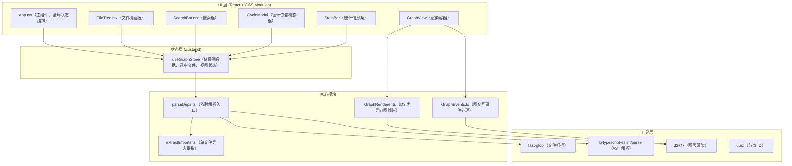

## 1. 架构设计



## 2. 技术说明

- **前端框架**：React@18 + TypeScript（严格模式）
- **构建工具**：Vite@5 + @vitejs/plugin-react，路径别名 `@` 指向 `src`
- **状态管理**：Zustand（轻量级、无 Provider 嵌套）
- **图表渲染**：D3.js v7（力导向模拟 + SVG/Canvas 绘制）
- **依赖解析**：fast-glob（文件扫描）+ @typescript-eslint/parser（TS/JS AST 解析）
- **UI 样式**：CSS Modules（零外部 UI 库）+ 全局 CSS 变量（Catppuccin Mocha）
- **工具库**：uuid（节点唯一 ID 生成）

## 3. 路由定义

| 路由 | 用途 |
|------|------|
| / | 主页面，包含文件树 + 依赖图 + 搜索 + 统计 |

本工具为单页应用（SPA），无多级路由，内部通过 Zustand 管理视图下钻状态（面包屑导航）。

## 4. 核心数据结构

```typescript
// 导入类型
type ImportType = 'internal' | 'external' | 'namespace';

// 单个导入关系
interface ImportInfo {
  path: string;
  resolvedPath?: string;
  type: ImportType;
  named: string[];
  default?: string;
}

// 文件节点
interface FileNode {
  id: string;           // uuid
  path: string;         // 相对项目根路径
  isDirectory: boolean;
  children?: FileNode[];
  imports: ImportInfo[];
  importedBy: string[]; // 引用该文件的其他文件 ID
}

// 依赖边
interface DepEdge {
  id: string;
  source: string;       // 文件节点 ID
  target: string;
  type: ImportType;
}

// 依赖图数据
interface DepGraph {
  nodes: FileNode[];
  edges: DepEdge[];
  cycles: string[][];   // 循环依赖链（文件路径数组）
  rootPath: string;
}

// Zustand Store
interface GraphState {
  graph: DepGraph | null;
  selectedFileId: string | null;
  breadcrumbs: string[]; // 文件 ID 路径栈
  searchQuery: string;
  showFileTree: boolean;
  showCycleModal: boolean;
  loading: boolean;
  setGraph: (g: DepGraph) => void;
  selectFile: (id: string) => void;
  drillDown: (id: string) => void;
  goBack: (level?: number) => void;
  setSearch: (q: string) => void;
  toggleFileTree: () => void;
  toggleCycleModal: () => void;
  parseProject: (rootPath: string) => Promise<void>;
}
```

## 5. 模块职责

| 文件 | 职责 |
|------|------|
| `src/modules/parser/parseDeps.ts` | 项目入口：扫描文件 → 逐文件解析 → 构建图 → 检测循环依赖 |
| `src/modules/parser/extractImports.ts` | 单文件解析：AST 遍历提取所有 import 语句，识别 import 类型 |
| `src/modules/graph/GraphRenderer.ts` | D3 封装：力导向模拟初始化、节点/边渲染、缩放、入场动画 |
| `src/modules/graph/GraphEvents.ts` | 交互事件：节点拖拽、点击选中、双击下钻、缩放回调 |
| `src/components/FileTree.tsx` | 递归渲染文件树、展开折叠、三角旋转动画、选中状态 |
| `src/components/SearchBar.tsx` | 防抖输入、匹配文本高亮、查询过滤 |
| `src/App.tsx` | 左右布局、汉堡菜单、面包屑、统计条、模态框组合 |
| `src/styles/theme.css` | 全局 CSS 变量（Catppuccin Mocha）、布局基础样式、动画 keyframes |
