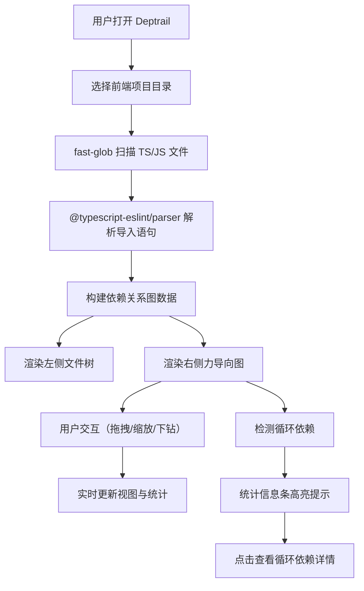

## 1. 产品概述

Deptrail 是一款面向前端开发者的代码依赖可视化分析工具，通过静态分析解析 TS/JS 文件间的导入导出关系，并以可交互的力导向图呈现，帮助开发者快速理解项目模块结构和依赖关系。

- 核心目标：降低大型前端项目的理解成本，加速新成员上手和代码重构决策
- 目标用户：前端工程师、技术负责人、架构师

## 2. 核心功能

### 2.1 用户角色

| 角色 | 注册方式 | 核心权限 |
|------|----------|----------|
| 开发者 | 无需注册，本地工具 | 项目解析、依赖浏览、循环依赖检测 |

### 2.2 功能模块

1. **文件树面板**：可展开折叠的目录结构展示，支持文件节点快速定位
2. **依赖关系图**：基于 D3.js 的力导向图，支持拖拽、缩放、下钻导航
3. **搜索过滤**：按文件名或导入路径快速搜索定位
4. **统计信息**：实时展示文件数、依赖数、循环依赖数及详情
5. **循环依赖检测**：自动识别并高亮循环依赖链

### 2.3 页面详情

| 页面名称 | 模块名称 | 功能描述 |
|----------|----------|----------|
| 主页面 | 文件树面板 | 左侧 320px 宽，展示项目目录结构，支持展开折叠，点击文件切换依赖视图 |
| 主页面 | 搜索框 | 右侧顶部，支持文件名和导入路径搜索，防抖过滤，输入高亮匹配 |
| 主页面 | 依赖关系图 | 右侧核心区域，Canvas/D3 力导向图，节点拖拽、滚轮缩放、双击下钻 |
| 主页面 | 面包屑导航 | 下钻时显示层级路径，点击返回上层 |
| 主页面 | 统计信息条 | 右侧底部，实时统计文件/依赖/循环依赖数，循环依赖高亮闪烁 |
| 主页面 | 循环依赖模态框 | 点击循环依赖数弹出，展示所有循环依赖链 |

## 3. 核心流程

用户打开工具 → 选择项目目录 → 工具解析所有 TS/JS 文件 → 构建依赖图 → 渲染文件树和概览图 → 用户点击文件/搜索/拖拽节点/下钻 → 实时更新视图和统计数据。

## 4. 用户界面设计

### 4.1 设计风格

- **配色方案**：Catppuccin Mocha 深色主题（背景 #1E1E2E，面板 #181825，交互元素 #CBA6F7）
- **依赖边颜色**：内部模块 #A6E3A1、外部包 #89B4FA、命名空间 #F38BA8
- **圆角规范**：面板 8px、输入框 6px、模态框 12px
- **字体**：等宽字体（代码感）+ 现代无衬线字体混合
- **图标风格**：Emoji 图标（📁 文件夹 / 📄 文件）
- **动画**：节点淡入 500ms、三角旋转 0.2s ease、悬浮高亮 #CBA6F7

### 4.2 页面设计概览

| 页面名称 | 模块名称 | UI 元素 |
|----------|----------|---------|
| 主页面 | 文件树面板 | 320px 宽左栏、深色背景 #181825、圆角 8px、展开三角旋转动画、Emoji 图标 |
| 主页面 | 搜索框 | 圆角 6px、背景 #313244、聚焦边框 #89B4FA、输入文本高亮 |
| 主页面 | 依赖关系图 | D3 力导向、箭头有向边、节点拖拽、0.5x-3x 滚轮缩放、双击下钻、入场动画 |
| 主页面 | 统计信息条 | 高度 40px、背景 #45475A、底部圆角 8px、循环依赖红色 #F38BA8 闪烁 |
| 主页面 | 循环依赖模态框 | 居中、背景 #1E1E2E、圆角 12px、阴影 #00000050、展示循环链列表 |

### 4.3 响应式

- 桌面优先（768px - 1920px 自适应）
- 窄屏（< 768px）：左侧文件树自动隐藏，左上角汉堡菜单（28px、z-index 100）控制显隐
- 图表区域自适应容器尺寸

### 4.4 性能指标

- 100 文件解析耗时 ≤ 3 秒
- 图表交互帧率 ≥ 45fps
