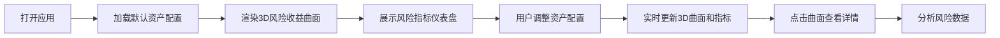

## 1. 产品概述

金融风险可视化沙盒是一个面向投资分析师的实时可视化工具，解决多资产组合收益分布与风险暴露难以直观理解的问题。通过3D风险收益曲面、动态粒子效果和多维度风险指标仪表盘，帮助用户快速把握资产相关性、VaR（风险价值）和压力测试结果。

- 目标用户：投资分析师、风险管理师、资产配置专员
- 核心价值：将抽象的金融风险数据转化为沉浸式3D可视化体验，提升风险决策效率

## 2. 核心功能

### 2.1 用户角色
| 角色 | 注册方式 | 核心权限 |
|------|----------|----------|
| 投资分析师 | 无需注册，本地应用 | 资产配置、风险分析、压力测试 |

### 2.2 功能模块
1. **资产配置面板**：资产列表管理、权重调节、收益率/波动率配置
2. **3D风险收益曲面**：时间-价值-概率三维曲面渲染、动态波光效果、粒子系统
3. **风险指标仪表盘**：年化波动率、最大回撤、相关系数矩阵、压力测试结果
4. **详情弹出层**：点击曲面查看具体数据点详情

### 2.3 页面详情
| 页面名称 | 模块名称 | 功能描述 |
|----------|----------|----------|
| 主界面 | 资产配置面板 | 左侧300px宽面板，支持添加股票/债券/商品资产，滑块调节权重，输入框配置回报率和波动率 |
| 主界面 | 3D风险曲面 | 中央主场景，Three.js渲染100x100网格曲面，支持鼠标拖拽旋转、滚轮缩放、点击交互 |
| 主界面 | 风险指标面板 | 右侧280px宽面板，四个仪表盘组件展示核心风险指标 |
| 主界面 | 详情弹出层 | 点击曲面触发，显示日期、组合价值、VaR、夏普比率 |

## 3. 核心流程

用户打开应用 → 查看默认资产配置的3D风险曲面 → 在左侧面板添加/调整资产权重 → 实时查看3D曲面和风险指标变化 → 点击曲面特定点查看详细数据 → 在右侧面板分析各项风险指标

## 4. 用户界面设计

### 4.1 设计风格
- **主色调**：深色主题，背景#0D0B1A，面板#1F1B36，卡片#2A2545
- **强调色**：股票#FF6B6B，债券#4ECDC4，商品#FFE66D，收益高#00D2FF，收益低#FF0050
- **布局**：CSS Grid三栏布局（300px 1fr 280px）
- **圆角**：主场景12px，面板10px，组件8px
- **字体**：现代无衬线字体，清晰的层级结构
- **动效**：ease-out 0.2s过渡，面板折叠0.3s动画，详情弹出0.3s cubic-bezier滑入

### 4.2 页面设计概述
| 页面名称 | 模块名称 | UI元素 |
|----------|----------|--------|
| 主界面 | 资产配置面板 | 深色卡片式布局、左侧色条标识资产类型、滑块权重调节、悬浮上浮效果 |
| 主界面 | 3D风险曲面 | 渐变色曲面、动态波光粒子、轨道控制器、半透明遮罩+详情弹出层 |
| 主界面 | 风险指标面板 | 半圆进度条、环形进度条、热力图、条形图、可折叠按钮 |

### 4.3 响应性
- Desktop-first设计，全屏应用
- 左右面板可折叠，主场景自动扩展
- 触控设备支持手势操作

### 4.4 3D场景指导
- **环境**：深色太空感背景，营造专业金融科技氛围
- **光照**：环境光+方向性光，突出曲面立体感
- **相机**：透视相机，初始视角45°俯角
- **交互**：OrbitControls轨道控制，Y轴360°旋转，X轴-60°到60°，缩放0.3x到3x
- **动效**：顶点波动0.05幅度、0.1Hz频率，粒子流动速度2px/s
- **性能**：稳定55fps以上，曲面重建≤300ms
