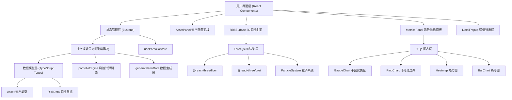
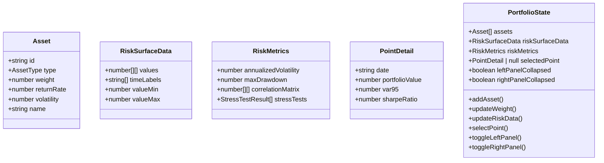

## 1. 架构设计



## 2. 技术描述

- **前端框架**: React 18 + TypeScript
- **构建工具**: Vite
- **3D渲染**: Three.js + @react-three/fiber + @react-three/drei
- **图表库**: D3.js v7
- **状态管理**: Zustand
- **样式方案**: CSS Modules
- **唯一ID**: uuid
- **开发模式**: 纯前端应用，无后端依赖，数据本地模拟

## 3. 项目结构

```
src/
├── main.tsx                    # React入口
├── styles/
│   └── global.css              # 全局样式
├── store/
│   └── usePortfolioStore.ts    # Zustand状态管理
├── utils/
│   ├── portfolioEngine.ts      # 风险计算纯函数
│   └── generateRiskData.ts     # 风险数据生成
└── modules/
    ├── asset-panel/
    │   ├── AssetPanel.tsx      # 资产配置面板
    │   ├── AssetCard.tsx       # 资产卡片组件
    │   └── AssetPanel.module.css
    ├── risk-3d/
    │   ├── RiskSurface.tsx     # 3D风险曲面
    │   ├── ParticleSystem.ts   # 粒子系统模块
    │   └── RiskSurface.module.css
    └── risk-metrics/
        ├── MetricsPanel.tsx    # 风险指标面板
        ├── GaugeChart.tsx      # 半圆仪表盘
        ├── RingChart.tsx       # 环形进度条
        ├── Heatmap.tsx         # 热力图
        └── MetricsPanel.module.css
```

## 4. 数据模型

### 4.1 数据模型定义



### 4.2 TypeScript类型定义

```typescript
type AssetType = 'stock' | 'bond' | 'commodity';

interface Asset {
  id: string;
  type: AssetType;
  name: string;
  weight: number;
  returnRate: number;
  volatility: number;
}

interface RiskSurfaceData {
  grid: number[][];
  timeLabels: string[];
  valueRange: [number, number];
  probabilityRange: [number, number];
}

interface RiskMetrics {
  annualizedVolatility: number;
  maxDrawdown: number;
  correlationMatrix: number[][];
  stressTests: { name: string; impact: number }[];
}

interface PointDetail {
  date: string;
  portfolioValue: number;
  var95: number;
  sharpeRatio: number;
}
```

## 5. 状态管理

使用Zustand管理全局状态，包含：
- 资产列表及配置
- 风险曲面数据
- 风险指标数据
- 选中点详情
- 面板折叠状态

## 6. 性能优化策略

1. **3D渲染优化**: 使用BufferGeometry减少draw call，粒子系统使用Points
2. **数据计算优化**: 风险计算使用纯函数，支持memoization
3. **React渲染优化**: 使用useMemo/useCallback减少重渲染
4. **动画优化**: 统一requestAnimationFrame循环，避免多个独立定时器
5. **曲面重建**: 100x100网格重建控制在300ms以内
