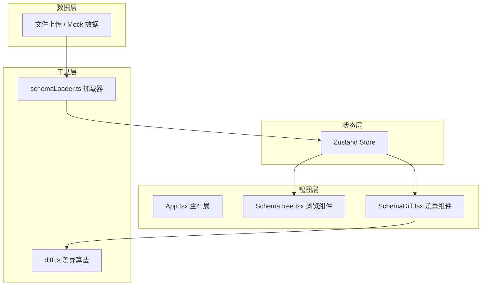

# JSON Schema 浏览与差异对比应用 - 技术架构文档

## 1. 架构设计



## 2. 技术栈说明

| 层级 | 技术选型 | 版本 | 说明 |
|-----|---------|------|-----|
| 框架 | React | 18.x | 组件化 UI 库 |
| 语言 | TypeScript | 5.x | 类型安全 |
| 构建工具 | Vite | 5.x | 快速开发构建 |
| 状态管理 | Zustand | 4.x | 轻量级状态管理 |
| 工具库 | uuid | 9.x | 生成唯一标识 |
| 样式 | 原生 CSS | - | CSS Modules / 内联样式 |

## 3. 文件结构

```
src/
├── main.tsx              # 应用入口
├── App.tsx               # 主布局组件
├── components/
│   ├── SchemaTree.tsx    # Schema 树形浏览组件（递归）
│   ├── SchemaDiff.tsx    # Schema 差异对比组件
│   └── TreeNode.tsx      # 树节点子组件（可选拆分）
├── utils/
│   ├── diff.ts           # 深度优先 diff 算法
│   └── schemaLoader.ts   # Schema 加载工具
├── store/
│   └── useSchemaStore.ts # Zustand 状态管理
├── types/
│   └── schema.ts         # 类型定义
└── styles/
    └── index.css         # 全局样式
```

### 调用关系与数据流向

1. **main.tsx** → 挂载 **App.tsx**
2. **App.tsx** → 引入并布局 **SchemaTree**（左）和 **SchemaDiff**（右）
3. **SchemaTree** → 从 **useSchemaStore** 获取 schemas 列表，调用 **schemaLoader** 加载文件
4. **SchemaTree** → 用户选中 schema 时，更新 store 中的 oldSchema / newSchema
5. **SchemaDiff** → 从 store 获取 oldSchema / newSchema，调用 **diff** 函数计算差异
6. **diff.ts** → 纯函数，接收两个对象，返回差异数组

## 4. 核心数据结构

### 4.1 Schema 对象类型

```typescript
interface JSONSchema {
  title?: string;
  type?: string;
  properties?: Record<string, JSONSchema>;
  items?: JSONSchema;
  description?: string;
  [key: string]: any;
}
```

### 4.2 Diff 结果类型

```typescript
type DiffType = 'add' | 'remove' | 'modify';

interface DiffResult {
  type: DiffType;
  path: string[];
  oldValue?: any;
  newValue?: any;
}
```

### 4.3 Store 状态

```typescript
interface SchemaState {
  schemas: { id: string; name: string; schema: JSONSchema }[];
  selectedOldId: string | null;
  selectedNewId: string | null;
  selectedFieldPath: string[] | null;
  addSchema: (name: string, schema: JSONSchema) => void;
  selectOldSchema: (id: string) => void;
  selectNewSchema: (id: string) => void;
  selectField: (path: string[]) => void;
}
```

## 5. 核心算法

### 5.1 深度优先 Diff 算法

- 递归遍历两个对象的所有键
- 对比每个键的值：
  - 仅在旧对象存在 → 'remove'
  - 仅在新对象存在 → 'add'
  - 两者都存在且值不同 → 若为对象则递归，若为原始值则 'modify'
- 使用 path 数组记录当前路径
- 时间复杂度：O(n)，n 为节点总数

### 5.2 树形渲染性能优化

- 递归组件按需渲染子节点（仅展开时渲染）
- 使用 React.memo 避免不必要的重渲染
- 大数据量下采用虚拟滚动（如超出性能预算）

## 6. 性能指标

| 指标 | 目标 | 实现策略 |
|-----|------|---------|
| 2000+ 字段渲染 | ≤ 500ms | 懒加载子节点 + memo 优化 |
| 500+ 字段 Diff | ≤ 200ms | 纯函数深度优先递归 |
| 动画流畅度 | 60fps | CSS transition + GPU 加速 |
