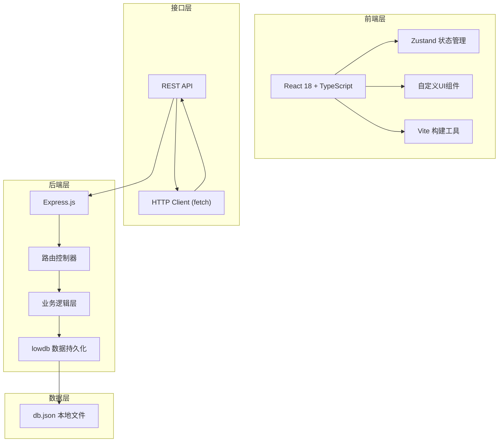
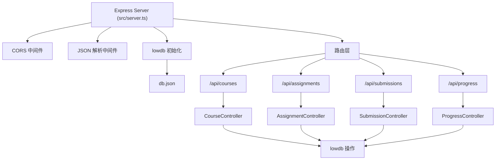

## 1. 架构设计



---

## 2. 技术描述

### 2.1 前端技术栈
- **框架**：React 18 + TypeScript（严格模式）
- **构建工具**：Vite 5.x
- **状态管理**：Zustand 4.x
- **语言标准**：ES2020
- **样式方案**：纯CSS（CSS Modules + CSS Variables），不使用任何UI组件库

### 2.2 后端技术栈
- **框架**：Express.js 4.x
- **数据库**：lowdb 6.x（基于文件的JSON数据库）
- **跨域**：cors 中间件
- **唯一标识**：uuid 库

### 2.3 核心依赖

```json
{
  "dependencies": {
    "react": "^18.2.0",
    "react-dom": "^18.2.0",
    "zustand": "^4.5.0",
    "uuid": "^9.0.0",
    "express": "^4.18.0",
    "cors": "^2.8.5",
    "lowdb": "^6.1.0"
  },
  "devDependencies": {
    "typescript": "^5.0.0",
    "vite": "^5.0.0",
    "@vitejs/plugin-react": "^4.2.0"
  }
}
```

---

## 3. 项目结构

```
auto66/
├── .trae/documents/
│   ├── PRD.md           # 产品需求文档
│   └── TECH_ARCH.md     # 技术架构文档
├── index.html           # 入口HTML
├── package.json         # 项目依赖
├── tsconfig.json        # TypeScript配置
├── vite.config.js       # Vite配置
└── src/
    ├── server.ts        # Express后端服务
    ├── store.ts         # Zustand状态管理
    ├── types.ts         # 全局类型定义
    ├── main.tsx         # React入口
    ├── App.tsx          # 主应用组件
    ├── styles/
    │   └── variables.css # CSS变量定义
    └── components/
        ├── CoursePanel.tsx      # 左侧课程树面板
        ├── AssignmentCard.tsx   # 作业卡片组件
        ├── ProgressDashboard.tsx # 学生进度仪表板
        ├── GradingView.tsx      # 批改视图组件
        ├── Button.tsx           # 自定义按钮
        ├── Input.tsx            # 自定义输入框
        ├── Spinner.tsx          # 加载指示器
        └── SuccessToast.tsx     # 成功提示组件
```

---

## 4. API 定义

### 4.1 类型定义

```typescript
// 章节节点（支持无限嵌套）
interface Chapter {
  id: string;
  name: string;
  order: number;
  children: Chapter[];
  expanded?: boolean;
}

// 课程
interface Course {
  id: string;
  title: string;
  chapters: Chapter[];
  createdAt: number;
}

// 作业
interface Assignment {
  id: string;
  chapterId: string;
  title: string;
  description: string;
  attachmentUrl?: string;
  createdAt: number;
}

// 学生作业提交
interface Submission {
  id: string;
  assignmentId: string;
  studentId: string;
  studentName: string;
  content: string;
  fileUrl?: string;
  submittedAt: number;
  status: 'pending' | 'graded';
  grade?: number;
  feedback?: string;
  gradedAt?: number;
}

// 学生进度
interface StudentProgress {
  studentId: string;
  studentName: string;
  chapters: {
    chapterId: string;
    chapterName: string;
    completion: number; // 0-100
  }[];
  recentGraded: Submission[];
}
```

### 4.2 接口列表

| 方法 | 路径 | 描述 | 请求体 | 响应 |
|------|------|------|--------|------|
| GET | `/api/courses` | 获取所有课程 | - | `Course[]` |
| POST | `/api/courses` | 创建新课程 | `{ title: string }` | `Course` |
| PUT | `/api/courses/:id/chapter` | 新增/更新章节 | `{ chapter: Chapter, parentId?: string }` | `Course` |
| DELETE | `/api/courses/:courseId/chapter/:chapterId` | 删除章节 | - | `{ success: boolean }` |
| PUT | `/api/courses/:id/reorder` | 重新排序章节 | `{ chapters: Chapter[] }` | `Course` |
| POST | `/api/assignments` | 发布作业 | `{ chapterId, title, description, attachmentUrl? }` | `Assignment` |
| GET | `/api/assignments/:chapterId` | 获取章节作业列表 | - | `Assignment[]` |
| GET | `/api/submissions/:assignmentId` | 获取作业提交列表 | - | `Submission[]` |
| POST | `/api/submissions` | 学生提交作业 | `{ assignmentId, studentId, studentName, content, fileUrl? }` | `Submission` |
| PUT | `/api/submissions/:id/grade` | 批改作业 | `{ grade: number, feedback: string }` | `Submission` |
| GET | `/api/progress/:studentId` | 获取学生进度 | - | `StudentProgress` |

---

## 5. 服务器架构



---

## 6. 状态管理设计（Zustand Store）

```typescript
interface AppState {
  // 课程相关
  courses: Course[];
  selectedCourseId: string | null;
  selectedChapterId: string | null;
  loadingCourses: boolean;
  
  // 作业相关
  assignments: Assignment[];
  submissions: Submission[];
  selectedSubmission: Submission | null;
  loadingAssignments: boolean;
  loadingSubmissions: boolean;
  
  // 进度相关
  currentStudentProgress: StudentProgress | null;
  loadingProgress: boolean;
  
  // 操作状态
  isSaving: boolean;
  successMessage: string | null;
  
  // Actions
  fetchCourses: () => Promise<void>;
  createCourse: (title: string) => Promise<void>;
  addChapter: (courseId: string, chapter: Chapter, parentId?: string) => Promise<void>;
  updateChapterName: (courseId: string, chapterId: string, name: string) => Promise<void>;
  reorderChapters: (courseId: string, chapters: Chapter[]) => Promise<void>;
  deleteChapter: (courseId: string, chapterId: string) => Promise<void>;
  selectChapter: (chapterId: string | null) => void;
  toggleChapterExpand: (courseId: string, chapterId: string) => void;
  
  fetchAssignments: (chapterId: string) => Promise<void>;
  createAssignment: (data: Omit<Assignment, 'id' | 'createdAt'>) => Promise<void>;
  
  fetchSubmissions: (assignmentId: string) => Promise<void>;
  submitAssignment: (data: Omit<Submission, 'id' | 'submittedAt' | 'status'>) => Promise<void>;
  gradeSubmission: (submissionId: string, grade: number, feedback: string) => Promise<void>;
  selectSubmission: (submission: Submission | null) => void;
  
  fetchProgress: (studentId: string) => Promise<void>;
  
  setSuccessMessage: (msg: string | null) => void;
}
```

---

## 7. 性能优化策略

| 优化点 | 策略 |
|--------|------|
| 初始加载 | 接口数据预加载，骨架屏占位，避免布局偏移 |
| 列表渲染 | React.memo 优化组件重渲染，虚拟滚动处理长列表 |
| 状态更新 | Zustand 选择器（selectors）细粒度订阅，避免不必要重渲染 |
| 拖拽优化 | requestAnimationFrame 节流，transform 而非 top/left |
| 动画性能 | 优先使用 transform 和 opacity 属性，开启 GPU 加速 |
| 网络请求 | 接口防抖合并，数据本地缓存，乐观更新 UI |
| 定时刷新 | 相对时间计算节流（每30秒更新一次即可） |

---

## 8. 构建与运行

- **安装依赖**：`npm install`
- **启动开发**：`npm run dev`（同时启动 Vite 前端和 Express 后端）
- **访问地址**：`http://localhost:5173`
- **后端端口**：`3001`（Vite 代理配置）
