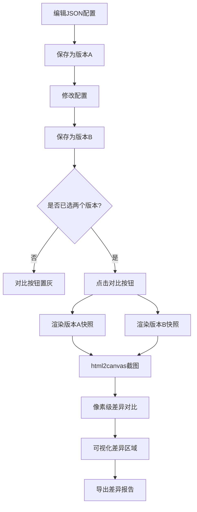

## 1. 产品概述

UI组件回归测试与视觉差异对比应用，面向UI设计师和前端开发团队，解决多轮迭代中组件视觉一致性校验的痛点。用户通过JSON配置描述组件，系统渲染为DOM快照后进行像素级差异对比，并导出结构化差异报告，让视觉回归问题在交付前被精准捕获。

## 2. 核心功能

### 2.1 功能模块

1. **组件渲染模块**：将JSON描述的组件配置解析为真实DOM节点，支持Button、Card、Input三种组件类型，使用React.createElement动态创建并挂载
2. **差异对比模块**：对同一组件的两个版本截图进行像素级RGBA遍历比较，阈值容忍度10，标记差异像素并输出差异区域边界框和差异百分比
3. **配置编辑模块**：提供JSON编辑器，支持语法高亮、实时校验、错误提示
4. **版本管理模块**：保存/加载版本A和版本B的配置，含预览缩略图和版本切换
5. **差异报告导出模块**：将差异结果导出为JSON文件下载

### 2.2 页面详情

| 页面名称 | 模块名称 | 功能描述 |
|---------|---------|---------|
| 主页面 | 左侧面板-配置编辑器 | JSON编辑器输入组件描述，实时语法校验，关键字蓝色#569CD6高亮，字符串绿色#CE9178高亮，非法JSON显示红色错误提示 |
| 主页面 | 左侧面板-版本管理 | 保存版本A/B按钮，版本缩略图预览(120x80px)，版本列表水平排列，选中高亮蓝色边框，点击版本加载配置 |
| 主页面 | 右侧面板-差异可视化 | 叠加显示两张快照，差异区域红色半透明蒙层#FF000040覆盖，红色实线1px边缘，悬浮tooltip显示坐标和RGB差值，缩放滑块1x-4x |
| 主页面 | 右侧面板-操作栏 | 对比按钮(#FA8C16)和导出报告按钮(#52C41A)，未选两版本时对比按钮置灰 |

## 3. 核心流程

用户在左侧JSON编辑器中编写组件配置 → 保存为版本A → 修改配置后保存为版本B → 点击对比按钮 → 系统分别渲染版本A和B为DOM快照 → 使用html2canvas截图 → 像素级对比生成差异图 → 在右侧可视化展示差异区域 → 用户可导出差异报告JSON文件

## 4. 用户界面设计

### 4.1 设计风格

- **主色调**：背景#F5F7FA，左侧面板#F0F2F5，强调色#1890FF
- **按钮风格**：圆角6px，过渡0.2s ease，主按钮#1890FF，对比按钮#FA8C16，导出按钮#52C41A
- **字体**：-apple-system, BlinkMacSystemFont, Segoe UI, Roboto，字号14px，行高1.6
- **布局**：左右两栏，左侧320px固定，右侧自适应（最少600px）
- **风格定位**：工业/工具型，注重功能性和信息密度，视觉简洁精准

### 4.2 页面设计概览

| 页面名称 | 模块名称 | UI元素 |
|---------|---------|--------|
| 主页面 | 左侧面板 | 280px宽编辑区域，背景#F0F2F5，圆角8px，JSON编辑器带语法高亮，底部版本列表 |
| 主页面 | 右侧面板 | 自适应宽度，差异画布区域，顶部操作栏和缩放滑块，差异区域红色蒙层覆盖 |
| 主页面 | 错误提示 | 红色背景#FFDCDC，文字#F44747，圆角4px，内边距8px |
| 主页面 | 版本缩略图 | 120x80px，圆角6px，边框#D9D9D9，选中时蓝色边框2px |

### 4.3 响应式设计

- 桌面优先（>800px）：左右两栏布局
- 移动端（<800px）：左侧面板收缩为可折叠抽屉，默认隐藏，点击汉堡按钮（#1A1A2E）从左侧滑出
- 缩放滑块确保在小屏幕上仍可操作差异画布

### 4.4 性能要求

- 像素对比操作：800x600截图在200ms内完成
- 完整渲染流程（点击对比→显示差异）：不超过500ms
- 使用Web Worker或requestAnimationFrame优化像素遍历性能
