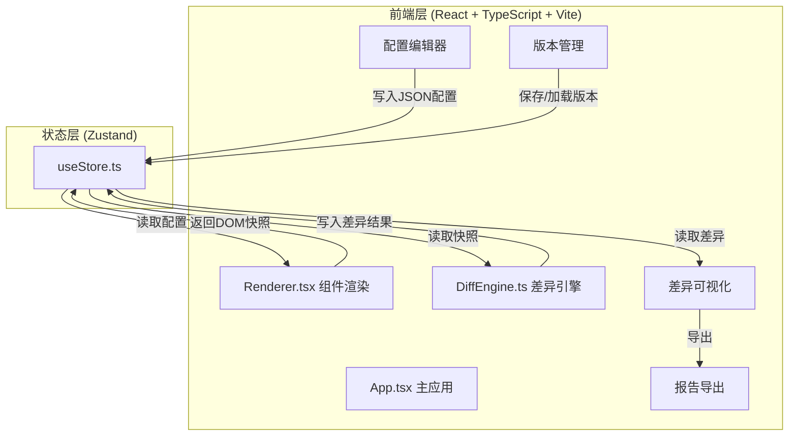

## 1. 架构设计



## 2. 技术选型

- **前端框架**：React@18 + TypeScript（严格模式，ES模块）
- **构建工具**：Vite + @vitejs/plugin-react
- **状态管理**：Zustand
- **截图工具**：html2canvas
- **唯一ID**：uuid
- **样式方案**：CSS Modules + CSS变量（遵循用户指定的精确颜色值）
- **无后端**：纯前端应用，所有数据存储在Zustand store中

## 3. 路由定义

| 路由 | 用途 |
|------|------|
| / | 主页面，包含组件配置编辑、版本管理、差异对比和报告导出 |

单页应用，无多路由需求。

## 4. 文件结构与调用关系

```
├── package.json              # 依赖和脚本
├── vite.config.ts            # Vite配置，设置resolve别名@
├── tsconfig.json             # TypeScript严格模式
├── index.html                # 入口HTML
├── src/
│   ├── main.tsx              # ReactDOM渲染入口 → App
│   ├── App.tsx               # 主应用，左右两栏布局
│   │                         # 数据流：store配置 → Renderer渲染 → DiffEngine对比 → store更新
│   ├── modules/
│   │   ├── renderer/
│   │   │   └── Renderer.tsx  # 组件渲染模块
│   │   │                     # 输入：JSON配置 → 解析组件类型/props/children
│   │   │                     # 输出：挂载到ref的DOM节点
│   │   │                     # 调用：React.createElement动态创建
│   │   └── diff/
│   │       └── DiffEngine.ts # 差异对比模块
│   │                         # 输入：两个canvas截图对象
│   │                         # 处理：逐像素RGBA比较，阈值10
│   │                         # 输出：差异坐标数组、差异率、边界框列表
│   ├── stores/
│   │   └── useStore.ts       # Zustand store
│   │                         # 状态：versionA/B配置、渲染快照、差异结果、基准版本
│   ├── components/
│   │   ├── JsonEditor.tsx    # JSON编辑器组件
│   │   ├── VersionPanel.tsx  # 版本管理面板
│   │   ├── DiffViewer.tsx    # 差异可视化组件
│   │   ├── DiffTooltip.tsx   # 差异区域悬浮提示
│   │   └── Toolbar.tsx       # 操作工具栏
│   └── types/
│       └── index.ts          # TypeScript类型定义
│                             # ComponentConfig, DiffResult, DiffRegion, VersionSnapshot
```

### 数据流向

1. **编辑→存储**：用户在JsonEditor中编辑 → 实时校验 → 写入 `useStore.jsonConfig`
2. **存储→渲染**：`Renderer` 从 `useStore` 读取配置 → 解析JSON → `React.createElement` 动态创建组件 → 挂载到ref → html2canvas截图 → 写入 `useStore.snapshots`
3. **存储→对比**：点击对比按钮 → `DiffEngine` 从 `useStore` 读取两个快照canvas → 逐像素RGBA比较 → 生成差异区域列表和差异率 → 写入 `useStore.diffResult`
4. **存储→展示**：`DiffViewer` 从 `useStore` 读取差异结果 → 叠加显示快照 → 标记差异区域 → 用户悬浮查看tooltip
5. **导出**：用户点击导出 → 从 `useStore.diffResult` 组装JSON → 触发文件下载

## 5. 核心类型定义

```typescript
interface ComponentConfig {
  type: 'Button' | 'Card' | 'Input';
  props: Record<string, any>;
  children?: ComponentConfig[];
}

interface DiffRegion {
  x: number;
  y: number;
  width: number;
  height: number;
  avgColorDiff: number;
}

interface DiffResult {
  totalDiffPixels: number;
  totalPixels: number;
  diffPercent: number;
  diffRegions: DiffRegion[];
  diffImageCanvas?: HTMLCanvasElement;
}

interface VersionSnapshot {
  id: string;
  label: 'A' | 'B';
  config: ComponentConfig;
  thumbnail: string;
  createdAt: number;
}

interface AppState {
  jsonConfig: string;
  jsonError: string | null;
  versions: VersionSnapshot[];
  selectedVersionId: string | null;
  snapshots: { A: HTMLCanvasElement | null; B: HTMLCanvasElement | null };
  diffResult: DiffResult | null;
  isComparing: boolean;
  zoomLevel: number;
}
```
