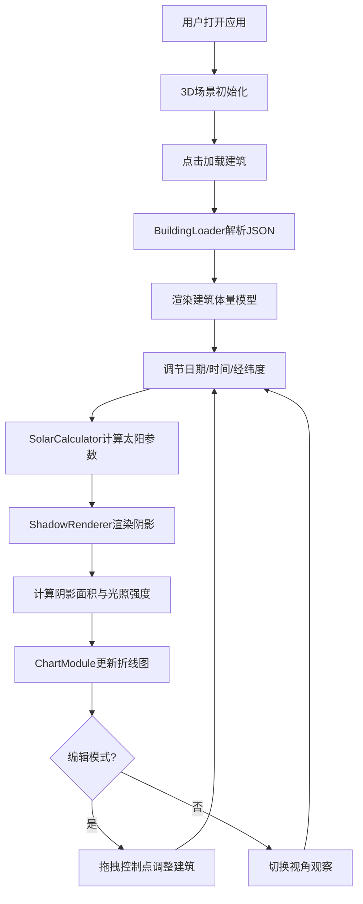

## 1. 产品概述

建筑日照光影模拟器是一款面向建筑设计师的交互式3D工具，用于在方案汇报前快速生成不同日照时段下的建筑物光影分析图，辅助判断采光方案优劣。目标用户为建筑设计师、规划师及建筑学师生，核心价值在于将复杂的日照计算可视化，降低专业门槛、提升沟通效率。

## 2. 核心功能

### 2.1 功能模块

1. **3D场景页**：建筑体量渲染、日照阴影模拟、地面网格分析、视角控制
2. **控制面板**：日期/时间/经纬度调节、建筑加载、视角快捷切换、编辑模式开关

### 2.2 页面详情

| 页面名称 | 模块名称 | 功能描述 |
|----------|----------|----------|
| 3D场景页 | 建筑体量加载与渲染 | 导入JSON建筑描述，渲染6层办公楼模型，楼层渐变色(#D4A373→#8B5E3C)，窗洞半透明蓝色方块(透明度0.4) |
| 3D场景页 | 日期与时间控制 | 滑块控制日期(1-365)和时间(6:00-18:00)，实时更新太阳位置与阴影，1秒线性插值过渡 |
| 3D场景页 | 多视角与缩放 | 鼠标拖拽旋转(绕Y轴360°，绕X轴0-60°)，滚轮缩放(0.5x-3x)，顶视图/人视图快捷切换 |
| 3D场景页 | 阴影面积与光照强度分析 | 实时计算地面阴影覆盖网格数，换算光照强度(0-1)，地面网格10x10m，阴影网格半透明黑色(0.2) |
| 3D场景页 | 时间-光照强度图表 | D3.js折线图，X轴时间(6-18时)，Y轴光照强度(0-1)，折线渐变(#FFD700→#FF8C00)，半透明填充，当前位置高亮节点 |
| 3D场景页 | 建筑编辑模式 | 拖拽楼层角点和屋顶中心点调整外形，蓝色引导线，释放后实时重算阴影与图表 |
| 控制面板 | 参数输入 | 日期滑块+数字输入(1-365,默认182)、时间滑块(6-18,步长1)、经纬度输入(默认北纬39.9,东经116.3)、加载建筑按钮 |

## 3. 核心流程

用户打开应用 → 3D场景初始化（渐变夜空背景+地面网格） → 点击"加载建筑"导入预设JSON → 场景渲染6层办公楼 → 调节日期/时间滑块 → SolarCalculator计算太阳方位角和高度角 → ShadowRenderer更新阴影投影 → 地面阴影面积计算 → 图表更新光照曲线 → 用户切换视角观察 → (可选)进入编辑模式拖拽控制点 → 实时重算阴影与图表

## 4. 用户界面设计

### 4.1 设计风格

- **主色调**：深色科技风，主背景#0A1628，面板背景#121E36，强调色#4A90D9
- **辅助色**：建筑渐变#D4A373→#8B5E3C，折线#FFD700→#FF8C00，地平线光晕#6B5B95
- **按钮风格**：矩形(高36px, 圆角6px)，背景#4A90D9，悬停#5BA0E9，点击缩小95%+色变#3A80C9
- **滑块风格**：轨道高4px，填充色#4A90D9，手柄直径16px圆角8px，悬停放大至20px
- **字体**：系统UI字体，标签12px，数值14px
- **布局**：全屏3D场景，左上角浮动控制面板(宽300px)，右下角浮动图表(400x200px)
- **动画**：0.2秒ease-out过渡，阴影更新1秒线性插值

### 4.2 页面设计概览

| 页面名称 | 模块名称 | UI元素 |
|----------|----------|--------|
| 3D场景页 | 渐变夜空背景 | 从#0A1628到#1A2744渐变，地平线#6B5B95淡紫色光晕 |
| 3D场景页 | 地面网格 | 10x10m网格，线色#2A3B5C，线宽1px，阴影覆盖网格半透明黑色(0.2) |
| 3D场景页 | 控制面板 | 左上角，宽300px，背景#121E36，圆角12px，内边距16px，透明度90%，控件间隔8px |
| 3D场景页 | 光照图表 | 右下角，宽400px高200px，背景#1A2744，圆角8px，阴影#00000040 |
| 3D场景页 | 建筑模型 | 6层办公楼，楼层渐变色，窗洞半透明蓝色方块 |

### 4.3 响应式设计

- 桌面端优先，全屏3D场景
- 窗口缩小时控制面板宽度变为100%，图表下移
- 所有交互反馈0.2秒ease-out过渡动画

### 4.4 3D场景指引

- **环境**：渐变夜空(#0A1628→#1A2744)，地平线淡紫色(#6B5B95)光晕
- **光照**：平行光模拟太阳光，根据SolarCalculator结果动态调整方向和强度
- **相机**：透视相机，聚焦建筑中心，支持绕Y轴360°和绕X轴0-60°旋转
- **交互**：OrbitControls旋转缩放，编辑模式拖拽控制点
- **后处理**：地面阴影半透明渲染，建筑面颜色渐变
