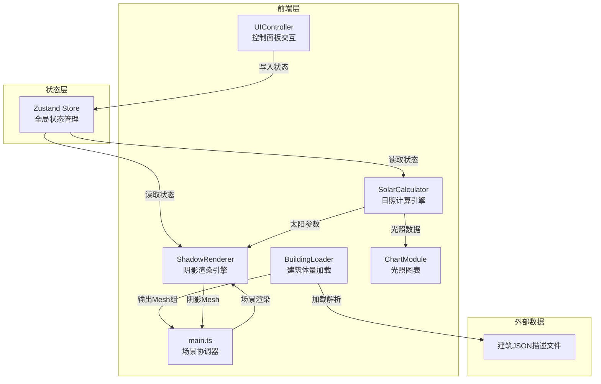

## 1. 架构设计



## 2. 技术选型

- **前端框架**：Three.js + TypeScript（原生Three.js，无React/Vue）
- **构建工具**：Vite（开发服务器端口3000）
- **图表库**：D3.js v7
- **状态管理**：Zustand
- **模块系统**：ES模块，target ES2020
- **无后端**：纯前端应用，建筑数据通过内置JSON预设

## 3. 文件结构与调用关系

```
project/
├── package.json                    # 依赖：three, @types/three, d3, @types/d3, vite, typescript, zustand
├── vite.config.js                  # 构建配置，解析three和d3模块，端口3000
├── tsconfig.json                   # 严格模式，ES模块，target ES2020
├── index.html                      # 入口页面，标题"日照模拟器"，背景色#0A1628
└── src/
    ├── main.ts                     # 入口：初始化场景/相机/渲染器，协调各模块，动画循环
    ├── store.ts                    # Zustand store定义：date, time, lat, lng, building, editMode
    └── modules/
        ├── solar/
        │   └── SolarCalculator.ts  # 输入：日期+时间+经纬度 → 输出：{azimuth, altitude}
        ├── render/
        │   └── ShadowRenderer.ts   # 输入：建筑Mesh+太阳参数 → 输出：阴影Mesh至场景
        ├── loader/
        │   └── BuildingLoader.ts   # 输入：JSON → 输出：建筑Mesh组(含颜色渐变+窗户)
        ├── ui/
        │   └── UIController.ts     # 用户操作 → 写入Zustand store
        └── chart/
            └── ChartModule.ts      # 监听SolarCalculator结果 → D3折线图更新
```

### 数据流向

```
用户操作(UIController) → Zustand Store → SolarCalculator(计算太阳参数)
                                    → ShadowRenderer(读取太阳参数+建筑数据→渲染阴影)
                                    → ChartModule(读取光照数据→更新图表)
BuildingLoader(JSON) → 建筑Mesh组 → main.ts(加入场景) → ShadowRenderer(读取几何数据)
```

## 4. 模块接口定义

### SolarCalculator

```typescript
interface SolarPosition {
  azimuth: number;   // 方位角（弧度）
  altitude: number;  // 高度角（弧度）
}

class SolarCalculator {
  calculate(dayOfYear: number, hour: number, latitude: number, longitude: number): SolarPosition;
}
```

### BuildingLoader

```typescript
interface BuildingData {
  floors: number;
  floorHeight: number;
  slabThickness: number;
  width: number;
  depth: number;
  windows: WindowData[];
}

interface WindowData {
  floor: number;
  position: [number, number, number];
  size: [number, number];
}

class BuildingLoader {
  load(data: BuildingData): THREE.Group;
}
```

### ShadowRenderer

```typescript
class ShadowRenderer {
  update(buildingMeshes: THREE.Group, sunDirection: THREE.Vector3, scene: THREE.Scene): void;
  getShadowArea(): number;
}
```

### ChartModule

```typescript
class ChartModule {
  constructor(container: HTMLElement);
  update(intensities: {hour: number, intensity: number}[], currentHour: number): void;
}
```

## 5. 日照计算算法

基于天文算法计算太阳位置：

1. **日序数**：dayOfYear (1-365)
2. **赤纬角**：δ = 23.45° × sin(360°/365 × (284 + dayOfYear))
3. **时角**：H = 15° × (hour - 12) + 经度修正
4. **高度角**：sin(altitude) = sin(lat)×sin(δ) + cos(lat)×cos(δ)×cos(H)
5. **方位角**：cos(azimuth) = (sin(δ) - sin(altitude)×sin(lat)) / (cos(altitude)×cos(lat))

## 6. 性能策略

- 阴影计算使用投影矩阵而非光线追踪，确保500ms内完成
- Three.js渲染器设置30fps下限
- D3图表更新使用节流(throttle)，避免频繁重绘
- 建筑编辑模式拖拽时使用requestAnimationFrame节流更新
- 地面网格预创建，仅更新材质透明度

## 7. 预设建筑JSON

```json
{
  "floors": 6,
  "floorHeight": 3.5,
  "slabThickness": 0.2,
  "width": 20,
  "depth": 12,
  "windows": [
    {"floor": 1, "position": [0, 1.5, 6.1], "size": [2, 2]},
    {"floor": 2, "position": [0, 5.0, 6.1], "size": [2, 2]}
  ]
}
```
