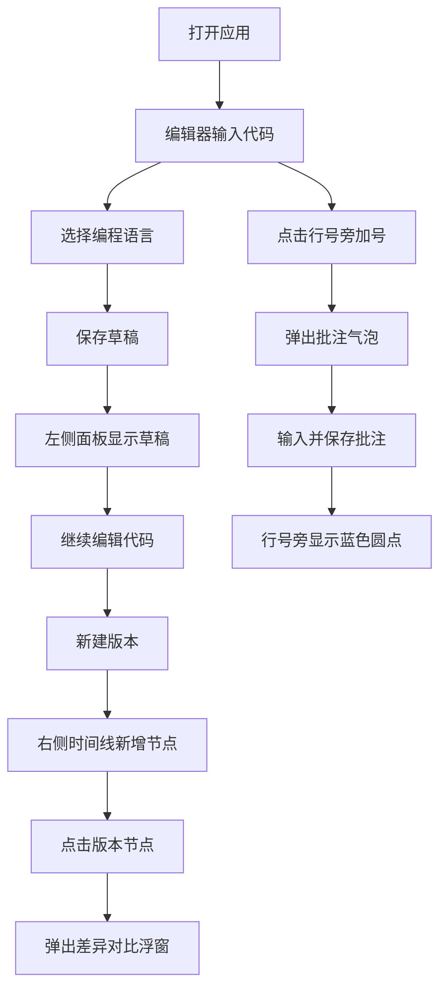

## 1. 产品概述
代码协作评审工具（CodeCollab）是一款面向小型团队的在线代码片段协作编辑与评审平台，解决团队在即时通讯工具中分享代码时缺乏语法高亮、版本管理和批注能力的痛点。
- 核心用途：代码片段的编写、保存、版本对比与行级批注评审
- 目标用户：开发团队、技术评审人员、教学场景中的师生

## 2. 核心功能

### 2.1 功能模块
1. **主编辑页面**：代码编辑器、语言选择器、保存草稿、新建版本
2. **草稿管理面板**：草稿列表展示、加载、悬浮高亮、选中指示
3. **版本历史面板**：时间线展示、版本节点交互、代码差异对比
4. **批注系统**：行级批注添加、批注预览气泡、批注状态指示

### 2.2 页面详情
| 页面名称 | 模块名称 | 功能描述 |
|---------|---------|---------|
| 主编辑页面 | 代码编辑器 | textarea + canvas双层架构，Monokai主题语法高亮，行号显示，当前行高亮 |
| 主编辑页面 | 语言选择器 | 支持JS、Python、HTML、CSS、TS等常见语言切换 |
| 主编辑页面 | 顶部工具栏 | 保存草稿、新建版本、毛玻璃效果、圆形按钮动效 |
| 草稿管理面板 | 草稿列表 | 标题+语言标签+编辑时间，悬浮高亮，选中蓝色竖条指示 |
| 版本历史面板 | 版本时间线 | 圆形节点+竖线连接，当前版本蓝色高亮，点击触发对比 |
| 版本历史面板 | 差异对比浮窗 | 左右并排对比，绿色新增/红色删除标注 |
| 批注系统 | 行号交互 | 悬浮显示加号图标，点击弹出批注气泡，保存后蓝色圆点指示 |
| 批注系统 | 批注预览 | 鼠标悬浮批注圆点，显示批注内容摘要（60字限制） |

## 3. 核心流程
用户打开应用 → 在编辑器中输入或粘贴代码 → 选择编程语言 → 保存为草稿（左侧面板新增条目）→ 继续编辑后点击"新建版本"（右侧时间线新增节点）→ 点击任意版本节点查看代码差异 → 点击行号旁加号添加批注 → 悬浮批注圆点查看批注内容

## 4. 用户界面设计

### 4.1 设计风格
- **主背景色**：#252526（深色面板）
- **辅背景色**：#1E1E2E（编辑器区域）
- **强调色**：#007ACC（选中、指示、按钮）
- **警告色**：#F48771（错误提示）
- **文字主色**：#D4D4D4
- **语法高亮**：Monokai主题（关键字#F92672、字符串#E6DB74、注释#75715E）
- **按钮样式**：圆形32px直径，悬浮背景#007ACC40，scale 1.05放大
- **字体**：Fira Code 14px（代码区），系统无衬线字体（UI文字）
- **布局风格**：三栏布局，左右面板可拖拽调宽
- **视觉效果**：毛玻璃工具栏（backdrop-filter: blur(8px)）、圆角卡片、阴影浮层
- **动效规范**：面板切换0.2s ease-in-out，拖拽反馈0.1s linear，按钮0.15s ease

### 4.2 页面设计概述
| 页面名称 | 模块名称 | UI元素 |
|---------|---------|-------|
| 主编辑页 | 整体布局 | 三栏：左侧280px草稿栏 + 中央编辑器 + 右侧240px版本栏，均支持拖拽调宽 |
| 主编辑页 | 顶部工具栏 | 半透明毛玻璃(#007ACC20)，圆形工具按钮，包含保存、新版本、语言下拉 |
| 主编辑页 | 代码编辑器 | 背景#1E1E2E，Fira Code 14px，行号栏，当前行#2D2D3F高亮，canvas语法高亮层 |
| 草稿面板 | 条目卡片 | 背景#252526圆角8px，悬浮#2A2A2B，选中左侧#007ACC竖条 |
| 草稿面板 | 语言标签 | 圆角4px，不同语言不同背景色（JS#F0DB4F等） |
| 版本面板 | 时间线 | 背景#1E1E2E圆角6px，圆形节点(8px)，1px#3A3A3C竖线连接 |
| 版本面板 | 差异浮窗 | 背景#2D2D2D圆角8px阴影#00000040，左右对比，绿#3C8D3C增/红#8D3C3C删 |
| 批注系统 | 气泡 | 背景#252526圆角8px三角指向，输入框300x80px边框#007ACC |
| 批注系统 | 指示点 | 加号灰色12px悬浮变白，保存后蓝色6px圆点 |

### 4.3 性能要求
- 语法高亮：30ms内完成，>300行使用Web Worker异步处理
- 代码对比：UI线程阻塞不超过50ms
- 批量保存：节流600ms
- 页面加载：首屏≤2s
