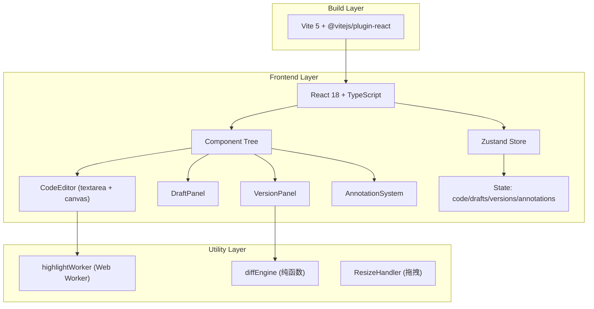

## 1. 架构设计



## 2. 技术描述
- **前端框架**：React 18 + TypeScript 5（严格模式，target ES2020，module ESNext）
- **构建工具**：Vite 5，resolve别名 @/ → src/
- **状态管理**：Zustand 4（全局单一store）
- **包管理**：npm
- **后端**：无（纯前端应用，localStorage可选持久化）
- **数据库**：无（内存状态管理）
- **其他依赖**：uuid（生成唯一ID）

## 3. 文件组织

| 文件路径 | 职责 |
|---------|------|
| `package.json` | 依赖声明：react, react-dom, typescript, vite, @vitejs/plugin-react, zustand, uuid；启动脚本 `npm run dev` |
| `index.html` | 入口文件，Fira Code字体预加载，viewport meta |
| `vite.config.js` | 构建配置，resolve.alias设置 `@/` → `src/` |
| `tsconfig.json` | strict模式，target ES2020，module ESNext，paths配置 |
| `src/main.tsx` | React入口，全局样式注入，渲染App |
| `src/store/editorStore.ts` | Zustand全局store：当前代码、草稿、版本、批注CRUD操作 |
| `src/components/CodeEditor.tsx` | 主编辑器：textarea层 + canvas高亮层叠加，同步滚动，行号渲染，行交互 |
| `src/components/DraftPanel.tsx` | 左侧草稿列表：条目展示、选中态、悬浮态、拖拽宽度 |
| `src/components/VersionPanel.tsx` | 右侧版本时间线：节点渲染、连接线、点击触发对比浮窗 |
| `src/components/DiffViewer.tsx` | 版本对比浮窗：左右并排diff展示，新增/删除行标注 |
| `src/components/AnnotationBubble.tsx` | 批注气泡组件：输入框、保存、取消、悬浮预览 |
| `src/components/Toolbar.tsx` | 顶部毛玻璃工具栏：保存按钮、新版本按钮、语言选择器 |
| `src/utils/highlightWorker.ts` | Web Worker：接收{code, language}，返回高亮token数组（Monokai配色） |
| `src/utils/diffEngine.ts` | 纯函数diff算法：LCS实现，返回DiffLine数组（type: add/remove/equal） |

## 4. 数据模型（Zustand Store）

```typescript
interface Draft {
  id: string;           // uuid
  title: string;        // 草稿标题（自动生成或用户输入）
  code: string;         // 代码内容
  language: Language;   // 编程语言
  updatedAt: number;    // 最后编辑时间戳
}

interface Version {
  id: string;           // uuid
  draftId: string;      // 所属草稿ID
  code: string;         // 该版本的代码快照
  timestamp: number;    // 创建时间戳（作为版本号显示）
}

interface Annotation {
  id: string;           // uuid
  draftId: string;      // 所属草稿ID
  lineNumber: number;   // 行号（1-based）
  content: string;      // 批注内容
  createdAt: number;    // 创建时间戳
}

type Language = 'javascript' | 'python' | 'html' | 'css' | 'typescript' | 'json' | 'markdown';

interface EditorState {
  currentDraftId: string | null;
  drafts: Draft[];
  versions: Version[];
  annotations: Annotation[];
  code: string;
  language: Language;
  
  // Actions
  setCode: (code: string) => void;
  setLanguage: (lang: Language) => void;
  saveDraft: (title?: string) => Draft;
  loadDraft: (draftId: string) => void;
  createVersion: () => Version;
  addAnnotation: (lineNumber: number, content: string) => void;
  getAnnotationsByLine: (draftId: string, lineNumber: number) => Annotation[];
}
```

## 5. 性能优化策略

| 优化点 | 实现方案 |
|-------|---------|
| 语法高亮性能 | ≤300行同步处理（正则分词→canvas绘制）；>300行委托Web Worker异步处理，Promise返回结果 |
| Diff算法性能 | LCS动态规划，UI线程≤50ms；超大数据可考虑Worker化（当前先同步实现，阈值5000行） |
| 批量保存节流 | 使用throttle工具函数，600ms窗口内多次saveDraft合并为最后一次 |
| 首屏加载 | 代码分包懒加载（DiffViewer、AnnotationBubble用React.lazy），字体display=swap |
| Canvas渲染 | requestAnimationFrame合并绘制，仅在code变化且30ms窗口内绘制一次 |
| 滚动同步 | textarea与canvas通过requestAnimationFrame同步scrollTop，避免抖动 |

## 6. 关键技术点实现

### 6.1 CodeEditor双层架构
```
容器（position: relative）
├── textarea（绝对定位，opacity 0，仅负责输入+滚动+光标）
├── canvas（绝对定位，z-index 0，绘制语法高亮文本）
├── 行号栏（左侧固定宽度，绘制行号+批注指示点）
└── 当前行高亮层（根据textarea.selection或scroll计算高亮矩形）
```

### 6.2 语法高亮正则分词
每种语言维护一套token规则数组：`[{regex, type, color}]`，按优先级匹配，每次匹配推进cursor位置。

### 6.3 拖拽宽度实现
三栏容器Flex布局，左右面板各有resize-handle（2px宽度，z-index高），监听mousedown→mousemove→mouseup，动态设置flex-basis，同时在拖拽中显示tooltip反馈当前宽度。
