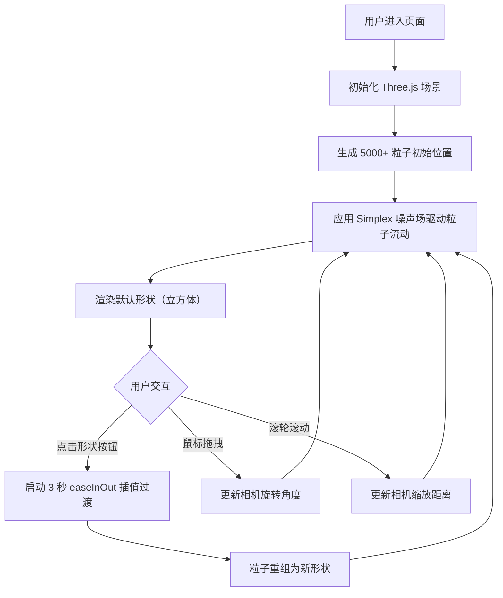

## 1. 产品概述

动态流体粒子雕塑是一个基于 WebGL 的沉浸式 3D 艺术展示项目，通过数千个彩色粒子的流动、聚散来塑造动态几何形态，为用户提供可交互的视觉艺术体验。

- 主要目的：创建一个可交互的流体粒子艺术装置，展现物理流体动力学与数字艺术的结合
- 目标用户：艺术爱好者、设计师、科技展览观众
- 产品价值：提供低门槛的沉浸式 3D 艺术体验，可用于展览、网站背景、艺术装置等场景

## 2. 核心功能

### 2.1 功能模块

1. **3D 粒子流体场渲染**：5000+ 彩色粒子的实时渲染，支持火焰色到冰蓝色的渐变过渡
2. **几何形状变形**：粒子在立方体、球体、环面三种几何形状间平滑过渡重组
3. **视角交互控制**：鼠标拖拽旋转视角（Y 轴 360°，X 轴 ±60°），滚轮缩放（0.3x-3x）
4. **控制面板 UI**：左下角固定控制面板，提供形状切换按钮组

### 2.2 页面详情

| 页面名称 | 模块名称 | 功能描述 |
|-----------|-------------|---------------------|
| 主页面 | 3D 场景渲染 | 全屏深色背景（#0A0A0F），实时渲染粒子流体场 |
| 主页面 | 粒子系统 | 5000+ 粒子，2-4px 随机大小，火焰→冰蓝渐变，Simplex 噪声驱动流动 |
| 主页面 | 尾迹效果 | 粒子运动尾迹，透明度 0.3，1.5 秒渐隐 |
| 主页面 | 控制面板 | 左下角 240px 宽度，半透明深色背景，三按钮形状切换组 |
| 主页面 | 视角控制 | 鼠标拖拽旋转、滚轮缩放、实时响应无闪烁 |

## 3. 核心流程

## 4. 用户界面设计

### 4.1 设计风格

- **主色调**：深色背景 #0A0A0F，粒子从火焰色（#FF4500→#FFD700）过渡到冰蓝色（#00BFFF→#E0FFFF）
- **按钮配色**：立方体 #FF6B6B、球体 #4ECDC4、环面 #FFE66D
- **控制面板**：背景 #1A1A2E，透明度 0.85，边框 #3A3A5E，圆角 12px
- **动效风格**：平滑缓动，形状切换 3 秒 easeInOut，按钮指示条滑动 0.3 秒

### 4.2 页面设计概述

| 页面名称 | 模块名称 | UI 元素 |
|-----------|-------------|-------------|
| 主页面 | 3D 场景 | 全屏 Canvas，深色背景，粒子构成的流动几何形体 |
| 主页面 | 控制面板 | 左下角 240px 宽度卡片，三个彩色按钮，选中状态底部高亮指示条 |

### 4.3 响应式

- 桌面端优先设计
- 控制面板固定定位，不随画面缩放变化
- Canvas 自适应窗口大小，支持 resize 事件监听

### 4.4 3D 场景指导

- **环境/氛围**：深太空色调，无外部光源，粒子自发光
- **光照设置**：粒子使用顶点颜色，无需场景光照
- **相机设置**：透视相机 FOV 60°，拖拽旋转 Y 轴 360°、X 轴 ±60°，缩放范围 0.3x-3x
- **构图与焦点**：粒子构成的几何体居中，占画面主体 60% 区域
- **交互与动画**：噪声驱动的持续流动 + 形状切换插值动画
- **性能预算**：帧率稳定 45FPS+，使用 BufferGeometry 每帧更新 position/color 属性
