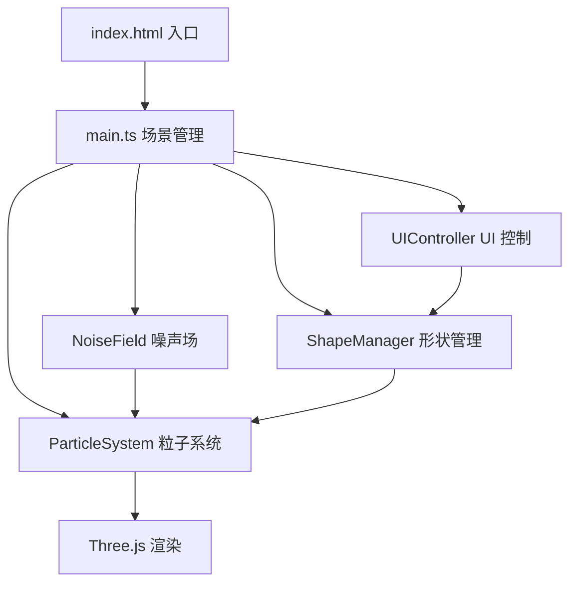

## 1. 架构设计



## 2. 技术说明

- **前端框架**：无框架，纯 TypeScript + Three.js
- **构建工具**：Vite（ESM 模式）
- **3D 引擎**：Three.js（rlatest）
- **类型系统**：TypeScript strict 模式，target ES2020，module ESNext
- **状态管理**：各模块内部状态，通过回调/订阅模式通信

## 3. 文件结构

| 文件路径 | 职责说明 |
|-----------|-------------|
| `package.json` | 依赖声明：three, @types/three, vite, typescript |
| `vite.config.js` | Vite 构建配置，解析 three 模块，启用 ESM |
| `tsconfig.json` | TS 配置：strict 模式，ES2020 target，ESNext module |
| `index.html` | 全屏入口，body margin 0，无滚动条 |
| `src/main.ts` | 初始化场景/相机/渲染器，管理动画循环，装配各模块 |
| `src/noiseField.ts` | Simplex 噪声算法，生成时间驱动的流体速度场 |
| `src/particleSystem.ts` | 粒子生成、位置更新、颜色渐变、尾迹效果，BufferGeometry |
| `src/shapeManager.ts` | 三种形状顶点定义，形状切换插值计算，导出形状列表 |
| `src/uiController.ts` | DOM 控制面板创建与管理，按钮事件监听 |

## 4. 模块接口定义

### 4.1 NoiseField

```typescript
class NoiseField {
  constructor(scale?: number, speed?: number);
  sample(x: number, y: number, z: number, time: number): { vx: number; vy: number; vz: number };
}
```

### 4.2 ShapeManager

```typescript
interface ShapeInfo {
  name: string;
  color: string;
  vertices: Float32Array; // [x,y,z, x,y,z, ...]
}

type ShapeName = 'cube' | 'sphere' | 'torus';

class ShapeManager {
  readonly shapes: Record<ShapeName, ShapeInfo>;
  readonly shapeNames: ShapeName[];
  getCurrentShape(): ShapeName;
  switchShape(target: ShapeName): { vertices: Float32Array; duration: number; easing: (t: number) => number };
  isTransitioning(): boolean;
  getTransitionProgress(): number; // 0~1
}
```

### 4.3 ParticleSystem

```typescript
class ParticleSystem {
  constructor(scene: THREE.Scene, count: number, noiseField: NoiseField);
  setTargetPositions(vertices: Float32Array, duration: number, easing: (t: number) => number): void;
  update(deltaTime: number, elapsedTime: number): void;
  dispose(): void;
}
```

### 4.4 UIController

```typescript
interface UIControllerOptions {
  shapes: { name: string; label: string; color: string }[];
  onShapeChange: (name: string) => void;
}

class UIController {
  constructor(options: UIControllerOptions);
  setActiveShape(name: string): void;
  dispose(): void;
}
```

## 5. 关键实现要点

### 5.1 性能优化

- 使用 `THREE.BufferGeometry` + `THREE.Points`，避免每帧重建几何
- 粒子位置/颜色通过 `Float32Array` 直接更新 `BufferAttribute`
- 标记 `needsUpdate = true` 时才提交 GPU
- 粒子尾迹通过多帧位置缓冲 + 透明度衰减实现，避免额外 draw call

### 5.2 形状插值算法

- 每个粒子预先绑定到目标形状上的一个索引位置
- 形状切换时记录 `startPos` 和 `endPos`
- 每帧通过 `easeInOut(t)` 计算插值：`current = start + (end - start) * ease(t)`
- 插值结果与噪声场速度叠加，避免"硬切换"

### 5.3 视角控制

- 自行实现球面坐标相机控制（避免引入 OrbitControls 依赖）
- 鼠标按下记录起始角度，移动时更新 theta/phi
- 滚轮调整相机距离 radius，clamp 在 [min, max] 范围
- 使用 `requestAnimationFrame` 平滑插值相机位置

### 5.4 颜色渐变

- 预计算火焰色→冰蓝色 1D 查找表（LUT）
- 每个粒子根据其初始索引或当前 Y 坐标映射到 LUT 索引
- 形状切换时颜色随位置渐变，保持视觉连贯性
