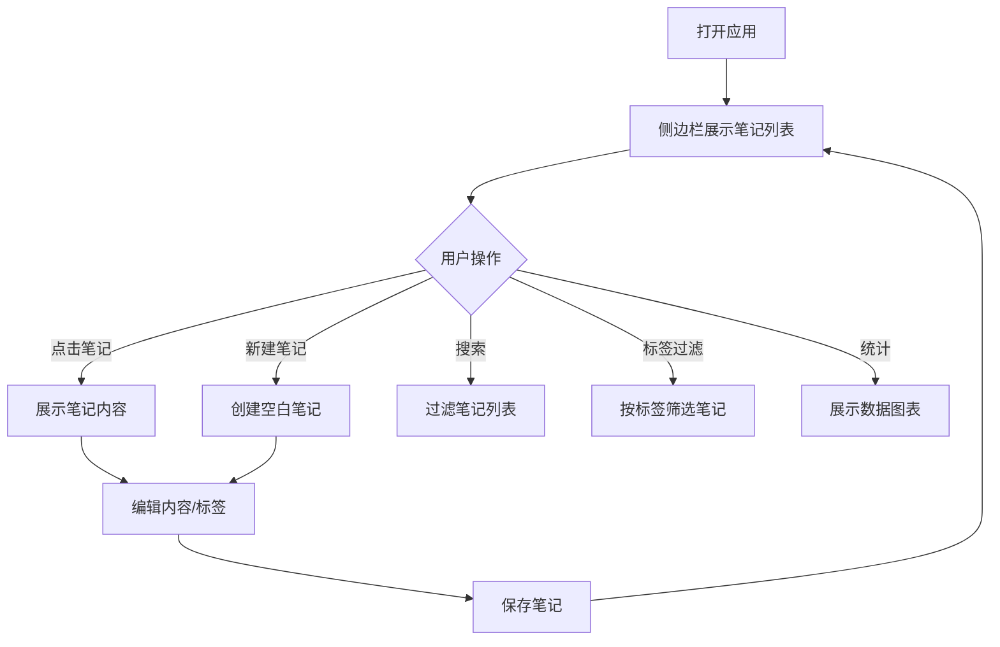

## 1. 产品概述

个人知识库管理应用，帮助用户创建、组织和检索个人笔记，支持标签分类、全文搜索和数据统计可视化。

- 目标用户：需要管理个人知识和笔记的普通用户
- 核心价值：提供高效的笔记管理、快速检索和直观的数据统计功能

## 2. 核心功能

### 2.1 功能模块

1. **笔记管理**：创建、编辑、删除、查看笔记
2. **富文本编辑**：标题输入、内容编辑（粗体、斜体、列表）
3. **标签系统**：标签添加/删除、按标签过滤笔记
4. **全文搜索**：实时搜索、关键字高亮
5. **统计图表**：每日新增柱状图、标签分布饼图

### 2.2 页面详情

| 页面名称 | 模块名称 | 功能描述 |
|-----------|-------------|---------------------|
| 主应用 | 侧边栏 | 笔记列表、搜索框、标签过滤、新建笔记按钮、统计按钮 |
| 主应用 | 笔记编辑区 | 标题输入、富文本内容编辑、标签管理、保存功能 |
| 主应用 | 统计视图 | 每日新增笔记柱状图、标签分布饼图 |

## 3. 核心流程

用户打开应用 → 侧边栏展示笔记列表 → 点击笔记查看/编辑 → 或点击新建笔记创建 → 输入标题和内容 → 添加标签 → 保存笔记 → 使用搜索框快速检索 → 点击统计查看数据图表

## 4. 用户界面设计

### 4.1 设计风格
- 主色调：蓝色 #4A90D9，悬浮 #357ABD
- 背景色：浅灰 #F5F5F5，侧边栏 #F8F9FA
- 文字色：#333333
- 按钮样式：圆角 8px，悬浮 0.3s 过渡动画
- 圆角统一：8px，阴影统一：#00000010 的 2px 偏移
- 标签样式：浅灰圆角矩形 #E8E8E8，选中胶囊按钮蓝色背景

### 4.2 页面设计概述

| 页面名称 | 模块名称 | UI 元素 |
|-----------|-------------|-------------|
| 主应用 | 侧边栏 | 固定宽度 280px，笔记列表悬浮变 #EDEDED，搜索框圆角 20px，按钮蓝色背景 |
| 主应用 | 笔记编辑区 | 标题 20px 加粗底部边框，可编辑 div，工具栏悬浮白色背景圆角 4px，标签输入回车添加 |
| 主应用 | 统计视图 | 柱状图（400x300）#4A90D9 柱体，饼图（400x300）多彩扇形 |

### 4.3 响应式
- Desktop 优先
- < 768px 时侧边栏收缩为顶部导航条（高度 56px），笔记列表改为下拉菜单，内容区占满全宽
