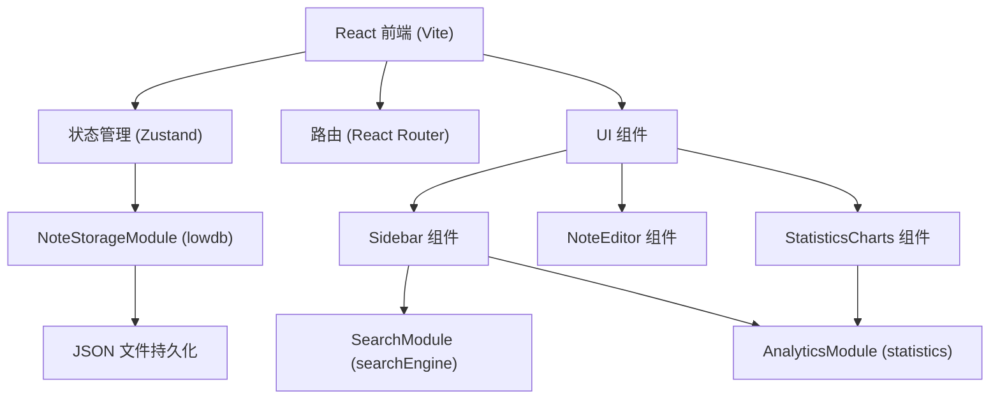
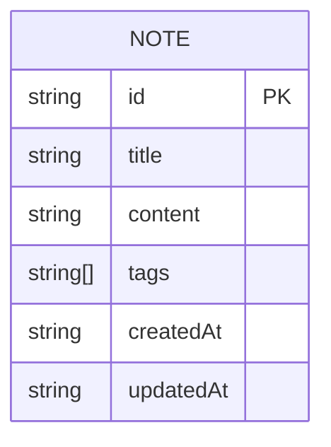

## 1. 架构设计



## 2. 技术描述

- 前端：React 18 + TypeScript + Vite
- 状态管理：Zustand
- 路由：React Router DOM
- 后端模拟：Express.js（可选，当前直接前端调用 lowdb）
- 数据持久化：lowdb（JSON 文件）
- 图表库：Recharts
- 唯一 ID：uuid

## 3. 路由定义

| 路由 | 用途 |
|-------|---------|
| / | 首页，显示笔记编辑或空状态 |
| /note/:id | 展示和编辑指定笔记 |
| /statistics | 统计图表视图 |

## 4. 数据模型

### 4.1 数据模型定义



### 4.2 数据结构

```typescript
interface Note {
  id: string;
  title: string;
  content: string;
  tags: string[];
  createdAt: string;
  updatedAt: string;
}

interface NoteDB {
  notes: Note[];
}
```

## 5. 模块说明

### NoteStorageModule (storage.ts)
- `getAllNotes(): Note[]` - 获取所有笔记
- `getNoteById(id: string): Note | undefined` - 根据 ID 获取笔记
- `createNote(note: Omit<Note, 'id' | 'createdAt' | 'updatedAt'>): Note` - 创建笔记
- `updateNote(id: string, data: Partial<Note>): Note | undefined` - 更新笔记
- `deleteNote(id: string): boolean` - 删除笔记

### SearchModule (searchEngine.ts)
- `searchNotes(keyword: string, notes: Note[]): string[]` - 基于标题和内容模糊匹配，返回匹配笔记 ID 数组

### AnalyticsModule (statistics.ts)
- `getTotalCount(notes: Note[]): number` - 笔记总数
- `getTagDistribution(notes: Note[]): { tag: string; count: number }[]` - 标签分布
- `getDailyNewNotes(notes: Note[], days: number = 7): { date: string; count: number }[]` - 最近 N 天每日新增量

## 6. 文件结构

```
project/
├── package.json
├── vite.config.js
├── tsconfig.json
├── index.html
└── src/
    ├── main.tsx
    ├── App.tsx
    ├── store/
    │   └── useNoteStore.ts
    ├── NoteStorageModule/
    │   └── storage.ts
    ├── SearchModule/
    │   └── searchEngine.ts
    ├── AnalyticsModule/
    │   └── statistics.ts
    └── components/
        ├── Sidebar.tsx
        ├── NoteEditor.tsx
        └── StatisticsCharts.tsx
```
