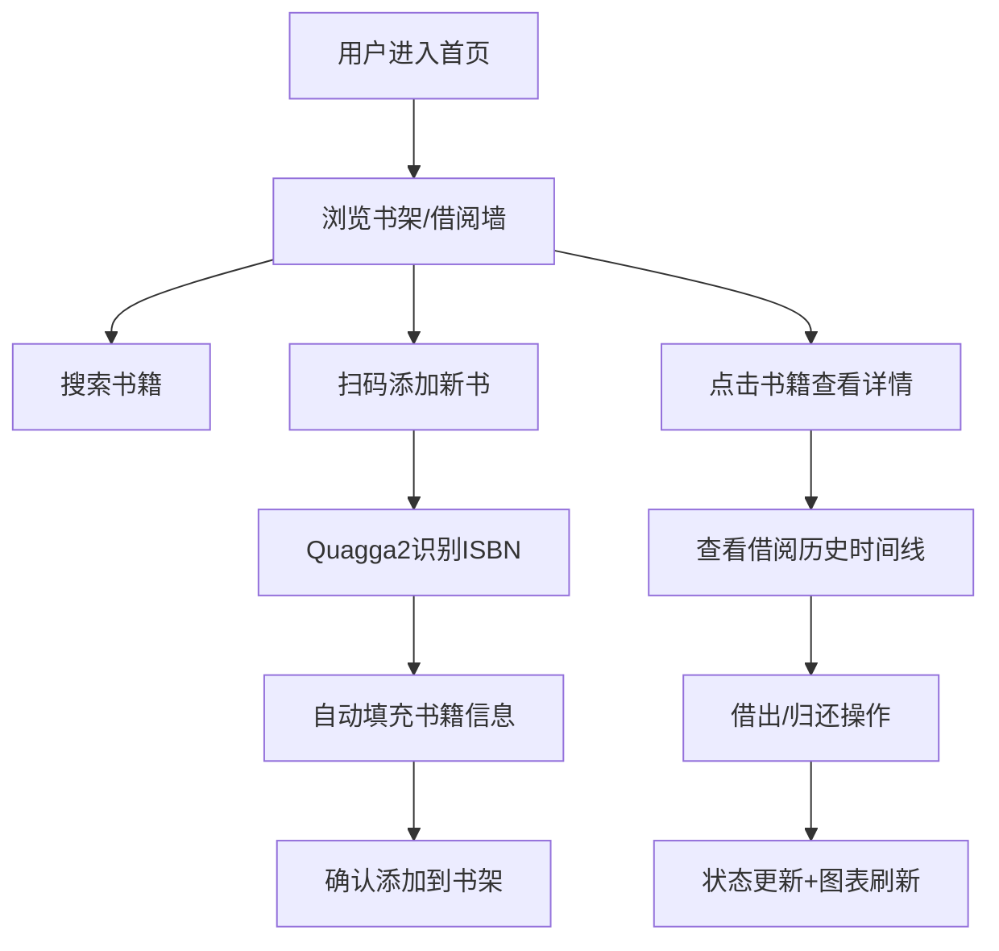

## 1. 产品概述

线上虚拟书房与书籍借阅管理系统，帮助用户在网页上整理实体书库，通过扫码快速上架书籍，跟踪每本书的出借和归还状态，并生成借阅统计图表。面向个人藏书爱好者和小型读书社群。

## 2. 核心功能

### 2.1 功能模块
1. **首页**: 左侧木质书架面板、右侧借阅墙、顶部搜索扫描栏
2. **书籍详情**: 书籍信息卡、借阅历史时间线、借/还操作按钮
3. **ISBN扫描**: 摄像头扫描模态框，自动识别并填充书籍信息
4. **统计图表**: 借阅状态分布、热门借阅统计

### 2.2 页面详情
| 页面名称 | 模块名称 | 功能描述 |
|-----------|-------------|---------------------|
| 首页 | 书架面板 | 木质书架视觉，彩色书脊展示，支持拖拽排序，点击书籍弹出详情 |
| 首页 | 借阅墙 | 卡片式展示所有书籍，显示书名、作者、状态、借阅者头像，状态切换翻转动画 |
| 首页 | 搜索栏 | 搜索书籍，扫码ISBN按钮，聚焦发光效果 |
| 书籍详情 | 详情卡片 | 书籍完整信息，借阅历史时间线，借出/归还操作按钮 |
| 扫描模态框 | ISBN识别 | 调用摄像头，Quagga2识别条码，识别成功后填充表单 |

## 3. 核心流程

用户进入首页，浏览书架和借阅墙，可搜索或扫码添加新书；点击书籍查看详情和借阅历史；可执行借出/归还操作，状态实时更新并同步到统计图表。

## 4. 用户界面设计

### 4.1 设计风格
- **主色调**: #F5E6CA（温暖米色背景）
- **辅色**: #2E86AB（蓝绿色按钮/交互）
- **强调色**: #E67E22（橙色状态点/时间线）
- **书架背景**: #8B5E3C，隔板 #6B4226（6px厚度）
- **卡片背景**: #FFF8E7，圆角8px，阴影#00000020
- **交互反馈**: 悬浮上浮4px + 加深阴影#00000030
- **按钮涟漪动画**: 扫码按钮点击扩散效果
- **翻转动画**: 状态切换0.4s ease-out卡片翻转
- **搜索框聚焦**: 光标闪烁 + 边框发光#2E86AB60

### 4.2 页面设计概述
| 页面名称 | 模块名称 | UI元素 |
|-----------|-------------|-------------|
| 首页 | 书架面板 | 木质纹理背景，多层隔板，彩色书脊（20-40px宽度随机），拖拽跟随吸附动画0.2s ease |
| 首页 | 借阅墙 | 网格布局书籍卡片，圆形32px借阅者头像，状态标签 |
| 首页 | 搜索栏 | 水平排列，输入框+扫描按钮，扫描按钮#2E86AB背景 |
| 书籍详情 | 时间线 | 圆点#E67E22 + 竖线#CCC连接，从上到下展开动画0.3s |

### 4.3 响应式
- 桌面端（≥768px）: 左侧书架+右侧借阅墙双栏布局
- 移动端（<768px）: 书架变为顶部水平滚动条，借阅墙单列卡片布局
- 触摸设备: 拖拽优化，按钮点击区域≥44px

### 4.4 性能指标
- 书架渲染200本书首屏加载 ≤ 1.5秒
- 拖拽操作刷新率 60fps
- 状态切换动画流畅无卡顿
