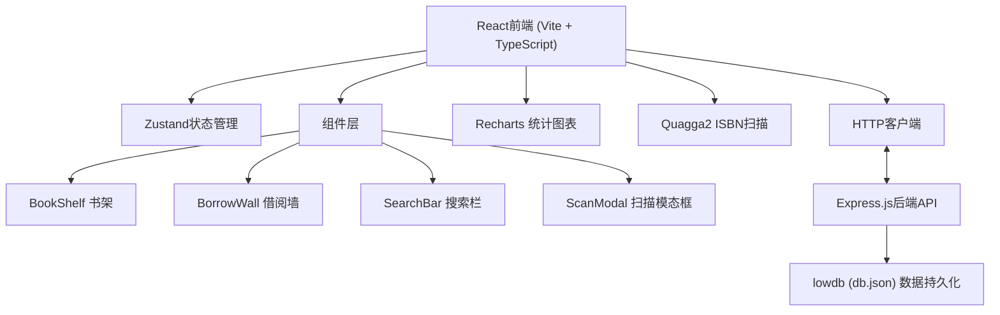
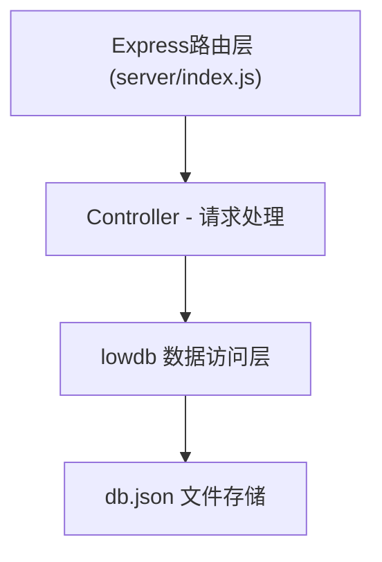
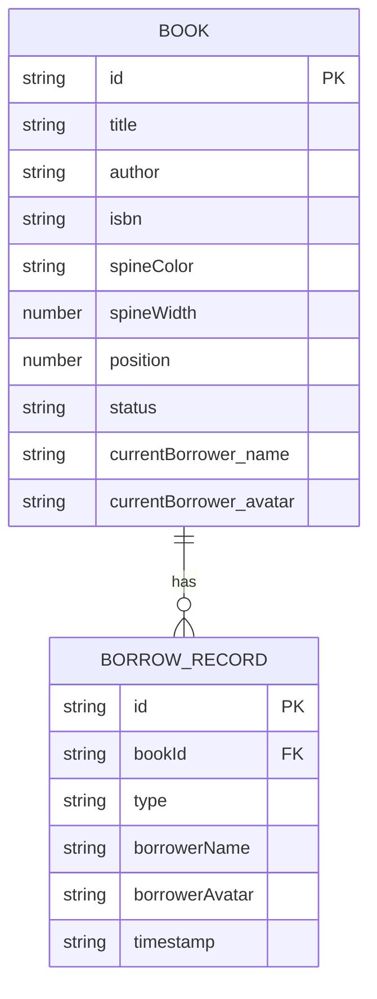

## 1. 架构设计



## 2. 技术描述
- **前端**: React@18 + TypeScript + Vite
- **状态管理**: Zustand
- **路由**: react-router-dom
- **图表**: recharts
- **ISBN扫描**: quagga2
- **后端**: Express.js
- **数据库**: lowdb (JSON文件存储)
- **工具库**: uuid, cors

## 3. 路由定义
| 路由 | 用途 |
|-------|---------|
| / | 首页，包含书架、借阅墙、搜索栏 |

## 4. API定义

### 类型定义
```typescript
interface Book {
  id: string;
  title: string;
  author: string;
  isbn?: string;
  spineColor: string;
  spineWidth: number;
  position: number;
  status: 'available' | 'borrowed';
  currentBorrower?: {
    name: string;
    avatar: string;
  };
  borrowHistory: BorrowRecord[];
  createdAt: string;
}

interface BorrowRecord {
  id: string;
  type: 'borrow' | 'return';
  borrowerName: string;
  borrowerAvatar: string;
  timestamp: string;
}
```

### API端点
| 方法 | 路径 | 描述 |
|------|------|------|
| GET | /api/books | 获取所有书籍列表 |
| POST | /api/books | 新增书籍 |
| PUT | /api/books/:id | 更新书籍信息 |
| PUT | /api/books/:id/reorder | 更新书籍排序位置 |
| PUT | /api/books/:id/borrow | 借出书籍 |
| PUT | /api/books/:id/return | 归还书籍 |
| DELETE | /api/books/:id | 删除书籍 |
| GET | /api/stats | 获取借阅统计数据 |

## 5. 服务端架构



## 6. 数据模型

### 6.1 ER图


### 6.2 db.json 结构
```json
{
  "books": [
    {
      "id": "uuid",
      "title": "书名",
      "author": "作者",
      "isbn": "978-xxx",
      "spineColor": "#xxx",
      "spineWidth": 30,
      "position": 0,
      "status": "available",
      "currentBorrower": null,
      "borrowHistory": [],
      "createdAt": "ISO日期"
    }
  ]
}
```
