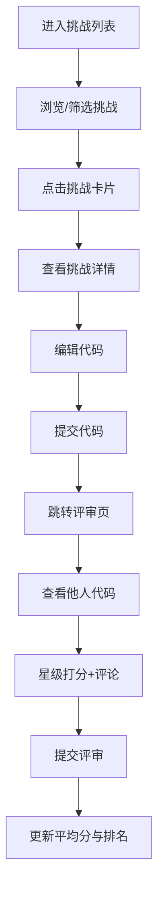

## 1. 产品概述
为独立开发者社区提供在线编码挑战平台，成员可发布解题代码、接受他人评审打分，系统维护参赛者综合排名。
- 目标用户：独立开发者社区成员，希望通过编码挑战提升技术水平并获得同行反馈
- 产品价值：构建互助学习的技术社区，通过评审机制促进代码质量提升

## 2. 核心功能

### 2.1 用户角色
| 角色 | 注册方式 | 核心权限 |
|------|----------|----------|
| 参赛者 | 模拟用户（本地数据） | 浏览挑战、提交代码、查看排名 |
| 评审者 | 模拟用户（本地数据） | 浏览他人代码、打分评审、填写评论 |

### 2.2 功能模块
1. **挑战列表页**：展示所有编码挑战，支持按难度筛选，卡片式布局
2. **挑战详情与代码提交页**：挑战描述、示例输入输出、代码编辑器、提交按钮
3. **评审打分页**：左右分栏展示他人代码和评审表单，星级打分和评论输入

### 2.3 页面详情
| 页面名称 | 模块名称 | 功能描述 |
|----------|----------|----------|
| 挑战列表页 | 导航栏 | 应用名称、用户排名徽章 |
| 挑战列表页 | 难度筛选器 | 全部/简单/中等/困难筛选，带淡入淡出动画 |
| 挑战列表页 | 挑战卡片网格 | 两列布局，卡片显示标题、难度色条、标签、描述、提交数 |
| 挑战详情页 | 挑战描述区 | Markdown渲染的挑战描述、示例输入输出 |
| 挑战详情页 | 代码编辑区 | CodeMirror编辑器，JavaScript高亮，One Dark主题 |
| 挑战详情页 | 提交按钮 | 紫色渐变按钮，悬浮变色效果 |
| 评审打分页 | 代码展示区（左60%） | 只读模式显示他人提交代码 |
| 评审打分页 | 评审表单区（右40%） | 星级评分组件（1-5分）、评论文本框、提交按钮 |

## 3. 核心流程
用户进入平台后浏览挑战列表，通过难度筛选找到感兴趣的挑战，点击进入详情页阅读题目说明，在代码编辑器中编写/修改解决方案，提交后跳转至评审页。在评审页可以查看其他用户的代码，进行星级打分和文字评论，提交后自动刷新显示最新平均分。用户排名根据提交代码获得的平均分数计算，在导航栏实时展示。

## 4. 用户界面设计

### 4.1 设计风格
- 主色调：深色主题，主背景#13111C，卡片背景#1E1B2E
- 难度色标：简单#22C55E（绿）、中等#EAB308（黄）、困难#EF4444（红）
- 按钮风格：主按钮#6366F1，悬浮#4F46E5，圆角6px
- 字体：Inter（sans-serif）
- 布局：卡片式布局，顶部固定导航栏（高64px）
- 动画：筛选器淡入淡出0.25s ease，星星高亮0.2s ease-out，卡片悬浮上移4px

### 4.2 页面设计概述
| 页面名称 | 模块名称 | UI元素 |
|----------|----------|----------|
| 挑战列表页 | 导航栏 | 固定顶部，底部边框#2D2A4A，左侧应用名加粗20px，右侧排名徽章 |
| 挑战列表页 | 难度筛选器 | 水平排列按钮组，选中态高亮 |
| 挑战列表页 | 挑战卡片 | 圆角10px，边框#2D2A4A，左侧难度色条，悬浮上移4px+阴影#00000040 |
| 挑战详情页 | 描述区域 | 背景#1E1B2E，Markdown样式 |
| 挑战详情页 | 代码编辑器 | One Dark主题，语法高亮 |
| 评审打分页 | 左右分栏 | 桌面端60:40，移动端上下排列 |
| 评审打分页 | 星级组件 | 点击星星高亮，动画过渡 |
| 排名徽章 | 圆形徽章 | 1-3名金银铜色，其余#6366F1 |

### 4.3 响应式
- 桌面端：挑战列表两列网格，评审页左右分栏60:40
- 移动端（<768px）：挑战列表单列，评审页上下排列
- 触摸优化：按钮和交互元素最小尺寸44px
