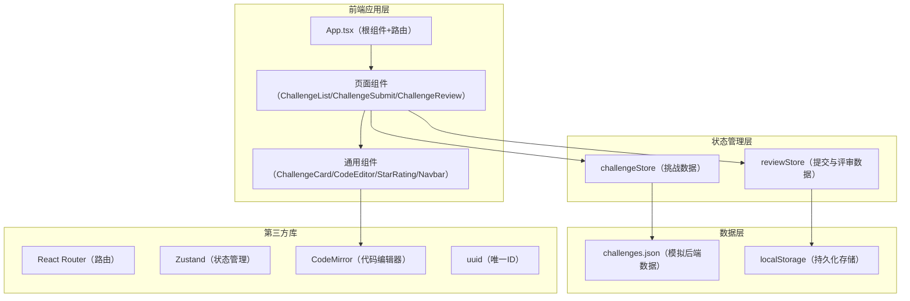
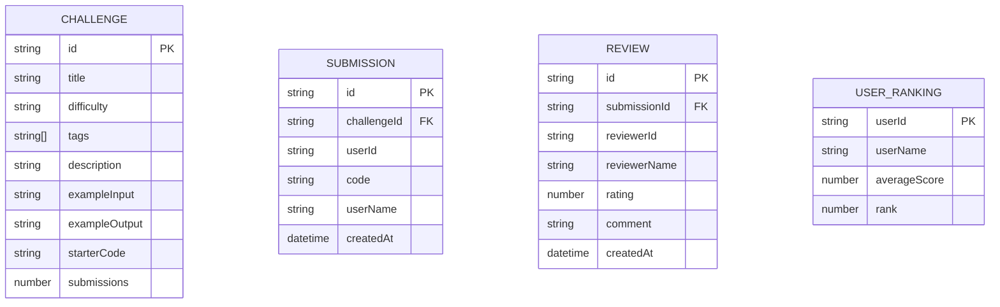

## 1. 架构设计



## 2. 技术描述
- 前端框架：React 18 + TypeScript
- 构建工具：Vite + @vitejs/plugin-react
- 路由管理：React Router DOM
- 状态管理：Zustand
- 代码编辑器：@codemirror/view + @codemirror/state + @codemirror/lang-javascript + @codemirror/theme-one-dark
- 工具库：uuid
- 数据存储：本地JSON文件模拟后端 + localStorage持久化

## 3. 路由定义
| 路由 | 页面组件 | 用途 |
|------|----------|------|
| /challenges | ChallengeListPage | 挑战列表页，展示所有编码挑战 |
| /challenge/:id/submit | ChallengeSubmitPage | 挑战详情与代码提交页 |
| /challenge/:id/review | ChallengeReviewPage | 评审打分页 |

## 4. 数据模型

### 4.1 数据模型定义



### 4.2 TypeScript 类型定义
```typescript
type Difficulty = 'easy' | 'medium' | 'hard';

interface Challenge {
  id: string;
  title: string;
  difficulty: Difficulty;
  tags: string[];
  description: string;
  exampleInput: string;
  exampleOutput: string;
  starterCode: string;
  submissions: number;
}

interface Submission {
  id: string;
  challengeId: string;
  userId: string;
  userName: string;
  code: string;
  createdAt: string;
}

interface Review {
  id: string;
  submissionId: string;
  reviewerId: string;
  reviewerName: string;
  rating: number;
  comment: string;
  createdAt: string;
}

interface UserRanking {
  userId: string;
  userName: string;
  averageScore: number;
  rank: number;
}
```

## 5. 文件结构与调用关系

```
src/
├── App.tsx                          （根组件，路由配置，调用store）
├── main.tsx                         （入口文件）
├── index.css                        （全局样式）
├── data/
│   └── challenges.json              （挑战模拟数据）
├── store/
│   ├── challengeStore.ts            （挑战状态管理，被页面组件调用）
│   └── reviewStore.ts               （评审状态管理，被页面组件调用）
├── components/
│   ├── Navbar.tsx                   （导航栏，被App调用）
│   ├── ChallengeCard.tsx            （挑战卡片，被ChallengeListPage调用）
│   ├── CodeEditor.tsx               （代码编辑器，被ChallengeSubmitPage/ChallengeReviewPage调用）
│   └── StarRating.tsx               （星级评分组件，被ChallengeReviewPage调用）
├── pages/
│   ├── ChallengeListPage.tsx        （挑战列表页，路由/challenges）
│   ├── ChallengeSubmitPage.tsx      （代码提交页，路由/challenge/:id/submit）
│   └── ChallengeReviewPage.tsx      （评审打分页，路由/challenge/:id/review）
└── types/
    └── index.ts                     （类型定义）
```

### 数据流向
1. 挑战数据：challenges.json → challengeStore → 页面组件 → ChallengeCard
2. 提交数据：CodeEditor → reviewStore（localStorage持久化）→ 评审页面
3. 评审数据：StarRating + 评论表单 → reviewStore（localStorage持久化）→ 平均分计算 → 排名更新

## 6. 性能优化策略
- 路由级代码分割：使用React.lazy和Suspense实现页面懒加载
- 组件渲染优化：ChallengeCard使用React.memo避免不必要重渲染
- 列表虚拟化：长列表时考虑虚拟滚动（当前数据量小可暂不实现）
- 状态管理优化：Zustand的selector模式避免不必要的订阅更新
- CSS动画：使用transform和opacity实现GPU加速动画，确保60fps
