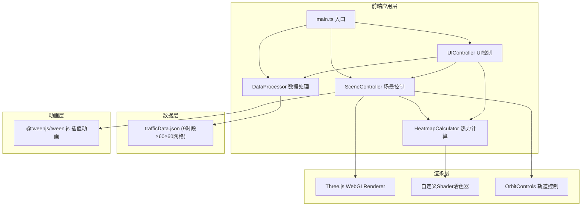

## 1. 架构设计



## 2. 技术说明
- **前端框架**: TypeScript + Vite 5 构建
- **3D引擎**: three.js (r160+)
- **动画库**: @tweenjs/tween.js (时段数据插值、格子隆起动画)
- **UI**: 原生HTML/CSS，模块化TypeScript控制器
- **无后端**: 纯前端应用，数据通过JSON文件静态加载

## 3. 文件结构
| 文件路径 | 职责 |
|---------|------|
| package.json | 依赖声明：three, @types/three, vite, typescript, @tweenjs/tween.js |
| vite.config.js | Vite构建配置，解析three和tween模块别名 |
| tsconfig.json | TypeScript配置：严格模式，ES2020目标 |
| index.html | 入口HTML，包含控制面板、3D画布、详情浮层DOM结构 |
| public/trafficData.json | 模拟流量数据：9个时段，每时段60×60网格密度值+道路骨架坐标+路段名称 |
| src/main.ts | 应用入口，初始化所有模块，绑定事件，启动动画循环 |
| src/dataProcessor.ts | 解析JSON流量数据，生成网格密度Float32Array，提供时段插值方法 |
| src/heatmapCalculator.ts | 自定义ShaderMaterial，顶点/片元着色器实现热力颜色映射，Uniform控制密度数据与增益 |
| src/sceneController.ts | 管理Scene、Camera、Renderer、OrbitControls、动画tick循环、Tween时段切换 |
| src/uiController.ts | 绑定DOM控制面板事件：时段滑块、显示模式按钮、增益滑块，响应格子点击 |

## 4. 核心数据结构

### 4.1 交通流量数据类型
```typescript
interface TrafficDataPoint {
  gridX: number;
  gridZ: number;
  roadName: string;
  density: number; // 0.0 ~ 1.0
}

interface TimeSlotData {
  time: string; // "08:00" ~ "20:00"
  grid: number[][]; // 60x60 density values 0.0~1.0
  roadNames: string[][]; // 60x60 road name strings
}

interface RoadSkeleton {
  startX: number;
  startZ: number;
  endX: number;
  endZ: number;
}

interface TrafficDataset {
  timeSlots: TimeSlotData[]; // length = 9
  roadSkeletons: RoadSkeleton[];
}
```

### 4.2 显示模式枚举
```typescript
enum DisplayMode {
  HEATMAP = 'heatmap',
  ROAD = 'road',
  HYBRID = 'hybrid'
}
```

## 5. 关键技术实现

### 5.1 HeatmapCalculator GPU着色器
- **顶点着色器**: 接收aDensity属性，计算顶点Y轴隆起高度（density × uGain × 2.0），传递vDensity给片元
- **片元着色器**: 实现4色渐变映射（蓝→绿→黄→红），使用smoothstep平滑过渡，vDensity控制透明度0.1~0.8
- **Uniform**: uDensityTexture（或uDensityBuffer）、uGain（热力增益0.1~5.0）、uTime（动画时间）

### 5.2 SceneController 动画循环
- requestAnimationFrame驱动tick循环
- 每帧调用TWEEN.update()处理插值
- OrbitControls.update()更新相机
- 自动旋转：5秒后通过sin函数驱动camera角度，30秒完成2π周期

### 5.3 DataProcessor 时段插值
- 当前密度数组 currentDensity: Float32Array(3600)
- 目标密度数组 targetDensity: Float32Array(3600)
- Tween在0.8秒内对progress从0→1进行easing插值
- 每帧更新：current = lerp(current, target, progress)

### 5.4 格子交互检测
- THREE.Raycaster + Mouse向量归一化坐标
- 点击Mesh时获取faceIndex，计算对应gridX, gridZ
- 选中格子替换材质为MeshBasicMaterial + 自定义发光片元（sin(uTime*4)控制强度脉动，0.4s周期）
