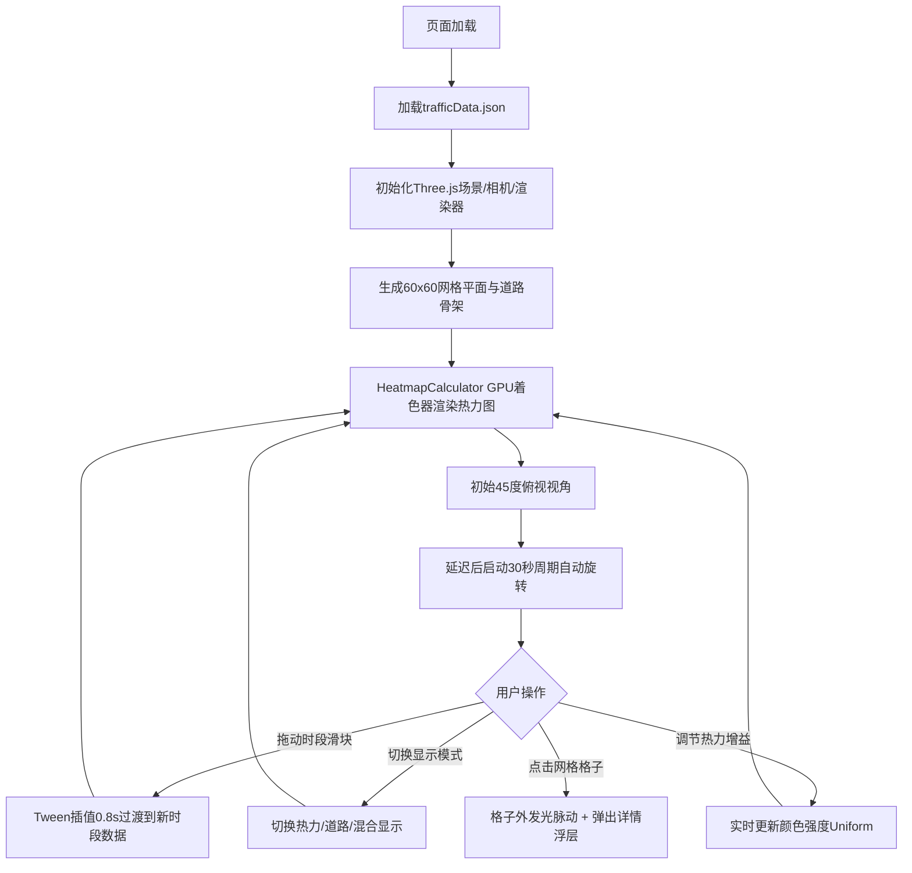

## 1. 产品概述
城市交通流量3D动态热力图可视化应用，通过Three.js实现GPU侧热力渲染，帮助用户直观观察城市不同时段、不同路段的交通拥堵变化与流量迁移趋势。
- 面向交通规划人员、城市管理者及数据分析人员，提供沉浸式的交通数据交互体验
- 产品价值：将抽象的JSON流量数据转化为可交互的3D可视化场景，辅助交通决策

## 2. 核心功能

### 2.1 功能模块
1. **主渲染场景**：3D网格平面、热力图渲染、道路骨架、相机控制、动画循环
2. **控制面板**：时段选择滑块、显示模式切换、热力权重增益调节
3. **数据处理**：JSON流量数据解析、网格密度数组生成、时段数据插值过渡
4. **交互详情**：格子点击高亮、详情浮层、迷你柱状图、绕行建议

### 2.2 页面详情
| 页面名称 | 模块名称 | 功能描述 |
|---------|---------|---------|
| 主页面 | 3D场景模块 | 60x60网格平面放置于XZ平面，支持热力图/道路/混合三种显示模式，支持鼠标拖拽旋转、滚轮缩放 |
| 主页面 | 左侧控制面板 | 时段选择（8:00~20:00共9个时段）、显示模式切换按钮组、热力增益滑块 |
| 主页面 | 右侧详情浮层 | 显示选中路段名称、流量等级（低/中/高）、前3时段迷你柱状图、绕行建议路线 |
| 主页面 | 自动旋转模块 | 页面加载后相机初始45度俯视，延迟后自动30秒周期缓慢旋转 |

## 3. 核心流程
用户打开页面后自动加载交通流量数据，3D场景初始化完成后呈现默认时段（8:00）的热力图。用户可通过左侧控制面板切换时段、调整显示模式和热力增益；点击任意网格格子触发高亮脉动效果并弹出右侧详情浮层展示路段信息。时段切换采用0.8秒Tween插值平滑过渡。

## 4. 用户界面设计

### 4.1 设计风格
- **主色调**：#FF6B6B（珊瑚红）作为交互主色
- **背景色**：#0A0A1A（深蓝黑），赛博朋克暗色风格
- **面板色**：#1A1A2E 半透明背景，#4A4A6E 辅助色，#2D2D5E 未选中按钮色
- **热力色阶**：#0000FF（蓝）→ #00FF00（绿）→ #FFFF00（黄）→ #FF0000（红）平滑过渡
- **按钮风格**：圆角矩形，0.2s过渡动画，悬浮亮度+20%，点击缩放0.95脉冲
- **字体**：使用无衬线现代字体，数字等宽
- **布局**：固定左侧控制面板（260px）、中央全屏3D场景、右侧详情浮层（300px）

### 4.2 页面设计概述
| 页面名称 | 模块名称 | UI元素 |
|---------|---------|--------|
| 主页面 | 3D场景 | 暗色背景，60x60网格平面#1A1A3A，道路骨架细白线#FFFFFF22，高流量格子隆起最高2单位 |
| 主页面 | 左侧控制面板 | 距左上角20px，圆角12px，半透明#1A1A2E背景，滑块轨道#4A4A6E，滑块圆圈#FF6B6B |
| 主页面 | 右侧详情浮层 | 背景#0F0F23 90%不透明，圆角8px，边框#FF6B6B 1px，仅点击后显示 |
| 主页面 | 时段滑块 | 8:00~20:00共9个刻度，拖动实时显示时段值 |
| 主页面 | 显示模式按钮 | 三个圆角按钮横排（热力/道路/混合），选中#FF6B6B，未选中#2D2D5E |
| 主页面 | 热力增益滑块 | 0.1~5.0步长0.1，默认1.0，带刻度线 |

### 4.3 响应式
- **桌面端**：左侧控制面板260px常驻显示，右侧详情浮层300px
- **移动端（<768px）**：控制面板折叠为图标按钮，悬浮或点击时展开为侧边抽屉
- **触摸优化**：支持触屏手势旋转、缩放3D场景

### 4.4 3D场景指引
- **环境**：纯深色#0A0A1A背景，无HDRI，赛博朋克科技感
- **光照**：AmbientLight（0.4强度）+ DirectionalLight（0.8强度，45度角）+ PointLight辅助高流量区域
- **相机**：PerspectiveCamera，fov=60，初始位置(0, 50, 50) lookAt(0,0,0)，45度俯视
- **相机运动**：OrbitControls启用拖拽旋转与滚轮缩放，禁用平移；延迟5秒后启动30秒周期自动水平旋转
- **构图**：网格平面居中，相机围绕中心点旋转，热力图为视觉焦点
- **交互**：Raycaster检测网格点击，选中格子添加发光材质并0.4s循环脉动动画
- **后处理**：使用自定义shader实现热力颜色映射，避免后处理性能开销
- **性能预算**：热力着色器计算<2ms，帧率稳定60FPS
