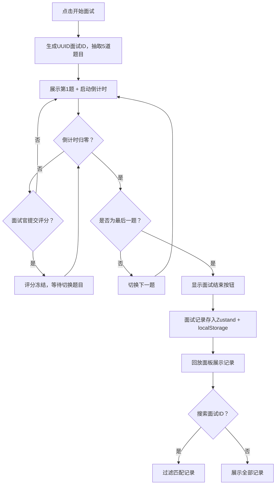

## 1. 产品概述

技术面试评分系统是一款面向初创公司HR的在线面试辅助工具，旨在解决远程面试中技术沟通能力评估困难、纸质评分表易丢失、电子表格难以检索的痛点。系统提供面试流程控制、实时评分记录、面试回放与搜索三大核心能力，帮助面试官高效完成面试并持久化评分数据。

- 目标用户：初创公司HR、技术面试官
- 核心价值：将面试流程数字化、评分标准化、记录可回溯可搜索

## 2. 核心功能

### 2.1 用户角色

| 角色 | 注册方式 | 核心权限 |
|------|----------|----------|
| 面试官 | 无需注册，直接使用 | 发起面试、评分、回放历史记录 |

### 2.2 功能模块

1. **面试控制模块**：面试流程管理，包括开始面试、题目展示、倒计时、结束面试
2. **评分记录模块**：对候选人各维度能力打分与文字批注
3. **面试回放面板**：历史面试记录浏览、搜索、展开详情

### 2.3 页面详情

| 页面名称 | 模块名称 | 功能描述 |
|----------|----------|----------|
| 主页面 | 面试控制模块 | 开始/结束面试，展示当前题目及倒计时，题目自动切换 |
| 主页面 | 评分记录模块 | 四维度滑块评分（技术深度/表达能力/逻辑思维/应变能力），文本批注框，提交后冻结 |
| 主页面 | 面试回放面板 | 左侧面板，按时间倒序展示面试记录卡片，搜索过滤，展开查看详细评分 |

## 3. 核心流程

1. 面试官点击"开始面试"，系统自动分配UUID面试ID，随机抽取5道技术题目
2. 面试中依次展示题目，每题5分钟倒计时，最后30秒橙色，最后10秒红色闪烁
3. 倒计时归零自动切换下一题，面试官可随时在右侧面板评分并提交
4. 提交后该题评分冻结不可修改
5. 所有题目完成后显示"面试结束"按钮
6. 面试结束后，左侧回放面板展示本次及历史面试记录
7. 可通过搜索框按面试ID过滤记录

## 4. 用户界面设计

### 4.1 设计风格

- 风格定位：浅色商务风格，专业简洁
- 主背景色：#F5F7FA
- 卡片背景：#FFFFFF，圆角12px，阴影#00000010
- 评分区背景：#FAFAFA，圆角12px，阴影#00000008
- 字体：Noto Sans SC（中文）+ DM Sans（英文/数字），20px题目加粗，48px倒计时字重300
- 主色调：商务蓝灰 + 维度色彩（绿#4CAF50、蓝#2196F3、黄#FFC107、紫#9C27B0）
- 按钮风格：圆角8px，hover 0.2s ease颜色过渡，点击scale 0.98
- 布局：左右分栏，左侧回放面板400px，右侧上下分栏（2:1）

### 4.2 页面设计概览

| 页面名称 | 模块名称 | UI元素 |
|----------|----------|--------|
| 主页面 | 面试回放面板（左） | 400px宽白色面板，搜索框200px圆角20px，面试记录卡片含UUID前8位/日期/四维度彩色圆点，展开动画0.3s ease-in-out |
| 主页面 | 面试控制模块（右上） | 白色卡片，中央题目文字#424242/20px加粗，下方倒计时48px字重300（正常#424242，30s橙色#FF9800，10s红色#FF9395闪烁），开始/结束按钮 |
| 主页面 | 评分记录模块（右下） | 浅灰背景卡片，4个滑块（180px宽，#E0E0E0轨道6px，圆角50%按钮，各维度色），分值数字加粗18px，批注框120px高#FAFAFA圆角8px，提交按钮 |

### 4.3 响应式设计

- 桌面优先设计（≥768px）：左右分栏布局
- 移动端适配（<768px）：左侧回放面板折叠为顶部横向滚动列表（卡片宽200px），右侧区域保持上下分栏
- 所有交互元素支持hover 0.2s ease过渡与点击scale 0.98效果

### 4.4 性能要求

- 倒计时更新频率：每秒1次（setInterval）
- Chrome DevTools FPS稳定55fps以上
- 评分持久化写入50ms内完成，不阻塞主线程渲染
- 搜索过滤0.2s debounce延迟
