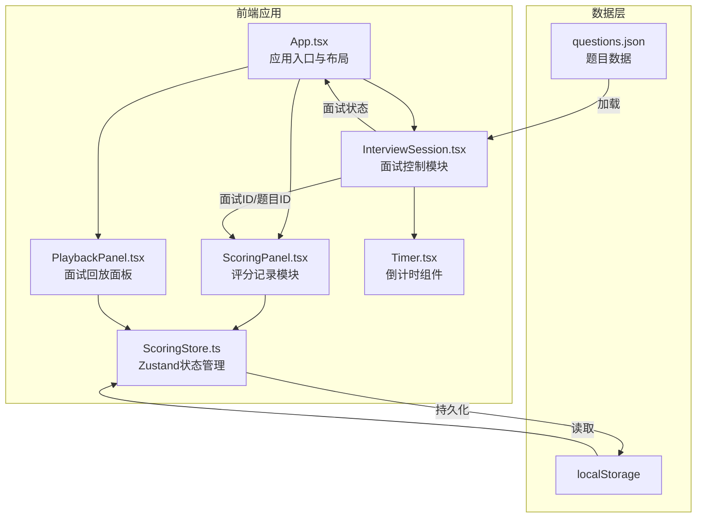
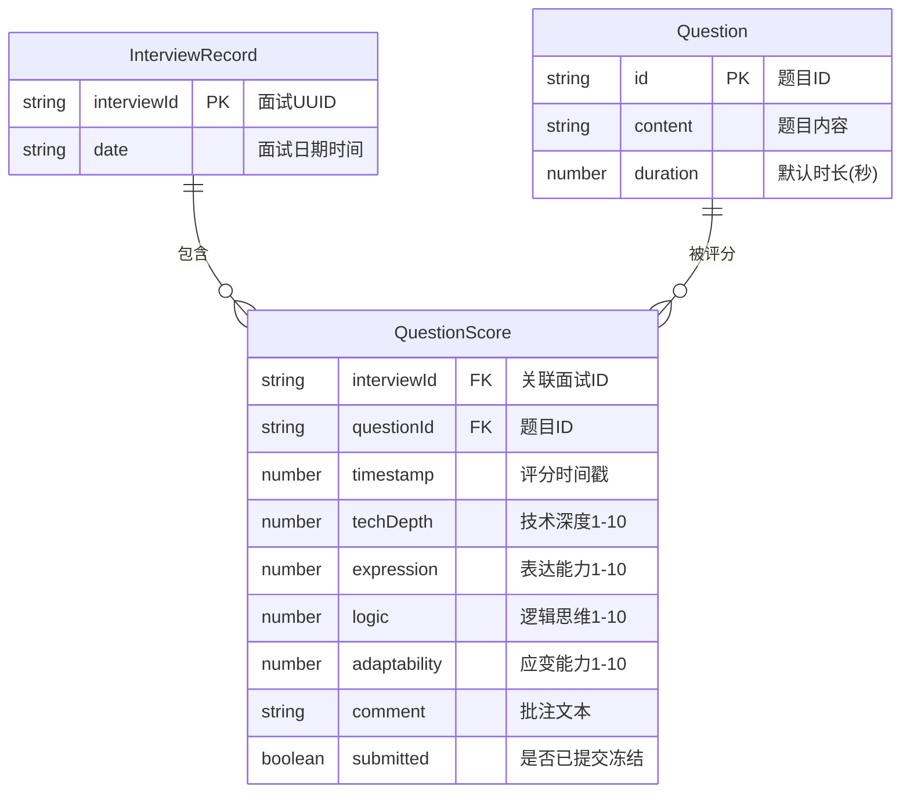

## 1. 架构设计



## 2. 技术说明

- 前端：React@18 + TypeScript + Vite + Zustand
- 初始化工具：vite-init（react-ts模板）
- 样式：Tailwind CSS + 自定义CSS（倒计时闪烁动画、滑块样式）
- 后端：无，题目数据通过JSON文件模拟
- 数据库：无，使用Zustand + localStorage持久化

## 3. 路由定义

| 路由 | 用途 |
|------|------|
| / | 主页面，包含面试控制、评分记录、回放面板 |

> 本应用为单页应用，所有模块在同一页面通过组件组合展示

## 4. API定义

无后端API。题目数据通过本地JSON文件加载，评分数据通过Zustand store管理并持久化到localStorage。

## 5. 数据模型

### 5.1 数据模型定义



### 5.2 数据定义语言

```typescript
interface Question {
  id: string;
  content: string;
  duration: number;
}

interface ScoreRecord {
  interviewId: string;
  questionId: string;
  timestamp: number;
  techDepth: number;
  expression: number;
  logic: number;
  adaptability: number;
  comment: string;
  submitted: boolean;
}

interface InterviewMeta {
  interviewId: string;
  date: string;
  questionIds: string[];
}
```

## 6. 文件结构与调用关系

```
src/
├── App.tsx                          # 应用入口，挂载三大模块
├── main.tsx                         # React根渲染
├── data/
│   └── questions.json               # 题目数据（10+道技术题）
├── modules/
│   ├── interview/
│   │   ├── InterviewSession.tsx     # 面试控制主组件
│   │   └── Timer.tsx                # 倒计时组件
│   ├── scoring/
│   │   ├── ScoringPanel.tsx         # 评分记录主组件
│   │   └── ScoringStore.ts          # Zustand store
│   └── playback/
│       └── PlaybackPanel.tsx        # 面试回放面板
├── types/
│   └── index.ts                     # 全局类型定义
└── styles/
    └── animations.css               # 闪烁动画等自定义样式
```

### 数据流向

1. **题目加载**：`questions.json` → `InterviewSession` → `Timer`（持续时间）+ `ScoringPanel`（题目ID）
2. **评分写入**：`ScoringPanel` → `ScoringStore.addScore()` → `localStorage`
3. **评分读取**：`PlaybackPanel` ← `ScoringStore.getAllScores()` ← `localStorage`
4. **面试状态**：`InterviewSession`（面试ID、当前题目索引）→ `ScoringPanel`（关联评分）
