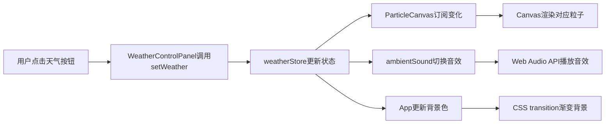

## 1. 产品概述
像素风格2D动态天气系统演示应用，为独立游戏开发者展示RPG游戏中的动态天气效果切换技术。
- 主要用途：展示晴天、雨天、雪天、风暴四种天气的实时切换，包含粒子效果、背景变化和环境音效
- 目标用户：独立游戏开发者、前端可视化工程师

## 2. 核心功能

### 2.1 功能模块
1. **天气控制面板**：天气切换按钮，当前状态显示
2. **粒子渲染系统**：Canvas 2D渲染雨滴、雪花、风暴粒子
3. **背景变化系统**：CSS动画模拟云层移动、闪电闪烁
4. **音效系统**：Web Audio API生成环境音效
5. **状态管理**：Zustand管理全局天气状态

### 2.2 页面详情
| 页面名称 | 模块名称 | 功能描述 |
|-----------|-------------|---------------------|
| 主页面 | 天气控制面板 | 底部居中显示4个天气按钮，点击切换天气，按钮带有主题色和缩放动画 |
| 主页面 | 粒子渲染区域 | 全屏Canvas渲染天气粒子效果（雨滴、雪花、飞沙） |
| 主页面 | 背景层 | 天气主题色背景，CSS transition平滑过渡，太阳/闪电特效 |
| 主页面 | 音效模块 | 自动播放对应天气的环境音效（鸟鸣、雨声、雷声、风声） |

## 3. 核心流程
用户进入页面 → 默认显示晴天效果 → 点击天气按钮 → Zustand更新天气状态 → 各模块订阅状态变化 → 粒子系统切换粒子类型 → 背景颜色渐变过渡 → 音效系统切换音频 → 用户体验完整天气效果

## 4. 用户界面设计

### 4.1 设计风格
- **主色调**：深色主题，游戏像素风格
- **天气主题色**：太阳黄#FFD700、雨滴蓝#4682B4、雪花白#FFFFFF、风暴紫#8B008B
- **按钮样式**：圆角8px，无边框，点击缩放回弹动画
- **字体**：白色像素风格字体，16px（移动端14px）
- **布局**：全屏Canvas主区域，底部居中控制面板
- **动画**：太阳光晕扩散、闪电闪烁、按钮缩放回弹、背景色渐变

### 4.2 页面设计概述
| 页面名称 | 模块名称 | UI Elements |
|-----------|-------------|-------------|
| 主页面 | 天气控制面板 | 半透明深灰#2C2C2C背景，圆角12px，内边距10px，高60px |
| 主页面 | 天气按钮 | 宽90px高40px，圆角8px，白色字体，点击变主题色，缩放动画 |
| 主页面 | Canvas区域 | 全屏渲染，z-index层级高于背景低于控制面板 |
| 主页面 | 太阳/闪电 | CSS动画实现，太阳光晕4秒周期，闪电0.1秒闪烁 |

### 4.3 响应式
- 桌面端优先，视口宽度<600px时按钮宽70px，字号14px
- Canvas自适应窗口大小变化
- 控制面板始终底部居中

### 4.4 性能要求
- 粒子数量≥500时FPS≥30
- 天气切换无卡顿、无白屏
- 背景色渐变过渡1秒完成
