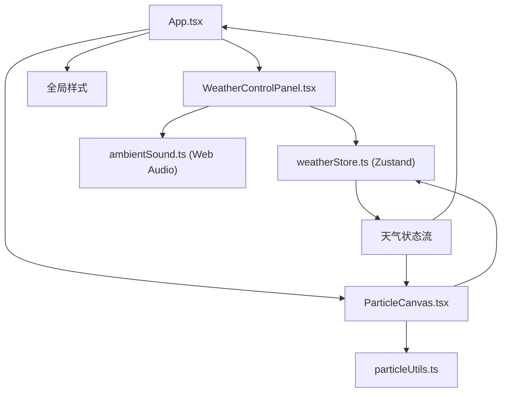

## 1. 架构设计



## 2. 技术描述
- **前端框架**：React 18 + TypeScript
- **构建工具**：Vite 5 + @vitejs/plugin-react
- **状态管理**：Zustand
- **渲染技术**：Canvas 2D API
- **音效技术**：Web Audio API
- **样式方案**：纯CSS + CSS动画 + CSS变量
- **无后端，纯前端应用**

### 依赖说明
| 依赖包 | 版本 | 用途 |
|--------|------|------|
| react | ^18.2.0 | UI框架 |
| react-dom | ^18.2.0 | DOM渲染 |
| typescript | ^5.4.0 | 类型系统 |
| vite | ^5.2.0 | 构建工具 |
| @vitejs/plugin-react | ^4.2.0 | React支持 |
| zustand | ^4.5.0 | 状态管理 |

## 3. 文件结构

```
d:\Pro\tasks\auto8\
├── package.json
├── vite.config.js
├── tsconfig.json
├── index.html
└── src\
    ├── App.tsx
    ├── main.tsx
    ├── index.css
    ├── weather-control\
    │   ├── WeatherControlPanel.tsx
    │   └── weatherStore.ts
    ├── particle-renderer\
    │   ├── ParticleCanvas.tsx
    │   └── particleUtils.ts
    └── audio-manager\
        └── ambientSound.ts
```

### 模块调用关系

| 文件 | 调用者 | 被调用者 | 数据流向 |
|------|--------|----------|----------|
| weatherStore.ts | WeatherControlPanel, ParticleCanvas, App | 无 | 输出WeatherState |
| WeatherControlPanel.tsx | App.tsx | weatherStore.setWeather, ambientSound.play/stop | 用户点击 → 状态更新 → 音效切换 |
| particleUtils.ts | ParticleCanvas.tsx | 无 | 提供粒子算法 |
| ParticleCanvas.tsx | App.tsx | weatherStore, particleUtils | 订阅天气状态 → 渲染粒子 |
| ambientSound.ts | WeatherControlPanel.tsx | 无 | 音频输出 |
| App.tsx | main.tsx | WeatherControlPanel, ParticleCanvas, weatherStore | 组合组件，背景色变化 |

## 4. 数据模型

### 4.1 天气枚举
```typescript
enum WeatherType {
  SUNNY = 'sunny',
  RAINY = 'rainy',
  SNOWY = 'snowy',
  STORMY = 'stormy'
}
```

### 4.2 Zustand Store
```typescript
interface WeatherState {
  currentWeather: WeatherType;
  setWeather: (weather: WeatherType) => void;
}
```

### 4.3 粒子接口
```typescript
interface Particle {
  x: number;
  y: number;
  vx: number;
  vy: number;
  size: number;
  opacity: number;
  life?: number;
}
```

## 5. 关键算法

### 5.1 雨滴粒子
- 数量：500+
- 长度15px，宽度2px，倾斜80度
- 下落速度600px/秒（风暴900px/秒）
- 超出屏幕底部重置到顶部

### 5.2 雪花粒子
- 数量：500+
- 半径3-6px随机
- 下落速度150px/秒
- 横向摆动±20px（正弦波）

### 5.3 风暴飞沙
- 数量：300+
- 深黄色#B8860B，大小2-4px
- 速度1200px/秒，从左到右
- 超出屏幕右侧重置到左侧

### 5.4 闪电特效
- 随机间隔0.5-2秒
- 全屏白色半透明矩形
- 持续0.1秒

### 5.5 音效生成
- **鸟鸣**：正弦波1500Hz，音量0.1，间歇播放
- **雨声**：白噪声滤波，音量0.3
- **雷声**：方波60Hz，音量0.5，持续0.3秒，随机间隔2-5秒
- **风暴轰鸣**：锯齿波80Hz，音量0.4，持续雷声间隔1-3秒
