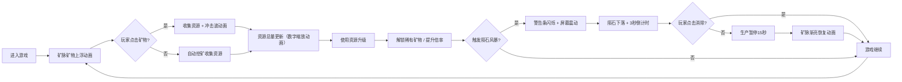

## 1. 产品概述
星际矿脉大师是一款太空主题的放置挂机游戏，玩家通过开采和升级外星矿石积累财富，解锁稀有矿物，应对随机陨石风暴事件。

- 目标用户：休闲游戏玩家，喜欢放置类、挂机类游戏的用户
- 产品价值：提供轻松有趣的游戏体验，精美的视觉效果，策略性的资源管理玩法

## 2. 核心功能

### 2.1 功能模块
1. **游戏主界面**：三层矿脉展示区、矿物动画、点击收集、粒子特效
2. **右侧工具栏**：升级系统、矿物图鉴、资源显示、自动挖矿倍率调节
3. **陨石风暴事件系统**：随机触发、警告提示、屏幕震动、陨石下落、倒计时点击消除、生产暂停与恢复

### 2.2 功能详情
| 功能模块 | 子功能 | 功能描述 |
|---------|--------|---------|
| 游戏主界面 | 三层矿脉 | 表层（立方体#7B68EE）、中层（菱形#00CED1）、深层（六边形旋转体#FFD700） |
| 游戏主界面 | 矿物动画 | 随机缓慢上浮，粒子拖尾渐隐0.8秒 |
| 游戏主界面 | 点击收集 | 点击矿物收集资源，冲击波动画（10px→60px，透明度1→0，0.3s） |
| 右侧工具栏 | 升级按钮 | 背景#4B0082，悬停#9400D3，点击#2F0047，过渡0.2s |
| 右侧工具栏 | 矿物图鉴 | 网格排列，背景#252040，圆角6px，发光描边 |
| 右侧工具栏 | 资源显示 | Press Start 2P字体，颜色#00FF7F，数字变化缩放1.1倍恢复0.3s |
| 右侧工具栏 | 倍率调节 | 滑块，轨道#3A2A5A，滑块#00FFFF |
| 陨石风暴 | 触发机制 | 每45-90秒随机触发 |
| 陨石风暴 | 警告特效 | 顶部红色警告条#FF4500，闪烁0.5s |
| 陨石风暴 | 屏幕震动 | 震动2帧，幅度3px |
| 陨石风暴 | 陨石下落 | 粒子系统，20个橘红到黄渐变三角片 |
| 陨石风暴 | 倒计时消除 | 3秒倒计时，点击消除，否则生产暂停15秒 |
| 陨石风暴 | 恢复动画 | 生产恢复时矿脉渐亮1.5s |

## 3. 核心流程
玩家进入游戏 → 观察三层矿脉中上浮的矿物 → 点击矿物收集资源（或自动挖矿）→ 使用资源升级系统 → 解锁更稀有矿物 → 随机触发陨石风暴 → 点击消除陨石或等待生产恢复 → 持续积累财富

## 4. 用户界面设计

### 4.1 设计风格
- 主色调：深空紫#1A102A到暗蓝#0F1B3D径向渐变背景
- 强调色：紫色系#7B68EE、#4B0082、#9400D3，青色#00CED1、#00FFFF，金色#FFD700，红色#FF4500，绿色#00FF7F
- 按钮风格：圆角按钮，带悬停荧光效果和点击反馈
- 字体：Press Start 2P（像素风格字体用于资源显示）
- 布局风格：左侧主游戏区域 + 右侧固定工具栏
- 视觉特效：粒子系统、发光描边、渐变、动画过渡

### 4.2 页面设计概述
| 页面 | 模块 | UI元素 |
|------|------|--------|
| 主游戏页面 | 背景层 | 深空径向渐变背景 |
| 主游戏页面 | 矿脉区域 | 三层矿物粒子、浮动动画、粒子拖尾 |
| 主游戏页面 | 点击特效 | 冲击波扩散动画 |
| 主游戏页面 | 陨石风暴层 | 警告条、陨石粒子、倒计时、屏幕震动 |
| 主游戏页面 | 右侧工具栏 | 升级按钮、矿物图鉴网格、资源数字、滑块控件 |

### 4.3 响应式
桌面端优先设计，主要适配PC端浏览器，画布尺寸随窗口自适应。

## 5. 性能要求
- 游戏以60FPS稳定运行
- 自动挖矿计算在空闲回调中执行
- 资源数值使用大数格式（k、M、B）
