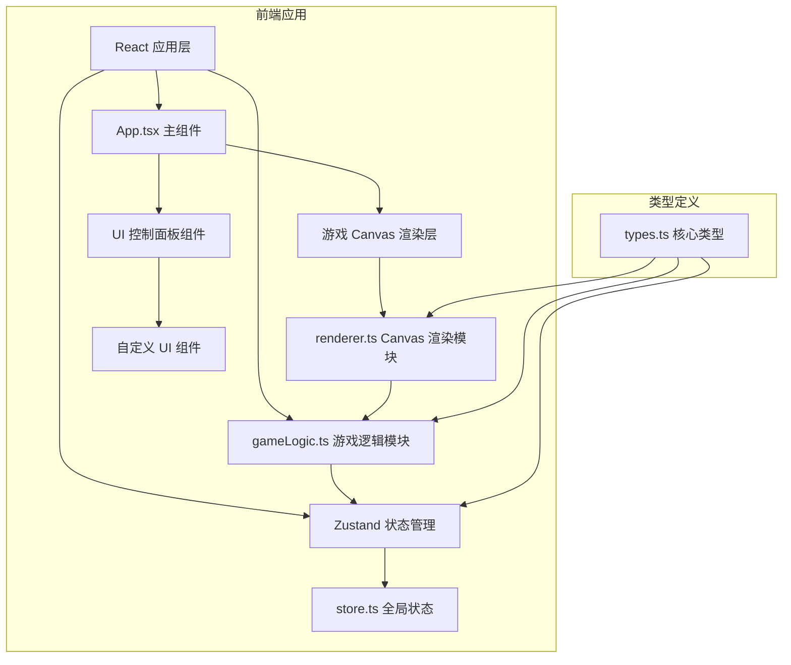

## 1. 架构设计



## 2. 技术描述

- **前端框架**：React 18 + TypeScript
- **构建工具**：Vite
- **状态管理**：Zustand
- **游戏渲染**：HTML5 Canvas + requestAnimationFrame 主循环
- **UI组件**：完全自定义，无外部UI库
- **依赖库**：react, react-dom, typescript, vite, @vitejs/plugin-react, zustand, uuid

## 3. 项目文件结构

```
d:\Pro\tasks\auto80\
├── package.json
├── index.html
├── vite.config.js
├── tsconfig.json
└── src/
    ├── main.tsx          # React 入口
    ├── App.tsx           # 主应用组件
    ├── gameLogic.ts      # 游戏逻辑纯函数模块
    ├── renderer.ts       # Canvas 渲染模块
    ├── store.ts          # Zustand 状态管理
    └── types.ts          # TypeScript 类型定义
```

## 4. 核心类型定义

### 4.1 MineralType 枚举
- Surface: 表层矿物（立方体，#7B68EE）
- Mid: 中层矿物（菱形，#00CED1）
- Deep: 深层矿物（六边形旋转体，#FFD700）

### 4.2 GameState 接口
- resources: 资源数量对象
- minerals: 矿物实例数组（位置、类型、速度等）
- autoMineRate: 自动挖矿倍率
- meteorEvent: 陨石事件状态（是否激活、陨石数组、倒计时等）
- shockwaves: 冲击波动画数组
- productionPaused: 生产是否暂停
- productionPausedUntil: 暂停结束时间戳

## 5. 关键实现设计

### 5.1 游戏主循环
- 使用 requestAnimationFrame 驱动
- 每帧调用 calculateFrame 更新游戏状态
- 调用 renderer 绘制当前帧
- 使用 requestIdleCallback 处理自动挖矿计算

### 5.2 Canvas 渲染层
- 深空径向渐变背景
- 三层矿物粒子系统（含旋转、浮动、粒子拖尾）
- 点击冲击波动画
- 陨石风暴粒子系统（20个三角片组成的陨石）
- 警告条闪烁特效
- 屏幕震动效果

### 5.3 游戏逻辑层
- 矿物位置更新（随机缓慢上浮）
- 点击碰撞检测与资源收集
- 资源数值计算（大数格式化 k/M/B）
- 陨石事件计时器（45-90秒随机触发）
- 陨石倒计时与消除逻辑
- 生产暂停与恢复机制

### 5.4 状态管理
- Zustand store 管理全局游戏状态
- 提供 actions 更新资源、矿物、倍率、事件状态等
- React 组件通过 useStore hook 订阅状态
