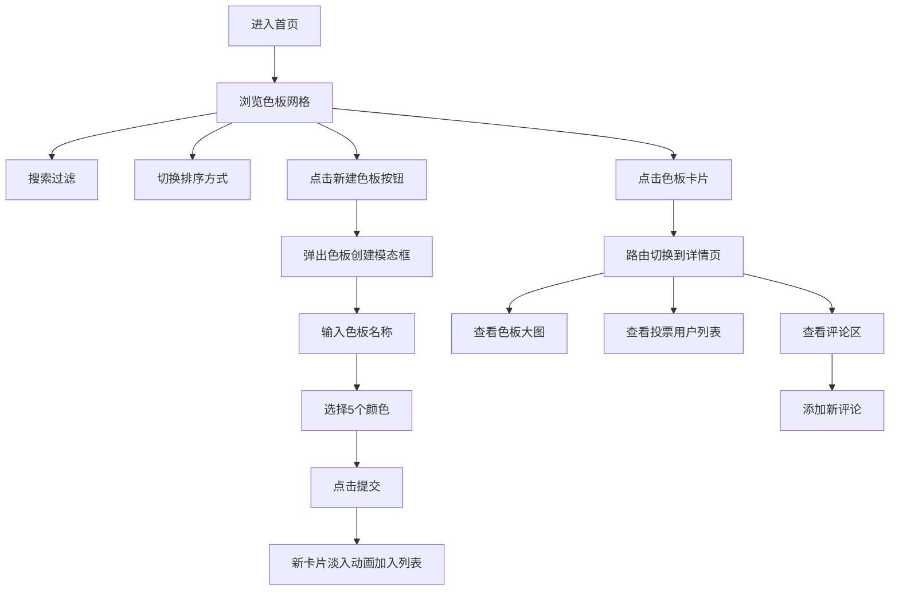

# 品牌配色方案收集应用 PRD

## 1. 产品概述

本产品是一款面向小型设计团队的在线品牌配色方案收集与管理工具，解决多人提交色板时缺乏统一管理和智能排序的问题。团队成员可以提交、浏览、投票和筛选品牌配色方案，提升设计协作效率。

- 主要目标：为设计团队提供统一的色板管理平台
- 目标用户：设计师、品牌经理、设计团队负责人
- 核心价值：统一管理 + 智能排序 + 高效协作

## 2. 核心功能

### 2.1 用户角色
| 角色 | 注册方式 | 核心权限 |
|------|---------|---------|
| 普通用户 | 匿名使用（localStorage） | 浏览、创建、投票、评论、编辑、删除自有色板 |

### 2.2 功能模块
1. **首页**：色板网格展示、搜索、排序切换、新建色板
2. **详情页**：色板大图展示、投票用户列表、评论区

### 2.3 页面详情
| 页面名称 | 模块名称 | 功能描述 |
|---------|---------|---------|
| 首页 | 导航栏 | 应用名称、搜索框、用户头像菜单 |
| 首页 | 排序切换 | 最新优先/最热优先，Segmented Control |
| 首页 | 色板网格 | 四列等宽卡片布局，展示色板信息 |
| 首页 | 色板卡片 | 颜色块、名称、作者、投票按钮、操作菜单 |
| 首页 | 新建模态框 | 输入名称、添加颜色、提交色板 |
| 详情页 | 色板大图 | 5个颜色块横向排列展示 |
| 详情页 | 投票用户 | 头像叠加列表，悬浮显示用户名 |
| 详情页 | 评论区 | 评论列表、评论输入框 |

## 3. 核心流程

### 3.1 主流程描述
用户进入首页 → 浏览色板网格 → 可通过搜索过滤/切换排序方式 → 点击"新建色板"按钮 → 填写信息并提交 → 新色板出现在列表最前面 → 点击卡片进入详情页 → 查看投票用户和评论 → 可添加评论

### 3.2 流程图

## 4. 用户界面设计

### 4.1 设计风格
- **主色调**：#6C63FF（紫色），代表创造力和专业性
- **辅助色**：#E74C3C（红色）用于投票爱心，#ADB5BD（灰色）用于未选中状态
- **中性色**：#1A1A2E（深灰文字）、#6C757D（次要文字）、#F2F4F8（背景）、#FFFFFF（卡片背景）
- **按钮风格**：圆角8px，主色背景+白色文字，悬浮加深
- **卡片风格**：白色背景，圆角12px，柔和阴影
- **字体**：现代无衬线字体，清晰易读
- **布局风格**：卡片式网格布局，顶部固定导航
- **图标风格**：简洁线性图标

### 4.2 页面设计概述

| 页面名称 | 模块名称 | UI元素 |
|---------|---------|--------|
| 首页 | 导航栏 | 固定顶部60px高度，左侧应用名，中央搜索框，右侧用户头像 |
| 首页 | 排序控制 | Segmented Control，平滑滑动动画 |
| 首页 | 色板网格 | 四列等宽，间距适中，卡片悬浮微动效 |
| 首页 | 色板卡片 | 顶部名称，中间5个颜色方块，底部作者+时间，右上角投票按钮 |
| 首页 | 新建按钮 | 紫色背景，涟漪点击效果 |
| 首页 | 模态框 | 缩放入场动画，表单布局 |
| 详情页 | 色板展示区 | 大尺寸颜色块横向排列 |
| 详情页 | 投票用户 | 圆形头像叠加，tooltip提示 |
| 详情页 | 评论区 | 气泡式评论，输入框圆角设计 |

### 4.3 动画与交互
- **模态框入场**：缩放0.9→1，透明度0→1，0.3s ease-out
- **新卡片入场**：translateY 20px→0，透明度0→1，0.4s ease
- **投票按钮**：缩放1.2倍再恢复，0.2s动画
- **搜索过滤**：非匹配卡片透明度渐变到0.2，0.3s过渡
- **排序切换**：卡片交错式淡入，每个延迟40ms
- **路由切换**：旧页左滑出0.2s，新页右滑入0.3s
- **涟漪效果**：圆形从点击位置扩散，透明度1→0，持续0.6s

### 4.4 响应式设计
- **桌面端（≥768px）**：四列网格布局，完整导航栏
- **平板（480px-768px）**：两列网格，导航栏搜索框显示
- **移动端（<480px）**：单列网格，搜索框折叠为图标，模态框90%宽度
- **触摸优化**：点击区域≥40px，手势友好

