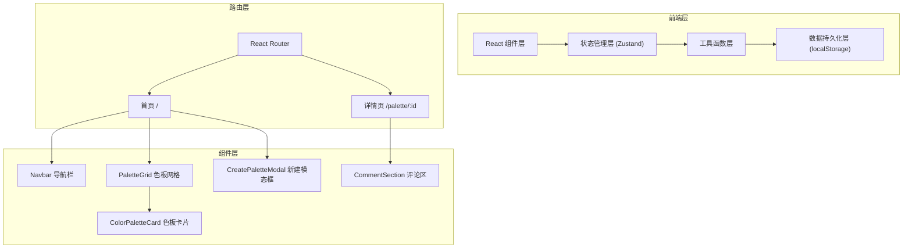
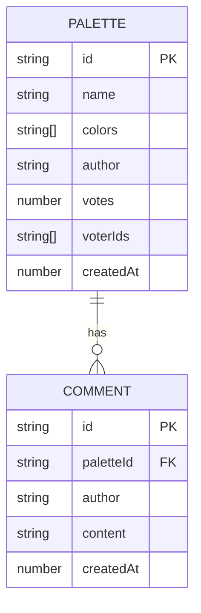

# 品牌配色方案收集应用 - 技术架构文档

## 1. 架构设计



## 2. 技术栈说明

| 类别 | 技术 | 版本 | 用途 |
|-----|------|------|------|
| 构建工具 | Vite | 最新 | 构建与开发服务器 |
| 前端框架 | React | 18.x | UI 框架 |
| 类型系统 | TypeScript | 最新 | 类型安全 |
| 状态管理 | Zustand | 最新 | 全局状态管理 |
| 路由 | React Router DOM | 最新 | 路由管理 |
| 工具库 | uuid | 最新 | 生成唯一 ID |
| 样式 | CSS Modules / 内联样式 | - | 组件样式 |

## 3. 目录结构

```
src/
├── components/          # 组件目录
│   ├── ColorPaletteCard.tsx    # 色板卡片组件
│   ├── PaletteGrid.tsx         # 色板网格组件
│   ├── CreatePaletteModal.tsx  # 新建色板模态框
│   ├── Navbar.tsx              # 导航栏组件
│   ├── CommentSection.tsx      # 评论区组件
│   └── SegmentedControl.tsx    # 分段控制器组件
├── pages/               # 页面目录
│   ├── HomePage.tsx           # 首页
│   └── DetailPage.tsx         # 详情页
├── store/               # 状态管理
│   └── usePaletteStore.ts     # Zustand Store
├── utils/               # 工具函数
│   └── colorUtils.ts          # 颜色处理工具
├── types.ts             # TypeScript 类型定义
├── App.tsx              # 根组件
└── main.tsx             # 入口文件
```

## 4. 路由定义

| 路由 | 页面 | 说明 |
|-----|------|------|
| `/` | 首页 | 色板网格、搜索、排序、新建按钮 |
| `/palette/:id` | 详情页 | 色板详情、投票用户、评论区 |

## 5. 数据模型

### 5.1 数据模型定义



### 5.2 TypeScript 类型定义

```typescript
interface Palette {
  id: string;
  name: string;
  colors: string[];
  author: string;
  votes: number;
  voterIds: string[];
  createdAt: number;
}

interface Comment {
  id: string;
  paletteId: string;
  author: string;
  content: string;
  createdAt: number;
}

type SortMode = 'latest' | 'popular';
```

## 6. 状态管理设计

### 6.1 Zustand Store 状态

```typescript
interface PaletteState {
  palettes: Palette[];
  comments: Comment[];
  searchQuery: string;
  sortMode: SortMode;
  currentUserId: string;
}
```

### 6.2 Store Actions

| Action | 说明 |
|--------|------|
| `addPalette(palette: Omit<Palette, 'id' | 'createdAt' | 'votes' | 'voterIds'>)` | 添加色板 |
| `deletePalette(id: string)` | 删除色板 |
| `updatePalette(id: string, updates: Partial<Palette>)` | 编辑色板 |
| `toggleVote(paletteId: string)` | 切换投票状态 |
| `addComment(paletteId: string, content: string)` | 添加评论 |
| `setSearchQuery(query: string)` | 设置搜索关键词 |
| `setSortMode(mode: SortMode)` | 设置排序方式 |
| `getFilteredPalettes()` | 获取过滤排序后的色板列表 |
| `getPaletteById(id: string)` | 根据 ID 获取色板 |
| `getCommentsByPaletteId(paletteId: string)` | 获取色板评论 |

## 7. 性能优化策略

1. **首屏渲染优化**
   - 使用 Vite 构建优化
   - 组件按需渲染
   - 初始数据使用 mock 数据快速渲染

2. **滚动性能优化**
   - 使用 CSS transform 动画
   - 避免布局抖动
   - 卡片使用 contain: layout style

3. **搜索性能优化**
   - 防抖搜索（200ms 内完成反馈）
   - 纯函数过滤逻辑
   - 避免不必要的重渲染

4. **动画性能优化**
   - 使用 CSS 动画而非 JS 动画
   - 使用 will-change 优化
   - 避免频繁重排

## 8. 数据持久化

- 使用 localStorage 存储色板和评论数据
- Store 初始化时从 localStorage 读取
- 数据变更时自动同步到 localStorage
- 提供默认 mock 数据用于首次访问
