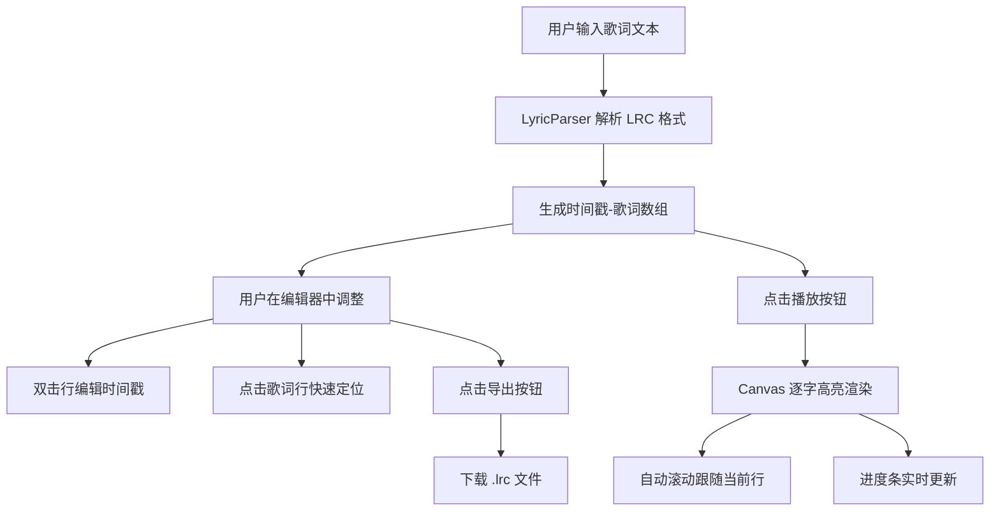

## 1. 产品概述

在线歌词排版与卡拉OK同步预览应用，为音乐创作者、K 歌爱好者提供 LRC 歌词的编辑、时间轴调整和卡拉OK效果实时预览功能。

- 核心价值：将传统的歌词排版工作流程数字化，通过可视化时间轴和逐字高亮预览，大幅提升歌词制作效率
- 目标用户：音乐制作人、字幕组、K 歌平台内容运营、个人爱好者

## 2. 核心功能

### 2.1 用户角色
无需用户登录和角色区分，所有访客拥有完整功能权限。

### 2.2 功能模块

1. **歌词编辑面板**：LRC 格式文本输入、语法高亮显示、时间戳内联编辑
2. **卡拉OK 预览面板**：基于 Canvas 的逐字高亮渲染、自动滚动、当前行强调
3. **播放控制条**：播放/暂停、进度拖拽、时间显示
4. **导出功能**：一键导出标准 LRC 格式文件

### 2.3 页面详情

| 页面名称 | 模块名称 | 功能描述 |
|---------|---------|---------|
| 主页面 | 歌词编辑器 | 支持 LRC 格式粘贴/手动输入，语法高亮（时间戳粉色、歌词白色），行内时间戳双击编辑 |
| 主页面 | 卡拉OK预览区 | Canvas 渲染，当前行居中放大显示，逐字从底部向上扫过高亮，其他行半透明缩小，自动滚动居中 |
| 主页面 | 时间轴控制条 | 播放/暂停按钮切换、可拖拽进度条（4px高度，圆形手柄12px）、monospace 时间显示 |
| 主页面 | 导出按钮 | 右上角紫色按钮，点击后浏览器下载 .lrc 文件 |

## 3. 核心流程

用户输入歌词文本 → 系统自动解析 LRC 时间戳 → 用户调整时间戳（双击编辑行或拖拽进度）→ 点击播放预览卡拉OK逐字高亮效果 → 满意后导出 LRC 文件

## 4. 用户界面设计

### 4.1 设计风格

- **主色调**：暗色主题，背景 `#121212`，卡片 `#1E1E2E`
- **强调色**：高亮文字 `#FFB347`（橙黄色），导出按钮 `#6C63FF`（紫色），时间戳 `#FF79C6`（粉色）
- **文字**：主文本 `#F0F0F0`，次要文本 `#BBBBBB`
- **按钮**：圆角 6px-12px，悬停微变色，点击 0.1s scale(0.95) 反馈
- **字体**：无衬线字体，时间显示使用 monospace
- **布局**：左右分栏（桌面端），上下分栏（移动端）
- **动画**：0.2s ease 过渡，逐字高亮扫过效果

### 4.2 页面设计概览

| 模块 | 关键 UI 元素 |
|------|-------------|
| 左侧编辑器 | 宽度 420px，圆角 12px，背景 `#1E1E2E`，内部编辑区背景 `#282A36`，语法高亮 |
| 右侧预览区 | 最小宽度 480px，自适应，中央 60% 高度为歌词区，当前行 32px 白色，其他行 24px 半透明白 |
| 底部控制条 | 高度 60px，背景 `#2D2D2D`，圆角 8px，进度条 4px，手柄 12px 圆形 |
| 导出按钮 | 右上角，背景 `#6C63FF`，悬停 `#5A52D5`，圆角 6px |

### 4.3 响应式适配

- 桌面端（≥900px）：左右分栏布局，左侧编辑器 420px，右侧预览区自适应
- 移动端（<900px）：上下布局，顶部编辑器可切换（高度 300px），底部预览区占满剩余高度

### 4.4 性能要求

- Canvas 渲染帧率 ≥ 50fps
- 400 行歌词以内操作无卡顿
- 时间戳编辑后重新排序 ≤ 5ms
